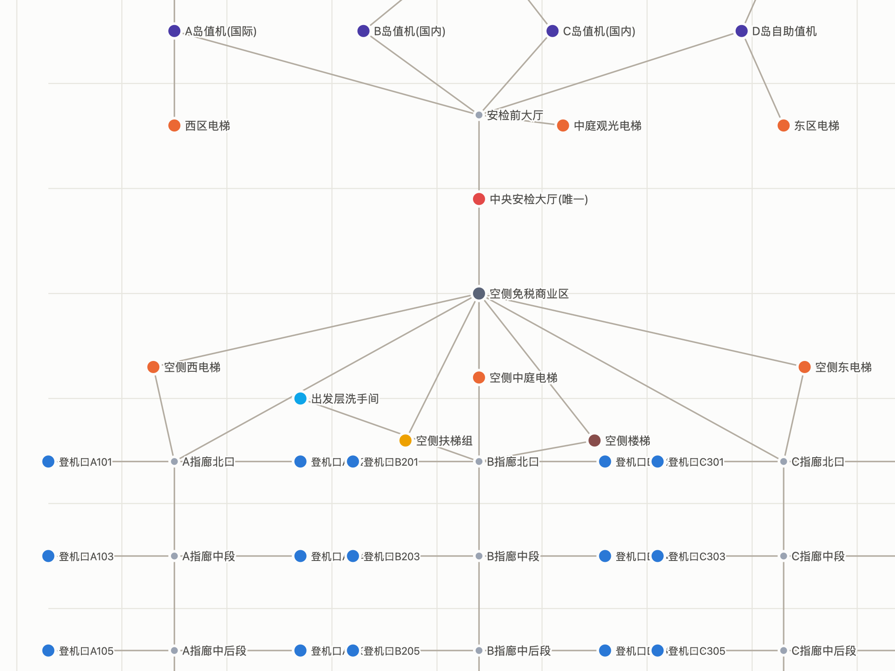
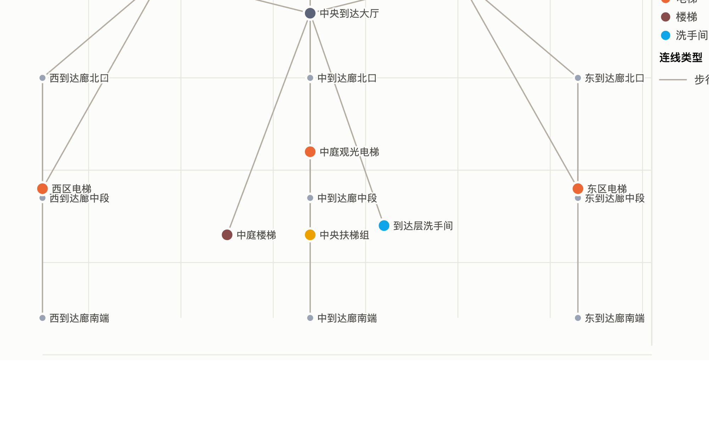
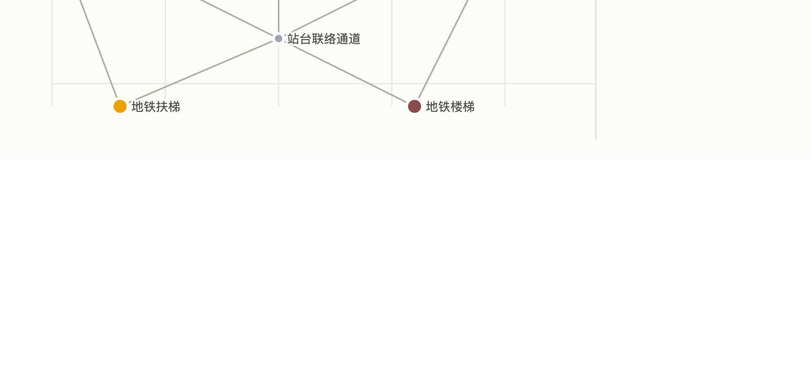

# 🛫 星海国际机场 · 室内导航元服务

> ArkTS 构建的纯端侧机场室内导航**元服务**：六层航站楼示意图、跨层最短路径、**中央安检必经**拆分、中英双语、地铁换乘引导。数据随包，无云端 / 无账号 / 无支付 / 无权限。



| 项目 | 内容 |
| --- | --- |
| 仓库名 | HarmonyOS-METASERVICE-airport-guide |
| 适合谁 | HarmonyOS 进阶到高级开发者；想完整复刻「元服务 + 数据驱动寻路 + Canvas 拓扑绘制 + 多语言」案例的人 |
| 难度与耗时 | 进阶 · 编译到模拟器实跑约 30 分钟（含 DevEco Studio 启动与模拟器开机） |
| 你将学到 | ArkTS 强类型数据模型（JSON → 类型化常量）、Dijkstra 最短路径与「安检必经」拆段、Canvas 三层渲染（示意背景 / 拓扑 / 路径）、Navigation 多页、中英双语、动效与转场 |
| 你将完成 | 可运行的机场室内导航元服务：找设施（分类 + 搜索）→ 选起点 → 跨层寻路 → 逐层路径图 → 地铁换乘引导 → 楼层漫游，全程中英可切换 |
| 验证环境 | compile API 24(6.1.1) · 兼容与目标 6.1.0(23) · hvigor 6.x（最后验证于 2026-09-15，模拟器实跑通过） |

> 🎯 **两条路线**：想先看到 App → [快速体验](#3-快速体验) · 想完整学习 → [完整实践](#4-完整实践)

---

## 1. 案例概览

### 为什么是机场导航

本项目以一个「一句话需求」为输入：做一个机场地图指引，选好起点终点就能把路走通。数据只存本地，不碰云端。

从这个需求出发，我们产出的是一个兼顾**实用功能**与**代码示范价值**的纯端侧元服务。地图以一张**节点-边图**（`data/XHA_xinghai_t1.map.json`，119 节点 / 145 边 / 6 层）为唯一事实源，`tools/gen_model.py` 把它编译成 ArkTS 类型化常量直接进包；端侧 Dijkstra 寻路**强制**处理「中央安检必经」——起点终点分属陆侧 / 空侧时，路线被拆成 `起 → 安检 → 终` 两段，安检作为醒目标注，**绝不可能被绕过**。

学到的能力可复用到「结构化数据 + 自定义 Canvas 绘制 + 多步导航流程」这类组合，以及任何需要「数据驱动的地图 / 拓扑 / 路径规划」的鸿蒙应用。

### 核心功能与体验

| 页面 | 功能 | 亮点 |
|------|------|------|
| 🏠 首页 | 机场总览、六层速览、三大入口（找设施 / 地铁 / 漫游）、热门直达 | Navigation 宿主 + 中英即时切换 |
| 🎯 终点选择 | 分类 Tabs + 中英文搜索（119 节点） | 语义类目聚合 + 安检徽标 |
| ↩️ 起点选择 | 快捷起点 chips + 全节点检索 | 会话内记忆上次起点 |
| 🧭 路线 | 逐层路径图 + 换层提示 + 路径生长动效 | 安检必经醒目标注，Tabs 按路线途经楼层生成 |
| 🚇 地铁引导 | 往市区 / 往星湖 → B1 闸机 → B2 站台 | 复用同一寻路引擎 |
| 🗺️ 楼层漫游 | 任意层点节点看详情 | bindSheet 半模态，可设为出发点 / 目的地 |

| 4F 出发层 | 2F 到达层 | B2 地铁站台 |
|:---:|:---:|:---:|
|  |  |  |

六层纵览（4F 出发 → B2 地铁站台）：

<p align="center"></p>

### 技术方案一览


- **单模型驱动**：`data` 是唯一数据源 → 生成 `AirportMap.ets`（`Map` 化键值字典 + 显式接口，对应 ArkTS 严格模式）→ 寻路 / 渲染 / 双语全部消费同一模型
- **寻路权**：walk = 米；垂直边电梯 30 / 扶梯 40 / 楼梯 25；偏好「最短 / 优先电梯 / 优先扶梯 / 避开楼梯」用乘子重算
- **安检必经**：唯一安检是陆↔空割点 → 异侧拆段结果严格等价、天然最短
- **渲染对齐**：示意背景 / 拓扑 / 路径三层共用同一视口变换（`Viewport`），平移缩放天然严丝合缝

| 层级 | 技术/产品 | 验证版本 | 作用 |
|------|-----------|----------|------|
| 端侧 | HarmonyOS ArkTS / ArkUI | compile API 24，兼容与目标 6.1.0(23) | Navigation 多页 + Canvas 绘制 + 状态管理 |
| 数据 | `data/*.map.json` + `tools/gen_model.py` | Python 3 | 图数据唯一源 → 类型化模型 |
| 校验 | `tools/pathfind_reference.py` | — | 500 组随机用例与端侧比对（含安检断言） |
| 工具 | DevEco Studio / hvigorw / hdc | hvigor 6.x | 编译与安装 |

### 边界说明

- **元服务（atomicService）**：`installationFree` / `deliveryWithInstall`，单入口免安装可运行。
- **纯端侧**：无账号 / 无云端 / 无支付 / 无敏感权限；地图数据随包。
- **登机口为静态示意数据**：接入真实航班动态数据时只需替换 gate 位置 / 编号，模型层不变。
- **无室内定位**：「起点」由用户手动选择，模拟当前位置。
- **示意背景为程序化绘制**：通道带 + 网格 + 楼体轮廓由数据几何生成，预留 `drawImage` 位图插槽。

---

## 2. 开始之前

### 环境与资源

| 项目 | 要求 | 检查或获取方式 |
|------|------|----------|
| 基础知识 | ArkTS 基本语法、ArkUI 组件概念 | 华为官方《ArkTS 语言》文档 |
| 开发环境 | Windows / macOS · DevEco Studio · SDK API ≥ 23 | `hvigorw --version` |
| 测试设备 | HarmonyOS 模拟器或真机（API 23+） | `hdc list targets` |

> 本工程**零第三方依赖**（`oh-package.json5` 的 `dependencies` 为空），无需配置任何云服务或 API 密钥。

---

## 3. 快速体验

> 这条路线面向「先把 App 跑起来」的读者，假设 DevEco Studio 与配套模拟器已就绪，目标是在 **5-10 分钟内**看到模拟器中的机场总览；若还需从零安装环境、学习每一步原理，则走[完整实践](#4-完整实践)，全程约 **30 分钟**。

### 1）获取代码

```bash
git clone https://gitcode.com/harmony-practice-center/HarmonyOS-METASERVICE-airport-guide.git
cd HarmonyOS-METASERVICE-airport-guide
```

**完成标志**：根目录存在 `README.md`、`harmony_app/`、`docs/`、`data/`、`tools/`。

### 2）编译

参考 [`docs/BUILD.md`](docs/BUILD.md) 选择一种方式：

| 方法 | 一句话 | 适用场景 |
|------|--------|---------|
| **A. 命令行** | 设环境变量 → `hvigorw assembleHap` | 快速、无 IDE |
| **B. DevEco Studio** | 打开 `harmony_app` → **Build → Build HAP(s)** | 日常开发 |
| **C. Agent (CI/CD)** | 流水线中执行 `hvigorw assembleHap` | 自动打包 |

**各方法详细步骤：**

<details>
<summary><b>A. 命令行</b> — Windows (PowerShell)</summary>

```powershell
$env:DEVECO_SDK_HOME = "<DevEco安装目录>\sdk"
$env:NODE_HOME       = "<DevEco安装目录>\tools\node"
$env:JAVA_HOME       = "<DevEco安装目录>\jbr"
$env:PATH = "$env:JAVA_HOME\bin;$env:NODE_HOME;<DevEco安装目录>\tools\ohpm\bin;<DevEco安装目录>\tools\hvigor\bin;$env:PATH"

cd harmony_app
hvigorw assembleHap --no-daemon --mode module -p product=default -p module=entry@default --console=plain
```

</details>

<details>
<summary><b>A. 命令行</b> — macOS / Linux (bash)</summary>

```bash
export DEVECO_SDK_HOME="/Applications/DevEco-Studio.app/Contents/sdk"
export NODE_HOME="/Applications/DevEco-Studio.app/Contents/tools/node"
export JAVA_HOME="/Applications/DevEco-Studio.app/Contents/jbr/Contents/Home"
export PATH="$JAVA_HOME/bin:$NODE_HOME/bin:$DEVECO_SDK_HOME/default/openharmony/toolchains:/Applications/DevEco-Studio.app/Contents/tools/ohpm/bin:/Applications/DevEco-Studio.app/Contents/tools/hvigor/bin:$PATH"

cd harmony_app
hvigorw assembleHap --no-daemon --mode module -p product=default -p module=entry@default --console=plain
```

</details>

<details>
<summary><b>B. DevEco Studio</b> — 日常开发</summary>

1. 打开 `harmony_app` 目录（**File → Open**）
2. 等待项目同步完成（右下角索引完毕）
3. **Build → Build HAP(s)**
4. 产物位于 `harmony_app/entry/build/default/outputs/default/entry-default-unsigned.hap`

> 如果已连接模拟器，也可以直接点击绿色运行按钮 ▶️，自动完成编译 + 安装 + 启动。

</details>

<details>
<summary><b>C. Agent </b> — 自动打包</summary>

在Agent中输入下述提示词：

```
按照下述命令的方式，帮我编译当前目录下的鸿蒙App

# 设置环境变量（替换为本机路径）
export DEVECO_SDK_HOME="/path/to/sdk"
export NODE_HOME="/path/to/node"
export JAVA_HOME="/path/to/jbr"
export PATH="$JAVA_HOME/bin:$NODE_HOME:/path/to/ohpm/bin:/path/to/hvigor/bin:$PATH"

cd harmony_app
hvigorw assembleHap --no-daemon --mode module -p product=default -p module=entry@default --console=plain
```

</details>

> 不同开发环境的路径差异详见 [`docs/BUILD.md §2`](docs/BUILD.md#2-环境准备)。

**完成标志**：产物 `harmony_app/entry/build/default/outputs/default/entry-default-unsigned.hap` 生成（unsigned，未签名属正常，供模拟器 / 调试真机使用）。

### 3）安装到模拟器

1. 启动匹配的模拟器（DevEco Studio → 工具 → 设备管理器 → 启动一台 API 23 的模拟器）
2. 直接把 `entry-default-unsigned.hap` 拖进模拟器窗口安装
3. 或命令行安装：`hdc install -r harmony_app/entry/build/default/outputs/default/entry-default-unsigned.hap`

**完成标志**：模拟器桌面出现「星海国际机场」图标，点击打开即可看到六层机场总览。

---

## 4. 完整实践

> 这条路线面向「理解并复现案例」的读者。你将通过对话方式，使用 AI 编程工具（如 CodeArts Agent 等）一步步完成整个案例的开发。以下与本案例实际开发一致的关键对话，按时间顺序排列——你可以直接复制每条指令发给 AI，逐步完成从需求到验证的全流程。

### 步骤 1：生成需求文档

**你发给 AI**：

```
我要做一个鸿蒙App：机场室内地图导航（星海国际机场，虚构机场 XHA）。请通过提问的方式，向我确认需求（包括但不限于覆盖楼层、寻路偏好、安检限制、双语范围、地铁换乘引导、界面风格），最终帮我生成一份需求文档。
```

**补充指令**（可选，AI 提问后你按实际需求回答即可）：

- 覆盖六层航站楼（4F 出发 → B2 地铁站台），地图数据随包、只存本地，不需要云端
- 完整导航闭环：分类 / 搜索选终点 → 选起点 → 跨层最短路 → 逐层路径图
- 中央安检大厅是陆侧 ↔ 空侧唯一通道：异侧路线必须经过安检并醒目标注，不可绕过
- 换层偏好：最短距离（默认）/ 优先电梯 / 优先扶梯 / 避开楼梯
- 中英双语，右上角随时切换
- 需要地铁换乘引导（往市区 / 往星湖度假区）与路径绘制动效

**预期产出**：AI 通过提问与你确认需求细节后，生成需求规格文档，包含功能需求、验收标准、UI 设计要求和数据约定。

**完成标志**：需求文档包含六层总览、分类 + 搜索、跨层寻路、安检必经、逐层路径图、地铁引导、中英双语、路径动效等功能定义。

### 步骤 2：生成架构设计

**你发给 AI**：

```
根据该需求文档生成一份架构设计
```

**预期产出**：AI 生成架构设计文档，包含分层架构图、模块职责、数据流、技术选型。

**完成标志**：架构文档包含 pages → core → model → ui 的分层结构，以及 Dijkstra 寻路 + 安检必经拆段、Canvas 三层渲染、数据管道（JSON → 类型化模型编译进包）等技术方案。

### 步骤 3：生成完整应用代码

**你发给 AI**：

```
根据需求文档和设计文档生成App
```

**预期产出**：AI 生成完整的 HarmonyOS 端侧工程代码（`harmony_app/` 目录），包含所有 ArkTS 源文件、地图数据与生成管道 `tools/`。

**完成标志**：工程可通过 `hvigorw assembleHap` 编译通过，生成 HAP 安装包。

### 步骤 4：运行到模拟器并验证

**你发给 AI**：

```
项目运行到模拟器，并按照需求文档的验收标准验证一遍
```

**预期产出**：AI 将 HAP 安装到模拟器（`hdc install`），启动应用，依次验证六层总览、分类搜索、跨层寻路（异侧必经安检）、逐层路径图、地铁引导、中英切换、路径动效，并截图确认。

**完成标志**：应用正常运行，所有验收项通过（本项目在 HarmonyOS 6.1.0(23) 模拟器实测通过）。

### 步骤 5：修复问题与迭代优化

验证过程中通常会发现问题。以下是你肉眼可见的问题，可以直接复制给 AI：

**你发给 AI**：

```
问题：
1、选择「最短 / 优先电梯 / 优先扶梯 / 避开楼梯」时，路线一样但显示距离不一致
2、直达路线仍出现 3F / 2F 的空白楼层 Tab
3、楼层浏览点节点弹出的详情弹窗有大片白区
4、出发点不明确，缺少地图式 UI（起点 / 终点切换、设为出发点不便）
```

**预期产出**：AI 逐个修复上述问题：

| # | 问题（用户可见） | 修复方案 |
|---|-----------------|----------|
| 1 | 四种偏好下距离显示不一致 | `planRoute` 选路用偏好乘子、显示距离一律用数据原始权重（walk=真实米，垂直=电梯30 / 扶梯40 / 楼梯25），实测与 `tools/pathfind_reference.py` 精确一致 |
| 2 | 直达路线残留 3F / 2F 空 Tab | `mergeTransitLegs` 吸收单节点过站腿为一段直达换乘，Tabs 只含真实途经楼层（如 4F/B2 或 4F/B1/B2） |
| 3 | 弹窗大片白区 | `bindSheet` 加 `backgroundColor` 深色底，弹层无白区 |
| 4 | 出发点不明 / 缺地图式 UI | SelectTarget 顶栏加「起点 ｜ 交换 ｜ 终点 ｜ 确认」；FloorBrowse 节点弹层加「设为出发点 / 设为目的地 / 取消」 |

**完成标志**：所有问题修复，重新构建安装到模拟器后功能正常，视觉效果明显改善。

> 💡 **提示**：如果你在实践过程中遇到其他问题，可以直接描述给 AI（如「这个页面切换太生硬」「节点点不准」「弹层关不掉」），它会分析代码并修复。这种对话式开发是本案例的推荐实践方式。

---

## 5. 验收与排障

### 业务验收

| # | 操作 | 预期结果 |
|---|------|----------|
| 1 | 打开 App | 机场总览，六层可入 |
| 2 | 搜「登机口 C308」→ 选终点 → 选起点 | 出逐层路径图，有路径、有换层提示 |
| 3 | 陆侧 → 空侧寻路 | 路线必经中央安检大厅，醒目标注 |
| 4 | 空侧 → 陆侧（如登机口去地铁） | 同样经安检，方向合理 |
| 5 | 同侧两点（两个登机口之间） | 不折返安检 |
| 6 | 跨层路线 | 换层提示（坐哪部电梯 / 扶梯 + 米数），总距准确 |
| 7 | 首页「地铁 · 往市区」 | 到 B2 对应站台 |
| 8 | 右上角「中 / EN」 | 文案 + 节点名即时切换 |
| 9 | 寻路 / 页面切换 | 路径生长动效 + 转场平滑 |

### 技术检查

> 以下为在实际模拟器上**人工核对**的项。仓库未引入自动化测试框架，正确性靠 `tools/` 的脚本化回归覆盖。

- [x] 端侧可编译、可装模拟器可跑（unsigned HAP 直接 `hdc install`）。
- [x] `AirportMap.ets` 与 `data/XHA_xinghai_t1.map.json` 逐字段一致（`gen_model` 重跑幂等，diff 为空）。
- [x] Pathfinder 500 组随机用例与 `tools/pathfind_reference.py` 一致；异侧 270 例全部含 `xha_p4_sec`，同侧 230 例全部不含。
- [x] 页面文案全量走 `Loc.t()`，中英对称；节点 ID 全部在图谱内。
- [x] 全程 hilog 无 FATAL / JsError / CppCrash。

### 验收环境

| 验证日期 | 设备 | 验证结论 |
|---------|------|---------|
| 2026-09-15 | HarmonyOS 6.1.0(23) 模拟器 | ✅ 全部通过（含 4 项用户体验修复实测） |

### 高频问题

| 现象 | 环节 | 常见原因 | 处理方式 |
|------|------|----------|----------|
| `00308018 EPERM` | 编译 | `local.properties` 的 `sdk.dir` 被改写 / 不正确 | 编辑 `harmony_app/local.properties` 修正 `sdk.dir` |
| `00303217` | 编译 | SDK 环境变量未设置 | 参考 `docs/BUILD.md §3.1` |
| `Compiler Error` | 编译 | ArkTS 严格模式：`Record` 字面量 / `@Builder` 局部变量 / `Gesture` 类型名 | 见 `docs/开发文档.md §9` 的 22 处整改清单 |
| bindSheet 空白弹层 | 运行时 | 弹层内容状态变化成空树导致不关闭 | 弹层内容永远非空（细节见开发文档 §8.1） |
| FloorCanvas 点不中节点 | 测试 | Canvas 坐标系 ≠ 物理 px | 用 PIL 实测坐标（开发文档 §8.2） |

---

## 6. 项目导览与进阶

### 关键目录

```text
.
├── cases/                      # 案例导入包：case.json / practice.html / cover / share / arch / preview
├── data/                       # 地图唯一事实源（节点 / 边 / 楼层 / 语义标签）
├── docs/                       # BUILD、需求、开发、审查报告
├── harmony_app/                # ArkTS 元服务工程
│   ├── AppScope/app.json5      # ★ bundleType: atomicService
│   └── entry/src/main/
│       ├── pages/              # Index、SelectTarget、SelectStart、Route、MetroGuide、FloorBrowse
│       ├── core/               # Pathfinder / Viewport / Router
│       ├── model/              # AirportMap / Localization / Categories
│       ├── ui/                 # FloorCanvas / Theme
│       └── resources/          # 多语言文案与静态资源
├── preview/                    # 楼层 SVG 可视化（本地预览）
└── tools/                      # gen_model.py、pathfind_reference.py、preview_nodes.py
```

### 完成回顾

本项目完成了一条完整的纯端侧元服务路径：**真实需求 → 地图建模 → 类型化 ArkTS 模型 → 寻路引擎 → Canvas 渲染 → 多语言 UI → 模拟器验收**。核心价值不在单个页面，而在「数据驱动 + 寻路约束 + 绘图渲染」三者共享同一模型的设计方式。

### 深入阅读与扩展

- 编译、环境变量与模拟器排障：[docs/BUILD.md](./docs/BUILD.md)
- 需求与工程实现：[docs/需求文档.md](./docs/需求文档.md)、[docs/开发文档.md](./docs/开发文档.md)
- 后续可扩展室内定位、真实航班信息、地图位图、无障碍与更多语言。

---

## 7. 参考与维护

### 数据安全

- **纯端侧**：数据只存本机 / 随包，无网络传输，无账号体系，无敏感权限。

### 改数据（重建地图）

地图以 `data/XHA_xinghai_t1.map.json` 为唯一事实源，修改后重跑同步链即可重建进包模型与预览：

```bash
python3 tools/gen_model.py      # 重生成 harmony_app/.../model/AirportMap.ets
python3 tools/preview_nodes.py  # 重生成 preview/*.svg 可视化（不入公共仓库）
```

### 技术债务与后续优化方向

| 问题 | 建议方案 |
|------|----------|
| 背景为几何示意图，观感朴素 | 换 `drawImage` 位图插槽（接缝点在 `FloorCanvas.drawBase`） |
| 登机口为静态数据 | 接入真实航班时替换 gate 位置 / 编号 |
| 无室内定位 | 「起点」由用户自选模拟当前位置 |
| 垂直边权重的相对比例未经实测校准 | 用真实换层时间校准 30/40/25 基准 |

### 官方资料

- [HarmonyOS 应用开发文档](https://developer.huawei.com/consumer/cn/harmonyos) — ArkTS / ArkUI 指南
- [Canvas 绘制](https://developer.huawei.com/consumer/cn/doc/harmonyos-references/ts-components-canvas-canvas) — 自定义绘图
- [元服务开发](https://developer.huawei.com/consumer/cn/doc/harmonyos-guides/atomic-service-access-overview) — atomicService 说明

### 维护信息

| 项目 | 内容 |
|------|------|
| 维护团队 | 鸿蒙实践案例开发团队 |
| 当前版本 | v1.0.0（bundleType: atomicService · versionName 1.0.0） |
| 最后验证日期 | 2026-09-15 |
| 兼容范围 | compile API 24(6.1.1) / 兼容与目标 6.1.0(23) |

### 许可证

本项目采用 [MIT](./LICENSE)。第三方依赖及素材遵循各自许可证。
