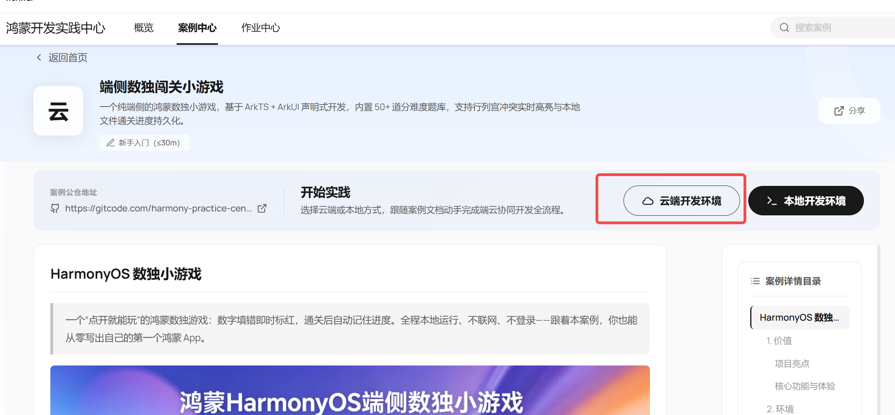
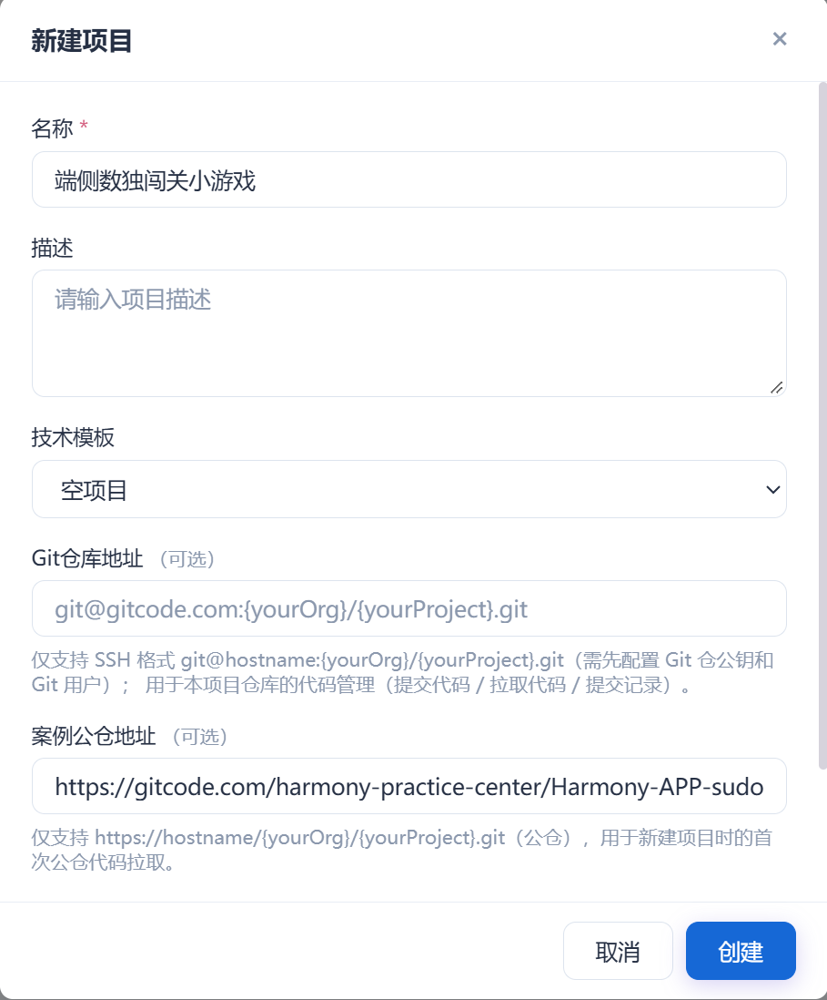
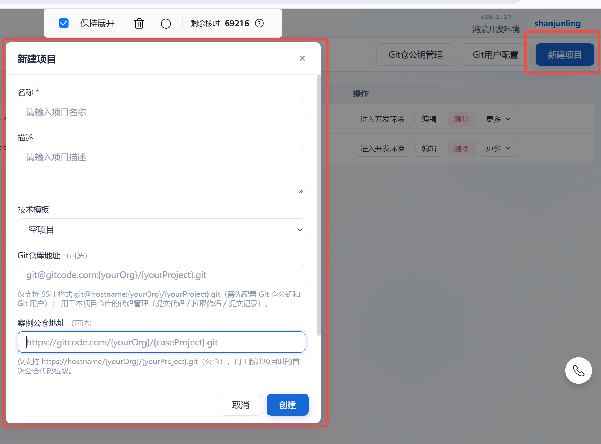
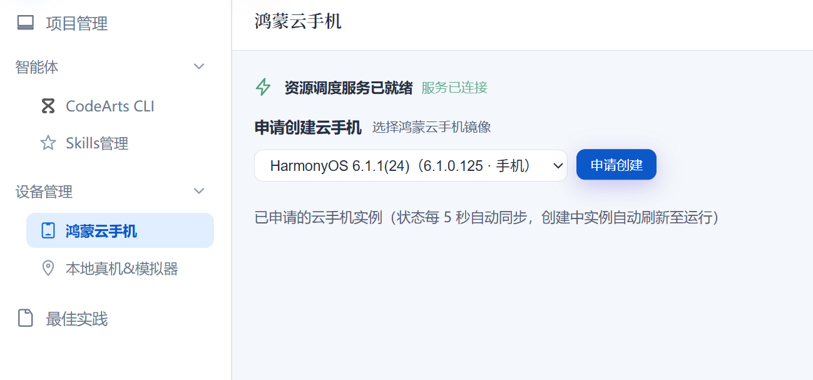

# 星海国际机场导航元服务

通过 AI 对话运行机场导航元服务，再从空项目构建自己的版本，学习原生界面、地图寻路与多页交互。

| 首页：开始新行程 | 路线预览：中央安检 | 逐步指引：电梯换层 |
| :---: | :---: | :---: |
|  |  |  |

| 学习卡 | 内容 |
| --- | --- |
| 适合谁 | 会使用 AI 编程工具，愿意核对运行效果；无需会手写 ArkTS。 |
| 难度与预计时长 | 进阶；快速体验约 15–30 分钟，完整实践约 3–6 小时（估计，不含环境和设备准备）。 |
| 将学到 | 分阶段 AI 开发、地图数据、安检约束寻路、行程状态与中英双语。 |
| 将做成 | 六页机场导览元服务：选目的地 → 选起点 → 看路线 → 分步抵达。 |
| 实践环境 | HarmonyOS SDK、云手机或本地模拟器；工程目标与兼容版本为 6.1.0（API 23）。 |

运行现成工程看[快速体验](#快速体验)，从零构建看[完整实践](#完整实践)，遇到问题看[功能检查与排障](#功能检查与排障)。更多界面见[案例截图](docs/images/product-20261001/phone/README.md)。

## 案例概览

星海国际机场是**虚构的教学场景**。应用用本地地图串联搜索、寻路与指引；用户手动选择当前位置、确认进度，无需账号、后端或 API 密钥。

### 核心功能与体验

- **去登机口**：搜索 A101 等编号，选起点，查看安检路线并开始指引。
- **坐地铁**：选往市区或往星湖，查看到站台的跨层路线。
- **找设施与看地图**：搜索设施，浏览 4F、3F、2F、1F、B1、B2，点选地点规划路线。
- **调整行程**：切换四种路线偏好，编辑或交换起终点，切换中英文。

### 技术方案一览

~~~mermaid
flowchart LR
    M["本地机场地图模型"] --> A["地点搜索与原生页面"]
    A --> S["行程状态与选择草稿"]
    S --> P["Dijkstra 路线规划"]
    M --> P
    P --> V["路线步骤与 Canvas 地图"]
    V -->|手动确认进度| S
    A <-->|语言与最近地点| L["本地 Preferences"]
~~~

[地图 JSON](data/XHA_xinghai_t1.map.json)生成 ArkTS 模型，供搜索和寻路使用。Dijkstra 按安检规则与偏好选路，结果拆为步行、安检、换层和到达步骤，驱动地图与指引面板。

| 层级 | 技术/产品 | 在案例中的作用 |
| --- | --- | --- |
| 原生页面 | ArkTS / ArkUI、Navigation | 组织首页、目的地、起点、路线、地铁方向、楼层地图六页。 |
| 数据 | 本地 JSON、ArkTS 地图模型 | 提供六层地图、119 个节点和 145 条边。 |
| 路线规划 | Dijkstra、安检规则、四种偏好 | 规划路线，分开展示步行距离与换层设施。 |
| 行程状态 | PlannerState、RouteStep | 管理选择草稿、编辑、预览与手动指引。 |
| 地图呈现 | ArkUI Canvas | 绘制地点和路线，支持平移、缩放、切层与点选。 |
| 本地保存 | Preferences | 保存语言与最近六个目的地；进度仅保留在会话内。 |
| 开发工具 | 码道 IDE、HarmonyOS Command Line Tools | AI 获取代码、编译 HAP、安装运行。 |

这些方法也适用于展馆、商场和校园导览。

## 开始之前

### 环境与资源

| 准备项 | 要求与检查 |
| --- | --- |
| 知识 | 会使用 AI 编程工具；理解节点、边和 JSON 有助于排障。 |
| 工具 | 云端进入[鸿蒙开发实践中心](https://harmonybp.developer.huaweicloud.com/)的作业中心；本地准备[码道 IDE](https://support.huaweicloud.com/usermanual-codeartsagent/codeartsagent_ug_0002.html)与 [Command Line Tools](https://developer.huawei.com/consumer/cn/deveco-studio/resources/)。 |
| 辅助脚本 | 研究现成工程的数据生成、寻路参考脚本需 Python 3；两条实践路径均不依赖这些脚本。 |
| 设备 | 云端创建并连接云手机；本地创建并启动模拟器。安装前让 AI 识别设备。 |
| 版本 | <code>compatibleSdkVersion</code> / <code>targetSdkVersion</code> 为 6.1.0（23）；让 AI 检查可用 SDK。 |
| 安装 | 让 AI 检查设备 API 与签名要求，按提示完成人工配置。 |

### 费用与配额

云端实践前，查看账号核时额度、云手机资源条件及费用说明。结束后按[安全与清理](#安全与清理)保存工程、停止资源。

## 快速体验

使用**现成工程**体验“选目的地 → 选当前位置 → 看路线 → 分步指引”。选择云端或本地路径，把提示词复制给 AI。

### 云端快速体验

在[鸿蒙开发实践中心](https://harmonybp.developer.huaweicloud.com/)操作，无需本机安装开发工具。

#### 第一步：创建项目并导入案例

从案例详情页点击 **“云端开发环境”**，核对自动带入的信息，再点击 **“创建”**。

直接进入作业中心时，点击 **“新建项目”**：

- 填写项目名称，例如“机场导航实践”。
- 技术模板选择 **“空项目”**。
- 在 **“案例仓地址”** 中填写：

~~~text
https://gitcode.com/harmony-practice-center/HarmonyOS-AtomSer-airport-guide.git
~~~

“Git 仓库地址”用于管理自己的代码，此处可留空。

**完成标志：** 开发环境中可见 <code>harmony_app</code> 和 <code>data/XHA_xinghai_t1.map.json</code>。

查看项目创建示意图（点击图片可看原图）

截图以**数独案例**演示；本实践请使用机场案例名称和上方仓库地址。

1. 在案例详情页选择“云端开发环境”。

2. 核对预填信息；案例仓地址应为机场案例 HTTPS 地址。

3. 手工创建时选空项目：快速体验填案例仓地址，完整实践留空。

#### 第二步：让 AI 编译打包

输入：

~~~text
请找到当前机场导航案例的 HarmonyOS 工程，检查 SDK、依赖与构建工具，编译 HAP。
按日志修复并重新编译，保留地图数据、寻路规则和包名。
告诉我 HAP 路径及设备 API、签名要求。
~~~

**完成标志：** 构建成功，AI 给出生成的 HAP 路径。

#### 第三步：创建云手机

进入 **“设备管理 → 鸿蒙云手机”**，选择符合工程要求的系统镜像并申请创建。

待云手机运行后，完成设备连接。

**完成标志：** 云手机运行且开发环境能识别。

查看云手机创建示意图（点击图片可看原图）

镜像和设备选项以平台当前界面为准。

#### 第四步：让 AI 安装并打开

输入：

~~~text
请识别已连接的鸿蒙云手机，推送、安装刚生成的 HAP，并打开机场导航元服务。
多个设备时先让我选择；失败时按错误处理连接、API 或签名问题。
告诉我所用设备和启动结果。
~~~

**完成标志：** 云手机上出现机场导航首页。

#### 第五步：体验机场导航

在云手机上完成以下操作：

1. 点击 **“去登机口”**，搜索并选择 **A101**。
2. 选择当前位置 **“西出发门”**。
3. 查看路线中的步行距离与中央安检提示。
4. 点击 **“开始指引”**，按照提示手动确认进度，直到确认到达目的地。

**完成标志：** 从目的地选择走完整个指引流程。

### 本地快速体验

通过码道 IDE 与 Command Line Tools，在本机编译并运行模拟器。

#### 第一步：准备开发工具

按官方指导安装：

- [码道 IDE](https://support.huaweicloud.com/usermanual-codeartsagent/codeartsagent_ug_0002.html)
- [HarmonyOS Command Line Tools](https://developer.huawei.com/consumer/cn/deveco-studio/resources/)

**完成标志：** 码道 AI 对话可用，Command Line Tools 已安装。

#### 第二步：让 AI 获取案例代码

在码道中创建项目或打开工作文件夹，输入：

~~~text
请将此案例默认分支的最新代码拉取到当前工作区的独立目录，保留已有文件：
https://gitcode.com/harmony-practice-center/HarmonyOS-AtomSer-airport-guide.git
告诉我代码位置和 HarmonyOS 工程目录。
~~~

**完成标志：** 本地可见 <code>harmony_app</code> 和 <code>data/XHA_xinghai_t1.map.json</code>。

#### 第三步：让 AI 编译打包

继续输入：

~~~text
请解析刚获取的机场导航案例，检查本机 SDK、依赖与构建工具，编译 HAP。
按日志修复并重新编译，保留地图数据、寻路规则和包名。
告诉我 HAP 路径及设备 API、签名要求。
~~~

**完成标志：** 构建成功，AI 给出本地 HAP 路径。

#### 第四步：准备模拟器

按 Command Line Tools 官方指导或 [模拟器创建说明](https://developer.huawei.com/consumer/cn/doc/HarmonyOS-Guides/ide-emulator-create)，创建并启动符合工程要求的模拟器。

回到码道，输入：

~~~text
请识别本机已启动的 HarmonyOS 模拟器，检查连接和安装条件。
告诉我可用设备；未识别时定位连接问题并给出恢复步骤。
~~~

**完成标志：** 模拟器已启动，AI 能够识别该设备。

#### 第五步：让 AI 安装并打开

输入：

~~~text
请识别本机已连接的 HarmonyOS 模拟器，推送、安装刚生成的 HAP，并打开机场导航元服务。
多个设备时先让我选择；失败时按错误处理连接、API 或签名问题。
告诉我所用设备和启动结果。
~~~

**完成标志：** 模拟器上出现机场导航首页。

#### 第六步：体验机场导航

在模拟器上完成以下操作：

1. 点击 **“去登机口”**，搜索并选择 **A101**。
2. 选择当前位置 **“西出发门”**。
3. 查看路线中的步行距离与中央安检提示。
4. 点击 **“开始指引”**，按照提示手动确认进度，直到确认到达目的地。

**完成标志：** 从目的地选择走完整个指引流程。

## 完整实践

**从空项目开始**，由 AI 创建应用代码。云端新建“空项目”，**案例仓地址留空**；本地在码道中打开空文件夹。

依次复制八组提示词，每步达到完成标志后继续；出错先修复。工具操作可参考[码道空项目开发示例](https://support.huaweicloud.com/bestpractice-codeartsagent/codeartsagent_bp_0050.html)。

### 统一教学素材

只需一份地图和三张参考图，无需拉取工程。第 2 步会让 AI 下载，也可按表中路径手动保存。

| 素材 | 保存位置 | 用途 |
| --- | --- | --- |
| [地图 JSON](https://api.gitcode.com/api/v5/repos/harmony-practice-center/HarmonyOS-AtomSer-airport-guide/raw/data/XHA_xinghai_t1.map.json?ref=6815f2c9e64b161cd1900d1e46829d8d597083d9) | <code>reference/map.json</code> | 固定地点、坐标与连接关系。 |
| [首页参考](https://api.gitcode.com/api/v5/repos/harmony-practice-center/HarmonyOS-AtomSer-airport-guide/raw/docs/images/product-20261001/phone/01-home.jpeg?ref=6815f2c9e64b161cd1900d1e46829d8d597083d9) | <code>reference/home.jpeg</code> | 导视风格与首页入口。 |
| [安检预览参考](https://api.gitcode.com/api/v5/repos/harmony-practice-center/HarmonyOS-AtomSer-airport-guide/raw/docs/images/product-20261001/phone/04-security-route-preview.jpeg?ref=6815f2c9e64b161cd1900d1e46829d8d597083d9) | <code>reference/security-preview.jpeg</code> | 路线、起终点与安检提示。 |
| [电梯指引参考](https://api.gitcode.com/api/v5/repos/harmony-practice-center/HarmonyOS-AtomSer-airport-guide/raw/docs/images/product-20261001/phone/10-elevator-transfer.jpeg?ref=6815f2c9e64b161cd1900d1e46829d8d597083d9) | <code>reference/elevator-guidance.jpeg</code> | 当前步骤、下一步与换层确认。 |

素材固定于同一版本，采用 [MIT 许可证](LICENSE)；应用代码由 AI 创建。

### 1. 检查环境

**目标：** 检查工作区、SDK、构建工具与设备。

**复制给 AI：**

~~~text
我要从空项目制作 HarmonyOS 机场导航元服务。
请只读检查工作区、原生元服务创建条件、SDK、构建工具、云手机或模拟器，
以及公开素材是否可访问，列出缺项和需要手动完成的操作。
不要拉取案例工程、写业务代码或安装未经确认的大型工具。
~~~

**完成标志：** 明确环境缺项和工程创建位置。

### 2. 确定产品需求和视觉方案

**目标：** 获取素材，确定需求与视觉方案。

**复制给 AI：**

~~~text
请为虚构的“星海国际机场”设计原生 HarmonyOS 导览元服务。
只用本地示例数据，不含实时定位、航班动态或真实机场导航。

仅下载以下素材，依次保存为 reference/map.json、reference/home.jpeg、
reference/security-preview.jpeg、reference/elevator-guidance.jpeg。
不要克隆仓库、下载其他文件或阅读示例源码。
地图 JSON：https://api.gitcode.com/api/v5/repos/harmony-practice-center/HarmonyOS-AtomSer-airport-guide/raw/data/XHA_xinghai_t1.map.json?ref=6815f2c9e64b161cd1900d1e46829d8d597083d9
首页参考：https://api.gitcode.com/api/v5/repos/harmony-practice-center/HarmonyOS-AtomSer-airport-guide/raw/docs/images/product-20261001/phone/01-home.jpeg?ref=6815f2c9e64b161cd1900d1e46829d8d597083d9
安检预览参考：https://api.gitcode.com/api/v5/repos/harmony-practice-center/HarmonyOS-AtomSer-airport-guide/raw/docs/images/product-20261001/phone/04-security-route-preview.jpeg?ref=6815f2c9e64b161cd1900d1e46829d8d597083d9
电梯指引参考：https://api.gitcode.com/api/v5/repos/harmony-practice-center/HarmonyOS-AtomSer-airport-guide/raw/docs/images/product-20261001/phone/10-elevator-transfer.jpeg?ref=6815f2c9e64b161cd1900d1e46829d8d597083d9

核对 JSON 可解析，含 119 个节点、145 条边；三张图片为 JPEG。
地图原始字节 SHA-256：a61d3d22cde1d320533c07d9a8f692dcf707110ca7f950a5de4f2913febbb256。
下载失败就停止，让我手动获取；不能使用 HTML 错误页。

六页：首页、目的地、起点、路线预览与指引、地铁方向、六层地图。
首页展示机场名和“你想去哪里？”，提供“去登机口”“坐地铁”“找设施”。
新行程起终点为空，先选目的地再手动选当前位置；起点页用“你现在在哪里？”。
主要动作依次为“选择出发位置”“从这里出发，查看路线”“开始指引”。
指引突出当前与下一步，用户手动确认进度。
陆侧与空侧间必经中央安检；跨层说明电梯、扶梯或楼梯。
偏好为“推荐路线、优先电梯、优先扶梯、尽量少走楼梯”。
支持中英双语，保存最近六个目的地；进度仅留在会话内。

浅色机场导视：主色 #007F7A、背景 #F4F7F9、白卡、文字 #172B3A、
安检色 #B86A12；系统 Sans 字体、原生符号或本地 SVG。
正文至少 16fp、辅助文字至少 14fp、按钮高度至少 48vp，适配安全区、胶囊、键盘与宽屏。
先输出页面流程、交互与异常状态、视觉层级和功能完成标准，
保存需求与设计记录，暂不写应用代码。
~~~

**完成标志：** <code>reference/</code> 素材齐全，六页需求与设计已保存。

### 3. 创建可编译的原生元服务工程

**目标：** 建立可编译的原生工程与六页骨架。

**复制给 AI：**

~~~text
按已保存的需求与设计，创建原生 ArkTS / ArkUI 元服务工程。
目标与兼容版本为 HarmonyOS 6.1.0（API 23）。
配置包名、入口、资源和六页导航骨架，使用当前 SDK 与工具，不写死机器路径或复制案例。
执行调试构建，按日志修复，告诉我工程入口、构建命令、HAP 路径与导航情况。
设备运行留到后续步骤。
~~~

**完成标志：** 生成 HAP，建立六页骨架与导航入口。

### 4. 接入统一地图，做首页与目的地搜索

**目标：** 接入固定地图，完成首页与地点搜索。

**复制给 AI：**

~~~text
将 reference/map.json 和三张参考图接入自己的工程，保留原始 JSON。
先做首页、六层入口和目的地分类/搜索，地图数据以 JSON 为准。
首页展示机场名、“你想去哪里？”及“去登机口”“坐地铁”“找设施”；
4F、3F、2F、1F、B1、B2 入口用两列完整展示。

地图含 119 个节点、145 条边：
xha_p4_sec 为中央安检，xha_p4_doorW 为西出发门，xha_p4_airMall 为空侧商业区。
节点含 id、中文 name、type、floor、x、y；lift 表示电梯。
边含 from、to、type、weight：walk 的 weight 为步行米数，垂直边为选路成本。
坐标只用于绘图，不推算距离；独立补齐英文地点名和登机口别名。
side 需派生：在双向图中临时移除 xha_p4_sec，
与 xha_p4_airMall 连通的地点为空侧，其余为陆侧；安检单独处理。

只展示可选公开地点，隐藏普通中转节点。
搜索忽略首尾空格和英文大小写，精确登机口编号优先；无结果可清除重选。
选目的地后用“选择出发位置”继续。
地铁先选往市区或往星湖，再复用手动起点流程。
检查字段、连通性、数据加载与搜索。
~~~

**完成标志：** 六层入口可见，A101 可搜索；列表不混入普通中转节点，原始 JSON 保留。

### 5. 完成起点与规划

**目标：** 完成起点选择与路线预览。

**复制给 AI：**

~~~text
完成“先目的地、后起点”流程，新行程起终点为空。
起点页用“你现在在哪里？”，手动选择后点击“从这里出发，查看路线”。

用 Dijkstra 在双向图上规划，提供“推荐路线、优先电梯、优先扶梯、尽量少走楼梯”。
步行边用原 weight；垂直边按电梯/扶梯/楼梯乘以下系数：
推荐 1/1/1，优先电梯 0.7/1.6/3.2，优先扶梯 1.3/0.8/2.2，尽量少走楼梯 1/1.4/6。
系数仅影响选路；陆侧与空侧间必经 xha_p4_sec，同侧不绕行。
安检为起点或终点时，直接规划与另一地点之间的路线。
预览显示步行米数、换层次数和“开始指引”；步行只累计 walk 边，垂直边单独提示换层。
检查西出发门到 A101、同侧两点、跨层到地铁站台。
相同点位提示“起点和目的地相同”；不可达时说明原因，两者均可重选。
~~~

**完成标志：** 路线可预览；异侧经安检，同侧不绕行；步行与换层分开显示，相同或不可达地点可重选。

可在第 6 步前按[快速体验](#快速体验)连接云手机，或按[模拟器说明](https://developer.huawei.com/consumer/cn/doc/HarmonyOS-Guides/ide-emulator-create)准备本地设备，也可留到第 8 步运行。

### 6. 完成地图与手动指引

**目标：** 联动地图、路线与手动指引。

**复制给 AI：**

~~~text
完成六层地图，以及路线预览、指引、完成三种状态。
地图支持平移、点选、缩放、“查看全层”“查看当前路线”。
地图设起点后给出反馈并引导选目的地；起终点、当前段、安检、换层设施清晰可见，
默认视口容纳关键标记，标签与控件避免遮挡。

路线拆为步行、安检、换层、到达步骤，突出当前与下一步，按步骤提供手动确认按钮。
支持上一步与全程步骤；用路段索引关联地图，重复经过同一楼层也能对应。
查看其他楼层或路段不推进进度。
适配手机、大字体与宽屏，主要按钮可见并避让系统区域。
设备已连接时安装，检查安检与跨层流程；否则先做逻辑检查，第 8 步运行。
~~~

**完成标志：** 地图与步骤同步，查看楼层不推进；指引可完成、回退，按钮可操作。

### 7. 补齐双语、状态与异常

**目标：** 补齐双语、编辑状态与异常处理。

**复制给 AI：**

~~~text
补齐所有文案与地点名的中英双语，本地保存语言和最近六个目的地。
进度仅留在会话内，新行程起终点为空。
编辑先改草稿：取消保留原路线和进度；确认后重新规划、回到预览、步骤归零。
交换起终点或修改偏好也重新规划并归零。
处理相同地点、无路、数据缺失、返回、键盘遮挡与地图无可选地点。
检查双语、重启保存、编辑取消/确认、偏好、交换、上一步与完成页，修复问题。
~~~

**完成标志：** 双语与最近地点保存正常，编辑取消保留、确认重置，异常可恢复。

### 8. 运行并检查完整流程

**目标：** 安装运行，检查完整流程。

**复制给 AI：**

~~~text
编译元服务，给出 HAP 路径。设备未就绪时指导创建、启动与连接，
在我选定的设备上推送、安装、打开；按错误处理连接、API 与签名问题。
逐项体验：新行程空起终点、A101、西出发门、中央安检预览、
当前/下一步手动指引与完成页、同侧免安检、地铁跨层与电梯偏好、
六层地图、双语与最近地点、编辑取消/确认、交换与返回。
按需求检查，结合日志修复后重新运行对应操作，告诉我如何再次构建和运行。
~~~

**完成标志：** 云手机或模拟器上完成选目的地、选起点、看路线与分步抵达。

## 功能检查与排障

### 体验检查

按下表检查常用场景与状态变化。

| 场景 | 操作 | 可观察的完成标志 |
| --- | --- | --- |
| 新行程 | 首页进入“去登机口” | 起终点为空，先选目的地再选起点。 |
| 安检路线 | 选 A101 → 西出发门 | 预览提示中央安检；指引展示当前与下一步，手动确认推进。 |
| 同侧路线 | 选同侧两点 | 无需安检，不绕行。 |
| 跨层与偏好 | 4F → B2 市区站台，选“优先电梯” | 列出换层并要求确认；步行米数不含垂直边。 |
| 状态回退 | 查看其他楼层、全程步骤，返回上一步 | 查看不推进，上一步回退；改偏好或确认编辑后重回预览。 |
| 编辑与交换 | 编辑后取消、确认，再交换起终点 | 取消保留路线及进度；确认、交换重新规划并重置。 |
| 双语与最近 | 切换 English、选择目的地后重启 | 文案与地点名切换；语言、最近 6 个目的地保留，新行程起终点为空。 |
| 六层地图 | 依次进入 4F、3F、2F、1F、B1、B2 | 全层、缩放、点选可用；地点可用于规划。 |
| 相同地点 | 起终点选同一地点 | 提示“起点和目的地相同”，可重选。 |
| 搜索无结果 | 输入无匹配查询 | 提示无结果，可清除后重选。 |

### 运行检查

- [ ] 构建成功，生成 HAP。
- [ ] 选定设备安装成功，首页可打开。
- [ ] 地点可搜索，路线预览与指引可完成。
- [ ] 错误输入或操作有恢复入口。

### 高频问题

| 现象 | 先检查 | 处理方向 |
| --- | --- | --- |
| 找不到 SDK、Node、Java 或构建工具 | 工具是否齐全、路径是否有效 | 补齐工具后重新编译；勿照搬其他机器的路径。 |
| 构建成功但未找到 HAP | 工程目录、构建日志与产物路径 | 让 AI 定位生成的 HAP，再安装。 |
| 设备不可见或安装失败 | 设备运行、连接与签名状态 | 按错误处理连接、API 或签名配置。 |
| 页面打开但路线为空 | 起终点是否已选、是否相同 | 重选两个不同地点。 |
| 布局或搜索结果与示例不同 | 窗口、语言、字号和查询 | 对照[案例截图](docs/images/product-20261001/phone/README.md)，让 AI 检查数据与布局。 |

将操作和错误日志交给 AI：

~~~text
请根据我的操作与日志复现问题，区分环境、编译、设备/签名或业务逻辑原因。
按已有需求设计修复，重新构建或运行对应步骤，说明原因、结果与下一步。
~~~

## 安全与清理

### 实践中的安全注意事项

- 使用虚构机场地图；语言和最近目的地保存在设备本地。
- 按工具指导配置签名，不向公开仓库提交私钥或登录凭据。
- 反馈时附环境、步骤和日志，移除敏感配置。

### 清理资源

1. 保存源码、需求设计和所需 HAP。
2. 用工作区上方的关机操作停止云端环境，节省核时；关闭浏览器页签不会停止环境。
3. 按平台说明停止不再使用的云手机，核对状态；本地关闭模拟器。
4. 保留后续所需配置，清理临时签名和测试数据。

**完成标志：** 资料已保存，闲置资源已停止。

## 项目导览与进阶

### 关键目录

~~~text
data/XHA_xinghai_t1.map.json                 六层图数据，节点、边与示例地点
tools/gen_model.py                            将地图生成类型化 ArkTS 模型
tools/pathfind_reference.py                   Python 寻路参考检查
tools/verify_product.mjs                      ETS 逻辑回归
tools/smoke_emulator.py、verify_flows.py       模拟器核心与扩展流程
harmony_app/AppScope/app.json5                 包名、atomicService、版本
harmony_app/entry/src/main/ets/
  entryability/EntryAbility.ets               应用入口
  pages/                                      六页 Navigation 体验
  core/                                       Pathfinder、PlannerState、RouteSteps、Viewport 等
  model/                                      AirportMap、Loc、Localization、Categories
  ui/                                         FloorCanvas、Common、Theme、PlacePicker
docs/images/product-20261001/phone/           11 张原始手机截图与说明
cases/                                        既有案例导入材料
~~~

### 完成回顾

完成后，你能：

- 用 AI 运行现成工程，从空项目构建元服务。
- 用地图数据实现搜索、安检约束与跨层寻路。
- 联动地图与手动进度，处理编辑、返回、双语和本地保存。

### 深入阅读与扩展

对照源码可按 <code>data</code> → <code>gen_model.py</code> → <code>model/AirportMap.ets</code> → <code>core/Pathfinder.ets</code> / <code>RouteSteps.ets</code> → <code>pages/Route.ets</code> → <code>ui/FloorCanvas.ets</code> 阅读，再看 <code>PlannerState.ets</code>。英文名称维护在生成脚本的 <code>NAME_EN</code> 中。

尝试为自己的工程新增设施：

~~~text
请在我的机场导览工程中新增一处本地设施。
根据 reference/map.json 和需求设计，说明节点、边、英文名、分类与地图标记的改动。
不要复制案例或运行会覆盖自定义地图的脚本。
验证新设施可搜索、点选、规划，原有安检与跨层路线仍正常。
~~~

还可扩展设施分类、地图标注、语言或场馆数据。改造后检查受影响的流程。

## 参考与维护

### 官方资料与帮助

[HarmonyOS 开发文档](https://developer.huawei.com/consumer/cn/harmonyos) · [元服务入门](https://developer.huawei.com/consumer/cn/fa/get-started/) · [DevEco Studio](https://developer.huawei.com/consumer/cn/deveco-studio/)

### 维护信息

| 项目 | 当前信息 |
| --- | --- |
| 案例归属 | 鸿蒙开发实践中心 |
| 维护团队 | 鸿蒙实践案例开发团队（见 [LICENSE](LICENSE)） |
| 应用版本 | <code>1.0.0</code>，以 <code>harmony_app/AppScope/app.json5</code> 为准 |
| 案例说明更新 | 2026-10-01 |
| 反馈 | 在 [GitCode 仓库](https://gitcode.com/harmony-practice-center/HarmonyOS-AtomSer-airport-guide) 的 Issues 提交问题，附环境、步骤及预期/实际结果。 |
| 许可证 | [MIT](LICENSE)；第三方素材和依赖遵循各自许可。 |

#### 案例迭代记录

- 2026-10-01：完善导航体验、云端/本地快速体验与八阶段 AI 实践指南。

### 许可证

本案例采用 [MIT 许可证](LICENSE)。第三方依赖及素材遵循各自许可证。
