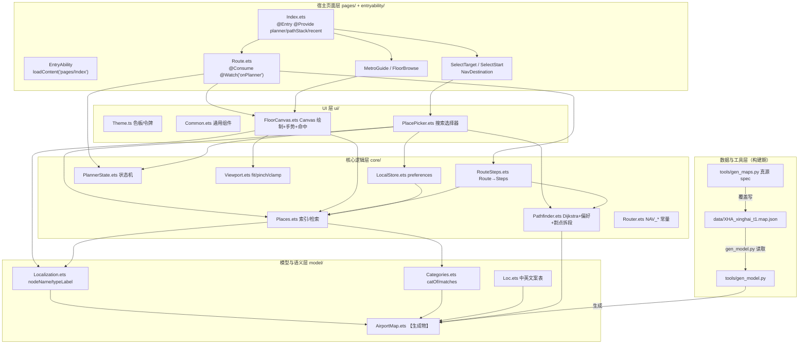
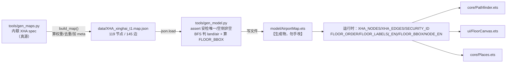
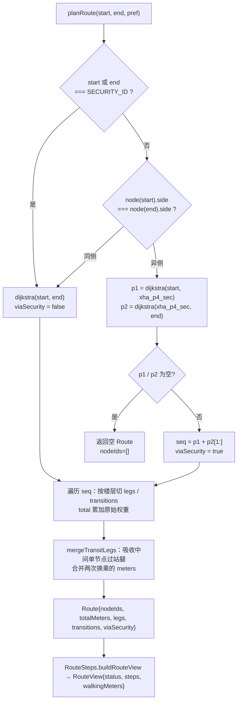
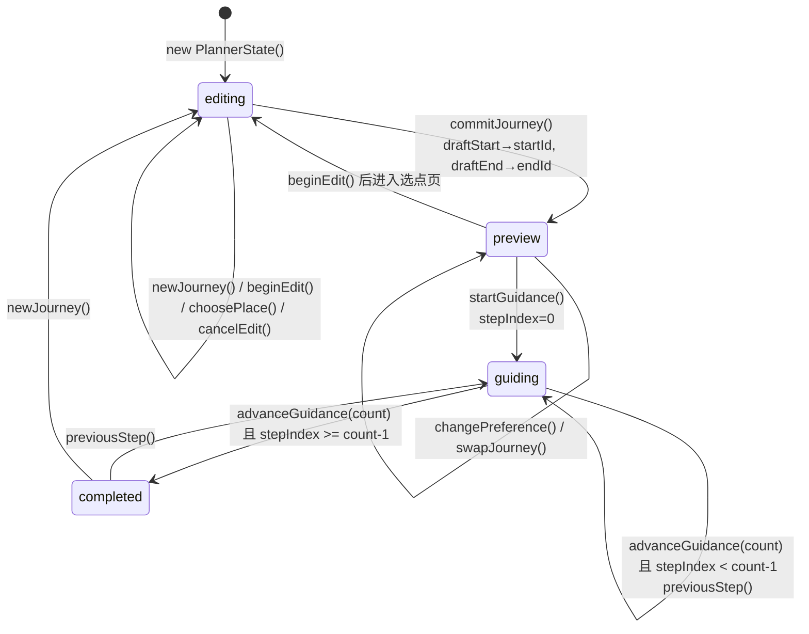
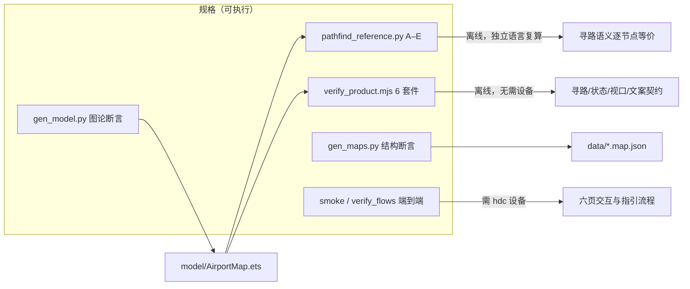

# 架构与数据流（architecture.md）

> 图片编号 05 · 架构和数据流

本文档面向"接手这个项目做开发的 AI Agent"，回答四件事：系统分成哪几层、各层边界在哪；一份地图数据从 `tools/gen_maps.py` 到屏幕上的路线是怎么流动的；一次"选目的地 → 看路线 → 分步指引"在代码里依次经过哪些函数；以及**改一处会影响什么**。文中所有非显然结论都给出仓库相对路径（多数带行号），可直接点开比对；凡与源码冲突，以源码为准。

---

## 1. 总体分层与职责边界

项目是一个单模块（`entry`）元服务，源码全部在 `harmony_app/entry/src/main/ets/`，共 22 个 `.ets` 文件。依赖方向是一条严格单向的链：`pages → ui → core → model`（外加最底下的 `data/` 与 `tools/` 生成链）。下表是逐层职责与硬边界。

| 层 | 主要文件 | 职责 | 边界（不能做的事） |
|---|---|---|---|
| 宿主页面层 | `entryability/EntryAbility.ets`、`pages/Index.ets`、`pages/SelectTarget.ets`、`pages/SelectStart.ets`、`pages/Route.ets`、`pages/MetroGuide.ets`、`pages/FloorBrowse.ets` | 单页 `@Entry` 宿主 + `Navigation` 分发二级 `NavDestination`；持有并下发全局行程状态；组织页面布局、绑定按钮 | 不实现算法、不直接读写 `preferences`、不直接解析地图 JSON |
| UI 层 | `ui/Theme.ets`、`ui/Common.ets`、`ui/FloorCanvas.ets`、`ui/PlacePicker.ets` | 色板与设计令牌；通用组件（`AppIcon`/`PageHeader`/`PrimaryAction`/`EmptyState`/`PlaceRow`/`SectionTitle`）；Canvas 绘制与手势；地点选择器 | 不定义状态转移规则（只调用 `core/PlannerState.ets` 的纯函数）；不写死文案（统一走 `Loc.t`） |
| 核心逻辑层 | `core/Pathfinder.ets`、`core/RouteSteps.ets`、`core/PlannerState.ets`、`core/Places.ets`、`core/Viewport.ets`、`core/LocalStore.ets`、`core/Router.ets` | 寻路与权重、Route→步骤投影、行程状态机、地点索引与检索、视口数学、本地存储、路由名常量 | 不 import `ui/` 或 `pages/`（已核对全部 import，无反向依赖、无循环）；不做绘制 |
| 模型与语义层 | `model/AirportMap.ets`（**生成物**）、`model/Localization.ets`、`model/Categories.ets`、`model/Loc.ets` | 类型化节点图常量（节点/边/元信息/楼层包围盒/英文名）；中英名与类型标签解析；分类与搜索匹配；界面文案表 | `AirportMap.ets` **禁止手改**；其余三个文件只依赖 `AirportMap.ets` |
| 数据与工具层 | `data/XHA_xinghai_t1.map.json`、`tools/gen_maps.py`、`tools/gen_model.py`、`tools/pathfind_reference.py`、其余 `tools/*` | 地图数据的唯一真源与两种"编译"产物（JSON、ArkTS）、离线校验脚本 | 不参与运行时；不进 HAP |

分层的可验证形式是 import 图（下面 `graph TD` 中的箭头即真实 import 方向）：



**给 AI 的三个判断法则**：

1. 只涉及展示/交互 → 落在 `ui/` 或 `pages/`；涉及"什么算一条路线、怎么算" → 落在 `core/`。
2. `core/` 中只有 `LocalStore.ets` 依赖平台 API（`@kit.ArkData`、`@kit.AbilityKit`），其余文件只依赖 `model/` 与彼此，因此核心逻辑可以被 `tools/verify_product.mjs` 用 TypeScript 转译后**在 Node 里直接跑**（见 §9）。
3. 任何"地图长什么样"的改动都不能落在 `model/AirportMap.ets`，必须回到 §2 的生成链。

---

## 2. 数据生成链

### 2.1 真实方向：不是"JSON → 生成器"，而是"脚本 → JSON → ArkTS"

任务常见的表述是 `data/*.map.json → gen_maps.py → gen_model.py → AirportMap.ets`，但**实际数据流方向与此相反**，这一点必须先纠正，否则会踩坑：

- `tools/gen_maps.py` 里内联着紧凑的 `XHA` spec（节点三元组 + 边三元组，`tools/gen_maps.py:90` 起），`main()` 把它"编译"成标准 map JSON 并**覆盖写** `data/XHA_xinghai_t1.map.json`（`tools/gen_maps.py:406-421`）。
- `tools/gen_model.py` 读这份 JSON，生成 `harmony_app/entry/src/main/ets/model/AirportMap.ets`（`tools/gen_model.py:21-22`）。

所以 **`tools/gen_maps.py` 是地图真源**，`data/XHA_xinghai_t1.map.json` 是中间产物。直接编辑 JSON 再跑 `gen_maps.py`，改动会被覆盖（`AGENTS.md` 红线 #2 同此结论）。`data/README.md:54` 的"改 JSON 后重跑 `gen_maps.py`"表述与此冲突，属上游文档待修正项。



### 2.2 每一步的输入、输出与设计理由

| 步骤 | 输入 | 输出 | 关键处理 | 为什么这样设计 |
|---|---|---|---|---|
| `tools/gen_maps.py` | 脚本内 `XHA` spec（每层节点 `(id,name,type,x,y)`、边 `(from,to,type)`） | `data/XHA_xinghai_t1.map.json` | walk 权重 = `max(10, round(欧氏像素距离 / PX_PER_METER / 5) * 5)`，`PX_PER_METER = 2.0`（`tools/gen_maps.py:16,46-49`）；垂直边取固定基准 `elevator 30 / escalator 40 / stair 25 / apm 350`（`tools/gen_maps.py:18`）；按 `(节点对, 类型)` 去重成无向边（`tools/gen_maps.py:58-66`）；写入 `meta`（schema/airport/name/pxPerMeter/floors/version/date/note/source，`tools/gen_maps.py:67-84`） | 让"物理长度"只有一处定义，且米数可复算；`note` 明示"示意拓扑、非真实比例" |
| `tools/gen_model.py` | 上述 JSON + 脚本内 `NAME_EN` 中英名表（`tools/gen_model.py:25-102`）与 `FLOOR_EN`（`104-111`） | `model/AirportMap.ets`（2139 行） | `assert len(secs) == 1` 强制唯一安检（`127-132`）；从第一个 `entrance` 出发、**跳过安检节点**做 BFS，把可达节点标 `land`、其余标 `air`、安检本身标 `gate`（`138-145`，`assert air_c > 0`）；按层算 `FLOOR_BBOX`（`147-151`）；所有键值字典一律产出 `Map` + 逐条 `set()` 而非对象字面量（`156-163`）；写文件头注释含规模与"请勿手改"（`172-228`） | 端侧只导入一个强类型常量文件，零运行时解析、零 IO；`side` 与 `FLOOR_BBOX` 在构建期算好，端侧只做查表；`Map` 写法是 ArkTS `arkts-no-untyped-obj-literals` 规则的硬要求（`tools/gen_model.py:156-157`） |
| 运行时 | `AirportMap.ets` 常量 | 寻路/绘制/检索 | 惰性建索引（`core/Pathfinder.ets:27-86`）、`Places` 模块加载即建索引（`core/Places.ets:4-5`） | 数据规模小（119/145），一次性建表成本可忽略，换来实现简单 |

### 2.3 坐标为什么是"图片像素空间"（数据先于底图）

`(x, y)` 存在**每层各自的示意背景图像素空间**，层与层坐标空间独立（`data/README.md:38`）。项目约定是**图（Graph）先于图（图片）**：先用节点坐标把拓扑定下来，示意底图再按这些坐标绘制，于是"背景图上的位置"与"节点坐标"天然对齐，不需要任何配准步骤（`data/README.md:5-6`）。

由此带来三个可观察后果：

- 米数由 `pxPerMeter = 2.0` 换算而来（`tools/gen_maps.py:16`、`AirportMap.ets` 的 `XHA_META.pxPerMeter`），**换底图图片分辨率会整体改变所有距离**；要改标定，只改 `PX_PER_METER` 后重跑生成链。
- 端侧 Canvas 从不 `drawImage` 底图：`ui/FloorCanvas.ets` 直接用坐标画楼层底板、走道线、节点与文字（`ui/FloorCanvas.ets:57-81`）。也就是说"底图"是画出来的，不是贴图。
- 每层 `FLOOR_BBOX` 由该层节点坐标的极值生成（`tools/gen_model.py:147-151`），视口适配（`core/Viewport.ets`）完全依赖它。

### 2.4 改数据的正确姿势

```text
1. 编辑 tools/gen_maps.py 的 XHA spec（加/改节点、加/改边）      ← 唯一真源
2. python3 tools/gen_maps.py        # 覆盖写 data/XHA_xinghai_t1.map.json
3. python3 tools/gen_model.py       # 生成 model/AirportMap.ets（会 assert 安检唯一、空侧非空）
4. python3 tools/preview_nodes.py   # 可选：渲染 preview/*.svg 目视校对（preview/ 已被 .gitignore 忽略）
5. 若新增中文名，需在 tools/gen_model.py 的 NAME_EN 补英文名，否则会打印 "⚠ 缺英译名称"（tools/gen_model.py:230-232）
```

`gen_maps.py` 自带结构断言，违反约定会在生成阶段直接失败而不是在端侧崩：节点 id 唯一、边两端存在、`walk` 边不得跨层（`tools/gen_maps.py:41-53`）。`gen_model.py` 再补两条图论断言：安检恰好一个、空侧非空（`tools/gen_model.py:131,145`）。这就是"数据规格 = 可执行断言"的第一道闸。

---

## 3. 寻路算法（`core/Pathfinder.ets`）

### 3.1 图索引与权重

四个概念先明确（全部在 `core/Pathfinder.ets` 与 `tools/gen_maps.py` 有定义）：

- **原始权重（米）**：walk 边是真实米数；垂直边是基准 30/40/25（电梯/扶梯/楼梯）。写入 JSON 与 `AirportMap.ets`。
- **生效权重（米）**：Dijkstra 实际使用的边权。walk 直接用原始值；垂直边 = `round(基准 × 偏好乘子)`（`core/Pathfinder.ets:89-99`）。
- **显示权重（米）**：`RouteLeg.meters` / `RouteTransition.meters` / `Route.totalMeters` 一律累加**原始权重**，与偏好无关（`core/Pathfinder.ets:218-247`，注释在 218 行）。
- **偏好档位**：`PREF_SHORTEST=0 / PREF_ELEVATOR=1 / PREF_ESCALATOR=2 / PREF_AVOID_STAIR=3`（`core/Pathfinder.ets:7-10`）。

垂直边基准与四档乘子（源码 `core/Pathfinder.ets:13-24`，下表末列为 `round(基准×乘子)` 的算术结果，四个乘积均为整数，`Math.round` 是恒等变换）：

| 偏好档 | elevator（基准 30m） | escalator（基准 40m） | stair（基准 25m） |
|---|---|---|---|
| 0 最短距离 | ×1.0 → 30 | ×1.0 → 40 | ×1.0 → 25 |
| 1 优先电梯 | ×0.7 → 21 | ×1.6 → 64 | ×3.2 → 80 |
| 2 优先扶梯 | ×1.3 → 39 | ×0.8 → 32 | ×2.2 → 55 |
| 3 避开楼梯 | ×1.0 → 30 | ×1.4 → 56 | ×6.0 → 150 |

`walk` 边**不参与**乘子表（`edgeWeight` 在 `tp === 'walk'` 时提前 return，`core/Pathfinder.ets:91-93`）。找不到类型时的兜底是基准 25、乘子 1（`94-98`）。

**惰性构建的三张表**（模块级单例，首次调用时填充）：

| 变量 | 内容 | 构建处 |
|---|---|---|
| `_nodeIndex` | `id → MapNode` | `core/Pathfinder.ets:35-49`（`node()`，找不到时 `throw`，见 `44-47`） |
| `_adj` | `id → (邻接 id → 原始权重)`，无向图两侧都写入 | `core/Pathfinder.ets:51-73`（`adjTable()`） |
| `_etype` | `"min|max" → 边类型`，键由 `edgeKey()` 规范化 | `core/Pathfinder.ets:31-33, 75-86` |

注意 `_etype` 用**规范化无序键**，所以同一对节点之间不能存在两条不同类型/不同权重的平行边——否则后者会覆盖前者的类型。当前数据无此情况（已核对：0 组同节点对多类型边）。这是一个隐性数据约束。

### 3.2 Dijkstra 实现细节

`dijkstra(pref, src, dst)`（`core/Pathfinder.ets:102-160`）是**朴素 O(V²)** 版本，不是堆优化版：

1. `dist`/`prev` 用 `Map`，`visited` 用 `Set`；`dist.set(src, 0)`。
2. 每轮用 `dist.forEach` 线性扫描出未访问的最小距离节点（`108-116`）——119 节点规模下完全够用，且避免了 ArkTS 下自己实现优先队列的复杂度。
3. `u === dst` 时提前 `break`（`120-122`），只求单点最短路。
4. 松弛时对邻接表 `forEach`，边权走 `edgeWeight(cur, v, raw, pref)`（`130-144`）。
5. 有一个 ArkTS 特有的写法值得注意：闭包内捕获循环变量 `u` 会丢失类型收窄，所以先把 `const cur = u` 冻结再进 `forEach`（`124-125` 的注释与代码，`BUILD.md` 的踩坑表同此记录）。
6. 回溯失败（`prev` 缺失）返回空数组表示不可达（`147-159`）。

### 3.3 唯一安检割点：为什么"异侧拆两段"严格等价

`planRoute(startId, endId, pref)` 分三种情况（`core/Pathfinder.ets:192-213`）：

1. **起点或终点就是安检节点** → 直接单次 Dijkstra（`197-198`）。此时 `viaSecurity` 保持 `false`：语义上"以安检为端点"不算"途经安检"。
2. **两侧相同**（`s.side === e.side`）→ 直接单次 Dijkstra（`core/Pathfinder.ets:202-203`）。
3. **两侧不同** → `viaSec = true`，分别求 `start→sec` 与 `sec→end`，把两段拼接（去掉重复的安检节点）：`seq = p1.concat(p2.slice(1))`（`205-212`）。任一段不可达则返回空 Route。

**等价性论证**（这是整套算法的正确性基石）：

- 图里有且仅有一个 `type === 'security'` 的节点 `xha_p4_sec`，该约束由 `tools/gen_model.py:131` 的 `assert len(secs) == 1` 在构建期强制。
- `side` 字段不是人工标注的，而是**从入口节点 BFS、且不经过安检节点**得到的结果：可达者 `land`，不可达者 `air`（`tools/gen_model.py:138-145`，`tools/pathfind_reference.py:116-126` 用同一算法独立复算）。
- 由构造可知：陆侧任一节点到空侧任一节点的**任何**路径都必须经过安检节点——否则该空侧节点本就会在跳过安检的 BFS 中被标记为 `land`，矛盾。故 `xha_p4_sec` 是割点（当前它的度为 2，只连 `xha_p4_preSec` 与空侧首个节点）。
- 于是"`A→S` 最短路 + `S→B` 最短路"就是"`A→B` 且必经 `S` 的最短路"，与在整张图上跑一次 Dijkstra 的结果逐节点相同。`tools/pathfind_reference.py` 的检查 B 就是在断言这一点：对随机异侧起终点，`plan()` 的分段结果必须 **严格等于** 全图 Dijkstra 的结果，且结果必须包含安检节点（`tools/pathfind_reference.py:151-159`）。
- 反过来，同侧路线被断言"绝不包含安检"（`tools/pathfind_reference.py:157-159`）。`verify_product.mjs` 用 `viaSecurity === crossSide` 在 2000 条随机路线上复验同一性质（`tools/verify_product.mjs:72`）。

结论：**不需要在算法里写"必须过安检"的特判**，割点性质让"拆分两段"与"全图最短路"在数学上等价。

### 3.4 `legs` / `transitions` 的切分与 `mergeTransitLegs`

拿到节点序列 `seq` 后（`core/Pathfinder.ets:217-247`）：

- 逐条边累加 `total += 原始权重`。
- **同层连续**节点并入当前 `leg`（`ids` 数组、`legMeters` 累加）。
- **跨层**（`node(v).floor !== curFloor`）时：先把当前 leg 压栈，再压入一条 `RouteTransition`（记录 `fromId/toId/viaType/viaName/fromFloor/toFloor/meters`，其中 `viaName` 取换层设施节点的 name，例如"中庭观光电梯"），然后以新层开一条新 leg，`legMeters = 0`。注意垂直边的那段米数**只进 `transitions[i].meters`**，不进任何 leg。
- 循环结束后压入最后一条 leg（`245-247`）。

因此恒有 `sum(legs.meters) + sum(transitions.meters) === totalMeters`。

`mergeTransitLegs(legs, trans)`（`core/Pathfinder.ets:259-283`）解决一个显示问题：像 `4F → 2F → 1F` 这种"中间只停一下电梯"的路线，会产生一条只含单个节点的过站腿（2F），在 UI 上表现为一个**空 Tab**。规则是：

- 从 `i` 出发压入 `legs[i]`，然后只要 `legs[j]` 的 `nodeIds.length === 1` 且 `j < legs.length - 1`，就把它吸收进同一条换乘：把 `trans[i]` 与 `trans[j]` 合并为 `fromId=t.fromId, toId=t2.toId, meters=t.meters + t2.meters`，保留首个 `viaType/viaName`（`271-278`）。
- `j < legs.length - 1` 保证**终点腿永远不会被吸收**；起点腿是 `i` 本身也不会被吸收。所以合并只会吃掉"既非起点也非终点的单节点过站腿"。
- 合并后 `legs` 数量减少、`transitions` 数量同步减少，UI 的楼层 Tab 与换乘计数随之减少（`pages/Route.ets:216-221` 渲染楼层 Tab，`126` 渲染步骤列表）。

### 3.5 为什么"偏好只影响选路、不影响显示米数"

这是有意的产品决策，不是疏漏：

- 选路时用生效权重（`edgeWeight`，`core/Pathfinder.ets:89-99` 被 `138` 调用），所以换偏好能改变走哪条路、用哪个换层设施。
- 显示时用原始权重（`core/Pathfinder.ets:228-230` 取 `adjTable().get(u)?.get(v)` 即原始值），所以"步行约 N 米"不会因为选了"优先电梯"而凭空变成 21 米/次。
- 代价：非最短偏好下显示的米数**可能不是全图最短的米数**（因为选的是生效权重下的最优解）。这是有意取舍——对旅客而言"电梯我更方便"比"少 5 米"更可解释。任何"让米数随偏好变化"的改动都属于产品决策变更，必须同步 `tools/pathfind_reference.py:135-138` 与 `tools/verify_product.mjs` 的断言。



---

## 4. 路线视图与步骤（`core/RouteSteps.ets`）

`buildRouteView(startId, endId, pref)` 是"算法输出"与"用户看到的东西"之间的唯一投影层（`core/RouteSteps.ets:12-41`），返回 `RouteView { status, route, steps, walkingMeters }`。

**`status` 取值与判定顺序**（顺序即优先级）：

| status | 触发条件 | 代码 |
|---|---|---|
| `missing` | `startId === ''` 或 `endId === ''` | `core/RouteSteps.ets:15` |
| `invalid` | 任一端 `place(id) === undefined`（数据里找不到） | `16` |
| `same` | `startId === endId` | `17` |
| `unreachable` | `planRoute` 返回空 `nodeIds` | `19` |
| `ready` | 以上都不成立 | 默认值，`14` |

`pages/Route.ets` 对非 `ready` 直接渲染 `EmptyState`，标题就是 `Loc.t(status)`（`pages/Route.ets:186-189`）——所以 `Loc.ets` 里必须有 `missing/invalid/same/unreachable` 四个键（`model/Loc.ets:103-106`）。

**`steps` 的生成规则**（`RouteStep { kind, fromId, toId, floor, toFloor, legIndex, meters, facility }`，`core/RouteSteps.ets:4`）：

- 按 `legs` 顺序遍历，每条 leg 内部再按节点累加 `edgeMeters`（`6-11`：在 `XHA_EDGES` 中查找 `type === 'walk'` 的那条边，找不到返回 0）。
- **切点有两个**：遇到安检节点 `SECURITY_ID`，或走到 leg 末尾。每到一个切点就产出一条 `kind='walk'` 步骤（`meters` = 本段步行米数），累加进 `walkingMeters`，并把 `from` 重置为该切点（`22-31`）。
- 切点若是安检节点**且不是终点**，紧跟一条 `kind='security'` 步骤（`meters=0, facility='security'`，`27-30`）。
- 每条 leg 之后，若还存在对应下标的换乘，产出一条 `kind='transfer'` 步骤（`facility` = `viaType`，即 `elevator/escalator/stair`；`floor→toFloor` 表示换层方向，`meters=0`，`33-37`）。
- 最后**无条件追加**一条 `kind='destination'` 步骤（`39-41`）。

由此可推出三条对 UI 有约束力的性质，且都被 `tools/verify_product.mjs` 的 `verifyRouteSteps()`（`87-121`，被第 4 个套件 `122` 调用）逐项断言：

1. `walkingMeters` 只统计 `walk` 边，**不含**垂直换层米数；`Route.totalMeters` 含垂直米数。二者不相等是正常的（见 §10 决策表与 §12 风险）。
2. `steps[].meters` 求和等于 `walkingMeters`；`transfer`/`security`/`destination` 步骤的 `meters` 恒为 0。
3. `legIndex` 把步骤映射回 `route.legs` 下标，`pages/Route.ets` 靠它实现"点某一步 → 地图切到那一层并高亮该段"（`activeIds()`，`pages/Route.ets:45-52`）。

UI 消费方式（`pages/Route.ets`）：

- 步骤标题由 `stepTitle()` 按 `kind` 分支生成：`security → Loc.t('pass_security')`、`transfer → "乘 <elevator|escalator|stair> · <设施名> → <目标层>"`、`destination → Loc.t('destination_step')`、其余 → `"沿通道前往 <地点名>"`（`53-61`）。
- 主按钮文案由 `actionLabel()` 按 `kind` 生成：`transfer → 已到达下一层`、`security → 已通过安检`、`destination → 确认到达目的地`、其余 → `已到达此处`（`62-65`，对应 `model/Loc.ets:76-79`）。
- `guiding` 阶段地图只高亮"当前步骤所覆盖的那几个节点"，实现为 `currentLeg().nodeIds.slice(a, b+1)`（`pages/Route.ets:45-52`），配合 `FloorCanvas` 的两层路径绘制（见 §6）。

---

## 5. 状态管理（`core/PlannerState.ets`）

### 5.1 不可变替换 + `revision`

`PlannerState` 是 12 个字段的纯数据类（`core/PlannerState.ets:2-7`）。所有转移函数都是**纯函数**：接收旧状态、返回**新对象**，从不就地改字段。



**为什么必须替换对象**：`pages/Index.ets` 用 `@Provide planner` 持有状态（`pages/Index.ets:21`），5 个子页与 `ui/PlacePicker.ets` 用 `@Consume planner` 读取（如 `pages/Route.ets:13`）。ArkUI 的状态观察语义是"检测到被观察变量的**赋值**（引用变化）才触发刷新"；对同一对象就地改字段，`@Consume` 侧不保证收到通知。因此约定是：**所有写入都写成 `this.planner = transitionFn(this.planner, …)`**，例如 `pages/Route.ets:70,74,77,102,140,171,173`。`pages/Route.ets:13` 还挂了 `@Watch('onPlanner')`，赋值后立即 `refresh()` 重算 `RouteView`（`26-35`）。

`copyPlanner()` 是唯一的字段级拷贝点，它把 `revision` 设为 `s.revision + 1`（`core/PlannerState.ets:12`）；`newJourney()` 造全新对象时同样 `+1`（`16`）。

> **诚实说明**：`revision` 目前在仓库内**只写不读**（全仓 grep 只命中 `core/PlannerState.ets:6,12,16` 三处，没有任何消费者）。因此让 `@Provide/@Consume` 观察到变化的**实际机制是"替换对象引用"**，不是 `revision` 的数值变化。`revision` 应视为"变更指纹/调试辅助"，后续可用于日志或缓存失效判断。不要把它当作刷新的必要条件，也不要指望改它能触发重绘。

### 5.2 转移函数逐个说明

| 函数 | 做什么 | 关键副作用 | 代码 |
|---|---|---|---|
| `copyPlanner(s)` | 逐字段拷贝，`revision+1` | 所有转移函数的公共底座 | `core/PlannerState.ets:8-14` |
| `newJourney(s, endId='', category='all')` | 造全新状态：起点/终点全部清空，只写 `draftEnd`/`category`，`revision+1` | 回到 `editing`；用于"规划新的路线" | `15-17` |
| `beginEdit(s, field)` | 把已提交的 `startId/endId` 回填成 draft，`editing=field`，清空 `category`/`query` | 进入编辑态；`field` 取 `'start'`/`'end'`/`'new'` | `18-20` |
| `choosePlace(s, id, start)` | 只写 `draftStart` 或 `draftEnd` | 不改 stage（选点过程中仍是 `editing`） | `21-23` |
| `commitJourney(s)` | `startId=draftStart, endId=draftEnd`，`stage='preview'`，`stepIndex=0` | 唯一的 `editing → preview` 入口 | `24-26` |
| `cancelEdit(s)` | 用已提交值覆盖 draft，`editing='new'` | 放弃本次编辑；`pages/SelectStart.ets:14-17` 的返回键会调用它 | `27-29` |
| `changePreference(s, v)` | 写 `preference`，强制回 `preview` 且 `stepIndex=0` | 改变偏好必然重算并重置进度 | `30-32` |
| `swapJourney(s)` | 起终点互换（连 draft 一起互换），回 `preview` | 交换按钮 | `33-35` |
| `startGuidance(s)` | `stage='guiding'`，`stepIndex=0` | `preview → guiding` 唯一入口 | `36-38` |
| `advanceGuidance(s, count)` | `stage==='guiding'` 时才动；`stepIndex >= count-1` 则 `stage='completed'`，否则 `stepIndex+1` | `count` 由调用方传 `view.steps.length`（`pages/Route.ets:173`）；`count < 1` 或 stage 不符时原样返回副本，不崩 | `39-42` |
| `previousStep(s)` | `stepIndex = max(0, stepIndex-1)`，并把 `stage` 强制回 `'guiding'` | 因此"已完成"页面能退回上一步继续指引 | `43-45` |

状态与页面的关系：`Index.ets` 是唯一持有者，子页只能通过 `@Consume` 读、通过"赋新对象"写（`pages/FloorBrowse.ets:18-36`、`ui/PlacePicker.ets:28-48`）。`stage` 决定 `pages/Route.ets` 的页脚分支（`preview` 显示"开始指引"，`guiding` 显示步骤计数 + 上一步/下一步，`completed` 显示"规划新的路线"，`pages/Route.ets:132-177`），标题由 `title()` 映射到 `route_preview/route_guiding/route_complete`（`66-68`）。

---

## 6. 渲染与交互

### 6.1 `ui/FloorCanvas.ets`：全 Canvas 自绘

`FloorCanvas` 是一个 `@Component struct`，用 `Canvas` + `CanvasRenderingContext2D` 自绘整张楼层图（`ui/FloorCanvas.ets:21,213`）。它通过 `@Prop @Watch('changed')` 接收 7 个输入：`floor`、`lang`、`pathNodeIds`、`currentIds`、`startId`、`endId`、`selectedId`（`12-18`），任一变化即 `draw()`（`31`）。

**绘制顺序（即图层顺序）**（`draw()`，`ui/FloorCanvas.ets:53-81`）：

| # | 内容 | 样式 | 代码 |
|---|---|---|---|
| 1 | 画布底色 | `MAP.surface` `#F6F8F8` 铺满 | `57-58` |
| 2 | 楼层底板 | `#E9F0F1`，按 `FLOOR_BBOX` 外扩 18px | `59-62` |
| 3 | 走道（仅同层 `walk` 边） | 先 22px `#DCE6E8` 描边、再 18px `#FFFFFF` 描边（形成"灰边白芯"的走廊） | `63-69` |
| 4 | 整条路线 | `#9ACCC6`，线宽 5，先画白色 halo（`line()` 内先 `width+4` 白描边） | `70,82-91` |
| 5 | 当前步骤高亮段 | `APP.accent` `#007F7A`，线宽 6 + 中点箭头 | `71-74,92-105` |
| 6 | 节点标记 | 白底圆点 + 按 `TYPE_COLOR`/安检金色描边；选中或路径上放大到 r=10 | `75-78,106-113` |
| 7 | 起点/终点徽标 | 起点实心圆 + "起"，终点实心方块 + "终" | `79,114-122` |
| 8 | 文字标签 | 见下 | `79,129-181` |
| 9 | 楼层名 | 左上角 16fp 加粗 | `80` |

标签避让策略（`priority()` + `labels()`，`ui/FloorCanvas.ets:123-181`）：先按优先级排序（`0` = 起终点/选中点，`1` = 安检或当前换乘设施，`2` = 路径上其他点，`3` = 其余），优先级 0/1 的节点先占据 26×26 的"禁入框"；每个标签尝试 4 个候选位置（下/上/右/左），选第一个既不越界（`x≥6`、`y≥42`、`y+h≤H-58` 等，`164-165`）也不与已放置框重叠的；`p === 0` 的标签允许退化为 `fallback` 位置以保证一定显示（`175`）。缩放小于 0.4 时，只保留登机口/地铁/值机三类标签，其余省略（`148`）。登机口名会去掉"登机口"/"Gate " 前缀（`150`）。

文字用 `getUIContext().fp2px(size)` 转像素（`28-30`），因此**Canvas 内文字也跟随系统字体缩放**（配合 `AppScope/resources/base/profile/configuration.json` 的 `fontSizeMaxScale: 2`）。

**手势与命中测试**（`ui/FloorCanvas.ets:183-205,222`）：

- `GestureGroup(Parallel)` 同时挂 `PanGesture`（单指，增量 `offsetX - panX` 平移）与 `PinchGesture`（双指，用 `e.scale / pinchScale` 传**增量**倍率，避免重复累积），`222` 行的 `onClick` 负责点选。
- 命中测试 `tap()`：把点击的**屏幕坐标** `e.x/e.y` 与 `view.scrX/scrY` 换算出的节点屏幕坐标比较，取距离平方最小且 `< 24²` 的节点；只在 `selectable === true`（楼层漫游页）时生效（`196-205`）。
- 二者共享同一套 `Viewport` 坐标变换，所以"画在哪"与"点在哪"永远一致——这是本项目不使用 `drawImage` 底图带来的最大好处（`BUILD.md:328` 记录了"Canvas 坐标 ≠ 物理 px 导致测试点不中"这一历史坑）。

### 6.2 `core/Viewport.ets`：视口数学

`Viewport` 只有 4 个公开状态（`zoom/tx/ty` + 私有 `bbox/w/h/minZoom`）与 5 个方法：

| 方法 | 行为 | 代码 |
|---|---|---|
| `fit(bbox, w, h, pad)` | 四边等距内缩的便捷封装 | `core/Viewport.ets:6-8` |
| `fitInsets(bbox, w, h, left, top, right, bottom)` | 记录画布尺寸与包围盒；`zoom = max(0.05, min(innerW/bw, innerH/bh))`；**`minZoom = zoom × 0.75`**；把 bbox 居中到内缩矩形 | `9-17` |
| `scrX/scrY(x/y)` | 世界坐标 → 屏幕坐标（`tx + x * zoom`） | `18-19` |
| `pan(dx, dy)` | 平移后立刻 `clampT()` | `20` |
| `pinch(cx, cy, factor)` | 以手指中心为焦点缩放：`z` 钳制在 `[minZoom, 5]`，再按 `k = z/zoom` 反推 `tx/ty` 保持焦点不动；最后 `clampT()` | `21-24` |
| `clampT()` | **边缘留白 `margin = 56`**：保证楼层至少有一角仍在可视区，防止把地图拖出屏幕 | `25-28` |

**与 `FloorCanvas.fit()` 的协作**（`ui/FloorCanvas.ets:32-52`）：`fit(route)` 先决定用哪个包围盒——`route=false` 用整层 `FLOOR_BBOX`；`route=true` 且有路径时，取**本层路径节点**的包围盒，并保证最小 160px 的跨度（不足则左右/上下各扩 80，`43-47`）。然后按模式给不同内缩量：

- 路线模式：`fitInsets(bb, W, H, 32, 48, 72, 90)` —— 右 72 给缩放按钮、下 90 给路线按钮区（`ui/FloorCanvas.ets:50`）。
- 漫游模式：`fitInsets(bb, W, H, 24, 48, 72, 78)`（`51`）。

`verify_product.mjs` 的 Viewport 套件就是在断言这些具体数字：路线模式下所有路径节点必须落在 `[32, W-72] × [48, H-90]` 内，漫游模式落在 `[24, W-72] × [48, H-78]` 内；平移钳制遵守 56 留白；`pinch` 的焦点不动；`zoom ∈ [minZoom, 5]`（`tools/verify_product.mjs:137-165`）。

自动重适配的触发点有两处：`fitKey` 由 `floor + 画布尺寸 + pathNodeIds` 拼成，键变化才重算（`ui/FloorCanvas.ets:55-56`）；画布 `onAreaChange` 时把 `fitKey` 清空并 `setTimeout(draw, 0)`，从而在折叠屏/横竖屏切换、`Route.ets` 动态调整 `mapHeight`（`pages/Route.ets:20-24`）后重新适配（`ui/FloorCanvas.ets:215-221`）。

### 6.3 调色板与令牌

- 应用与地图色板集中在 `ui/Theme.ets`：`APP`（背景 `#F4F7F9`、卡片 `#FFFFFF`、主色 `#007F7A`、金 `#B86A12`……）、`MAP`（surface/grid/ink/…）、`ROUTE`、以及 `TYPE_COLOR`（节点类型 → 描边色，安检用 `#B86A12`，见 `ui/FloorCanvas.ets:109`）。
- 资源侧只有极少量令牌：`resources/base/element/color.json` 仅 `start_window_background`，`float.json` 仅 `card_radius`/`pill_radius`；`ui/Common.ets` 的圆角/高度多为字面量。换言之**视觉令牌的主要来源是 `ui/Theme.ets`，不是 `element/*.json`**。
- 图标统一走 `$rawfile('icons/<name>.svg')`（`ui/Common.ets:15-18`），实际文件在 `resources/rawfile/icons/`（18 个 svg）；`iconFor(type)` 决定列表行图标（`ui/Common.ets:5-13`）。
- `PageHeader` 用 `getUIContext().getAtomicServiceBar().getBarRect()` 动态避让元服务胶囊按钮：`reserve` = 胶囊宽度 + 12，Header 右内边距 = `reserve + 16`（`ui/Common.ets:24-31,42`）——这是元服务形态对 UI 的直接影响。

---

## 7. 本地化与本地存储

### 7.1 两套文案体系（重要事实）

仓库里**并存两套文本来源**，只有一套在 UI 上真正生效：

| 体系 | 位置 | 条目数 | 是否被 UI 使用 |
|---|---|---|---|
| `Loc` 运行时文案表 | `model/Loc.ets:2-116`（`TEXTS: Translation[]`，112 条）+ `117-123`（`ZH`/`EN` 两个 `Map` 与 `Loc.t/Loc.floor`） | 112 条 | **是**。全仓 `.ets` 中 `$r('app.string.…')` 的命中数为 **0**，所有界面文字都走 `Loc.t(key, en)` |
| 资源字符串 | `resources/base/element/string.json` 与 `resources/en_US/element/string.json` | 各 66 条 | **否**（除模块元数据）。仅 `module.json5` 的 `$string:module_desc`/`EntryAbility_desc`/`EntryAbility_label` 与 `AppScope` 的 `$string:app_name` 生效 |

`string.json` 里那些 `home_title`、`tab_gate`、`route_total`、`metro_*`、`browse_*` 等键**没有任何 `.ets` 引用**。新增界面文案应改 `model/Loc.ets`（两个语言字段一起改）；改 `string.json` 不会改变界面。这一分工是当前仓库的真实状态，且 `tools/verify_product.mjs` 的第 6 个套件专门守护它：它扫描 `pages/`、`ui/` 下所有 `Loc.t('key'` 字面量，断言每个 key 在 `Loc.t(key, false)` 与 `Loc.t(key, true)` 下都不回退成 key 本身（`tools/verify_product.mjs:166-193`）。

楼层名另有来源：`Loc.floor()` 直接读生成物里的 `FLOOR_LABELS` / `FLOOR_LABELS_EN`（`model/Loc.ets:122`，数据来自 `tools/gen_model.py:104-111,217-218`）。

### 7.2 节点名的三层解析

`model/Localization.ets` 是"数据里的中文名 → 界面显示名"的解析器：

1. **安检特判**：`nodeName()` 对 `type === 'security'` 直接返回 `'中央安检大厅'` / `'Central Security'`（`model/Localization.ets:59-60`）。理由写在注释里：数据里的 `(唯一)` 是**图论标注**，不是地名词。这就是为什么 `data` 里名字是"中央安检大厅(唯一)"而界面只显示"中央安检大厅"。
2. **英文优先查 `NODE_EN`**（构建期由 `NAME_EN` 生成），查不到回落到中文原名（`61-65`）。
3. **类型与楼层标签**：`TYPE_ZH`/`TYPE_EN`（15 种类型，`6-38`）、`floorName`/`floorShort`（`47-55`）。

`model/Categories.ets` 独立于显示名，负责"分类 + 检索"：9 个业务分类 + `all` 共 10 个 Tab（`model/Categories.ets:14-25`）；`TYPE_CAT` 做类型→分类基础映射（`28-43`）；`ID_CAT` 对 7 个语义跨类节点做 id 级覆盖（如 `xha_p1_luggage → baggage`、`xha_b1_gtc → transport`，`46-54`）；`catOf()` 先查 id 再查类型、兜底 `service`（`57-64`）；`matches()` 中英名双查（`87-97`）；`HOT_DESTINATIONS` 是首页/直达用的 14 个高频目的地（`100-106`）。

> 注意 `core/Places.ets` 里还有一套更强的过滤：`publicPlace(n)` 会**隐藏所有 `corridor` 类型节点**，只有 7 个白名单 id 例外（`core/Places.ets:6,9`）。UI 列表、Canvas 标记与标签、命中测试都走这个过滤（`ui/FloorCanvas.ets:76,133,200`）。新增中转节点若要在图上可见/可点，必须加进 `PUBLIC_CORRIDORS`。

### 7.3 本地存储（`core/LocalStore.ets`）

用 `@kit.ArkData` 的 `preferences`，实例名固定为 `'airport-guide'`（`core/LocalStore.ets:10`），只存两个键：

| 键 | 类型/取值 | 读时校验 | 代码 |
|---|---|---|---|
| `language` | `'zh'` \| `'en'` | 非 `'en'` 一律当 `'zh'` | `12-14` |
| `recent` | 逗号拼接的 id 串 | `place(id)` 必须存在、去重、**最多 6 条** | `15-20` |

- `load()` 在 `catch` 中静默返回默认值 `{lang:'zh', recent:[]}`，注释写明"本地偏好读不到时导航仍可用"（`21`）。调用点是 `pages/Index.ets:28-30`（`aboutToAppear`），加载完成后写回 `@StorageLink('lang')` 与 `@Provide recent`。
- `save(lang, recent)` 在 `prefs === undefined` 时**直接返回**（`25-26`），即 `load()` 尚未完成时的保存会被丢弃；`put` + `flush` 也整体包在 `catch` 里静默失败（`27`）。
- `recent` 的写入值是 `recentPlaces(this.recent, id)` 的结果（`core/Places.ets:25-30`）：把新 id 放首位、去重、最多 6 条，保留既有顺序。
- 语言切换的入口是首页的 `language_switch` 按钮：翻 `lang` 后立刻 `LocalStore.save`（`pages/Index.ets:32`）；`lang` 通过在 `AppStorage` 里的 `@StorageLink('lang')` 传播到所有子组件（`pages/Index.ets:23,25`）。

---

## 8. 构建与打包配置

工程是"单模块 + 单页面 + 零权限"的元服务，配置文件只有 6 个关键项：

| 文件 | 关键项 | 含义 / 影响 |
|---|---|---|
| `harmony_app/build-profile.json5` | `compatibleSdkVersion` / `targetSdkVersion` = `"6.1.0(23)"`，`runtimeOS: "HarmonyOS"`（`5-11`） | 编译与运行的最低/目标接口版本。**当前声明 API 23**，但 `docs/reports/`、`docs/images/product-20261001/` 的实测证据集中在 API 24/26（详见 §11 扩展点） |
| | `signingConfigs: []`（`3`） | 不配置签名 → 只能产出 unsigned HAP，供模拟器/调试真机使用 |
| | `strictMode.caseSensitiveCheck` / `useNormalizedOHMUrl`（`12-17`） | 开启大小写敏感与规范化模块 URL 检查；`useNormalizedOHMUrl` 会让相对导入路径大小写错误直接编译失败 |
| | `buildModeSet: [debug, release]`（`20-27`） | 两种构建模式 |
| | `modules: [{ name: 'entry', srcPath: './entry' }]`（`29-42`） | 只有 `entry` 一个模块 |
| `harmony_app/oh-package.json5` | `modelVersion: "6.0.0"`，`dependencies: {}`（`2,9`） | hvigor 模型版本；**零三方依赖**（纯端侧、无网络库） |
| `harmony_app/hvigor/hvigor-config.json5` | `modelVersion: "6.0.0"`，`dependencies: {}` | 构建工具版本，需与 DevEco SDK 匹配 |
| `harmony_app/entry/build-profile.json5` | `apiType: "stageMode"`（`2`） | Stage 模型（非 FA） |
| | release 的 `obfuscation.enable: false`（`5-17`） | 发布构建**不做混淆**；规则文件 `entry/obfuscation-rules.txt` 已备但未启用 |
| `harmony_app/entry/src/main/module.json5` | `type: "entry"`、`mainElement: "EntryAbility"`（`4,6`） | 唯一入口模块与入口 Ability |
| | `deliveryWithInstall: true` + `installationFree: true`（`10-11`） | 随安装交付 + **免安装**（元服务核心特征） |
| | `pages: "$profile:main_pages"`（`12`） | 页面路由表指向 `main_pages.json` |
| | `abilities[0]`：`srcEntry`/`icon`/`label`/`startWindowIcon`/`startWindowBackground`/`exported: true`/`skills` = `entity.system.home` + `action.system.home`（`13-33`） | 桌面可启动的入口 Ability；启动窗口图标与背景色 |
| | **无 `requestPermissions`** | 与"纯端侧、无账号/支付/权限"一致；新增任何权限都会破坏案例定位 |
| `harmony_app/AppScope/app.json5` | `bundleName: "com.example.airportguide"`、`bundleType: "atomicService"`（`3-4`） | 元服务形态；`bundleName` 也是 `tools/smoke_emulator.py:18` 里启动被测应用的常量 |
| | `versionCode: 1000000`、`versionName: "1.0.0"`、`configuration: "$profile:configuration"`（`6-9`） | 版本与配置引用 |
| `AppScope/resources/base/profile/configuration.json` | `fontSizeScale: "followSystem"`、`fontSizeMaxScale: "2"` | 跟随系统字体缩放、上限 2 倍；这是"大字体"验证（`docs/images/product-20261001/api24-large-font-*`）的配置基础 |
| `entry/src/main/resources/base/profile/main_pages.json` | `src: ["pages/Index"]`（`2-4`） | **只注册一个页面** |

**单页 + `Navigation` 的意义**：`main_pages.json` 只有 `pages/Index`，其余 5 个界面都是 `@Component struct` + `NavDestination`，由 `Index.ets` 的 `PageMap` 按名字分发（`pages/Index.ets:68-74`），路由名常量集中在 `core/Router.ets:2-6`。这样做的收益是：`@Provide` 的 `pathStack`/`planner`/`recent` 天然被所有子页继承（`pages/Index.ets:20-22`），不需要跨页序列化行程数据；代价是新增"页面"必须同时改两处（`core/Router.ets` 常量 + `pages/Index.ets` 的 `PageMap` 分支），而只有新增**UIAbility** 才需要动 `main_pages.json`。

`entryability/EntryAbility.ets` 只做三件事：设窗口背景色 `#F4F7F9` 与状态栏/导航栏配色（防冷启动白闪，`17-30`）、`loadContent('pages/Index')`（`32-38`）、打 hilog 日志（TAG = `XhaGuide`）。

---

## 9. 验证体系

项目的"规格"不是靠文档约束，而是靠 `tools/` 下可执行脚本断言。四类脚本分工如下（命令均从脚本自身的 `argparse` / `__doc__` 读取，未猜测）。

### 9.1 构建期断言（生成链自带的校验）

- `python3 tools/gen_maps.py`：节点 id 唯一、边引用存在、`walk` 边不跨层（`tools/gen_maps.py:41-53`）。
- `python3 tools/gen_model.py`：安检恰好一个、空侧节点数 > 0（`tools/gen_model.py:131,145`），另会打印缺失英译的中文名（`230-232`）。

它们把"数据规格"变成生成失败，而不是运行期诡异行为。

### 9.2 `tools/pathfind_reference.py`：寻路规格的独立复算

- **怎么跑**：`python3 tools/pathfind_reference.py`（无需参数，`tools/pathfind_reference.py:19`）。
- **验证什么**：用 Python 重新实现同一套权重与割点拆分逻辑（`29-35, 54-109`），跑 **500 组随机起终点**（含全部 4 档偏好，`140-188`），断言 5 件事：
  - A. 全部可达（`148-149`）；
  - B. **异侧路线必须包含安检，且"拆两段"的结果与"全图 Dijkstra"逐节点相等**（`151-156`）；
  - C. 同侧路线绝不包含安检（`157-159`）；
  - D. 逐层 legs 只含同层节点、跨层边类型必属 `{elevator, escalator, stair}`、`transitions` 数量等于实际跨层次数（`161-183`）；
  - E. 逐对边权求和等于 total（`185-188`）。
- **本机实测输出**（2026-10-02 实际运行）：`节点 119（land 63 / air 55 / gate 1）| 阈值安检=xha_p4_sec`，A–E 各 500 通过，另打印 6 条样例路线（如 `出发门→远端登机口 [必经安检] 635 m 10 节点`）。
- **架构角色**：它是 `Pathfinder.ets` 的**跨语言对照实现**。同一份数据、同一套权重常数在两处独立实现，任一处改动而另一处没跟上（例如改 `PREF_MULT`）会立刻被对照测试暴露。

### 9.3 `tools/verify_product.mjs`：`.ets` 逻辑的离线回归（当前在本机跑不起来）

- **设计**：不依赖 DevEco 构建——用 TypeScript 的 `transpileModule` 把 `.ets` 即时转成 CommonJS 并在 `vm` 里执行，用一个自制的 `localRequire` 解析 `.ets` 相对导入（`tools/verify_product.mjs:9-25`）。因此它能直接断言真实的 `PlannerState.ets`、`Pathfinder.ets`、`RouteSteps.ets`、`Viewport.ets`、`Places.ets`、`AirportMap.ets`。
- **验证什么（6 个套件）**：`PlannerState` 转移与不可变性（`37-50`）；`Places` 搜索与最近列表 ≤6/去重（`51-60`）；**500 组随机起终点 × 4 档偏好 = 2000 条路线**的连通性、端点、路径连续性、`viaSecurity === crossSide`（`61-121`）；`RouteSteps` 的异侧往返与 `missing/invalid/same` 三种状态、步骤序列与 `walkingMeters` 逐项对照（`122-136`）；`Viewport` 的 fit/pan 钳制/焦点缩放与 56 留白、以及路线/漫游两种 inset 的边界（`137-165`）；`Loc` 键对称性与页面字面量覆盖（`166-193`）。通过后打印 `PASS 6/6 suites; route cases 2,000; nodes 119; edges 145`（`194`）。
- **怎么跑（意图）**：`node tools/verify_product.mjs`（`AGENTS.md` §10 亦如此记录）。
- **⚠ 实测结论：在当前 macOS 工作区无法运行**。第 8 行把 TypeScript 编译器的路径写死成 Windows 绝对路径：
  `const tsFile = 'C:/Program Files/Huawei/DevEco Studio/sdk/default/openharmony/ets/build-tools/ets-loader/node_modules/typescript/lib/typescript.js'`
  Node 会把该字符串当作相对 `cwd` 的路径去解析，于是实际报 `ERR_MODULE_NOT_FOUND: .../airport-guide/C:/Program Files/...`。要让这个"离线回归闸"真正可用，需要把它改成环境变量/自动探测 SDK（属 TODO 项）。

### 9.4 设备级 UI 验证：`tools/smoke_emulator.py` 与 `tools/verify_flows.py`

两者都只通过 `hdc` 操作**已在运行的**模拟器/真机，**从不安装 HAP、也不启动/停止模拟器**（`tools/smoke_emulator.py:1-5`，`tools/verify_flows.py:1-5`）。被测包名/Ability 固定为 `com.example.airportguide` / `EntryAbility`（`tools/smoke_emulator.py:18-19`）。

| 脚本 | 命令 | 覆盖面 |
|---|---|---|
| `tools/smoke_emulator.py` | `python3 tools/smoke_emulator.py --target <hdc-id> --out <dir> [--language zh\|en]`（`376-382`） | 核心冒烟：启动与语言（`280`）、登机口分类并选择 A101（`300`）、安检路线预览（`317`）、开始指引与步骤计数（`328`）、逐步确认直到完成（`338`）。手段是 `dumpLayout` 取控件树 + 截图取证（`144-165`） |
| `tools/verify_flows.py` | `python3 tools/verify_flows.py --target <hdc-id> --out <dir> [--language] [--map-only\|--state-only\|--metro-only]`（`483-491`） | 扩展流程：`gate_entry_to_preview`（`183`）、两个地铁方向（`222`）、`service_same_place_recovery`（`194`）、`advanced_guidance_and_state`（`235`）、`home_floor_scroll`（`337`）、`map_start_feedback_to_route`（`422`），并输出 `verify_flows_report.json`（`443`）。它直接复用 `smoke_emulator` 的辅助函数（`tools/verify_flows.py:21-24`），因此两者命令风格一致 |

值得注意的是 `verify_flows.py` 会**直接读源数据**做期望值校验：它加载 `data/XHA_xinghai_t1.map.json` 与 `model/AirportMap.ets`（`tools/verify_flows.py:27-28`），用于点击地图节点、比对楼层与名称——这让 UI 测试与地图数据同源，而不是维护一份黄金副本。它还把「560dpi 测试机」的密度写死为 `DENSITY_PX_PER_VP = 3.5`（`tools/verify_flows.py:29`），换设备需要改这一行（见 §11）。

另有两个辅助脚本不属于自动验证：`tools/preview_nodes.py` 把 JSON 渲染成 `preview/*.svg`（`preview/` 已被 `.gitignore` 忽略），`tools/gen_checker.py` 把 JSON 注入 `tools/checker.html` 生成人工坐标校准页（`tools/gen_checker.py:1-6`）。

### 9.5 验证体系在架构中的位置



覆盖越靠左越便宜、越靠右越可信。缺的两块是：**没有统一的一键回归入口**，以及 **9.3 的离线回归在当前平台跑不通**（`harmony_app` 内也没有工程化单测）。

---

## 10. 关键设计决策表

| # | 决策 | 理由 | 代价 / 副作用 | 相关文件 |
|---|---|---|---|---|
| 1 | **图（拓扑）先于底图（图片），坐标即图片像素空间** | 节点先定死，示意底图按坐标绘制，天然对齐、零配准 | 换底图分辨率会整体改变所有距离（`pxPerMeter` 需同步）；无法直接复用真实机场底图 | `tools/gen_maps.py:16`、`data/README.md:5-6,38` |
| 2 | **`tools/gen_maps.py` 是真源，JSON 只是中间产物** | 权重/去重/meta 只有一处定义，可复算 | 与 `data/README.md` 的"改 JSON"表述冲突；直接改 JSON 会被覆盖 | `tools/gen_maps.py:406-421`、`data/README.md:54` |
| 3 | **构建期把 JSON 编译成类型化 ArkTS 常量（`AirportMap.ets`）** | 端侧零解析、零 IO、零运行时错误；`side`/`FLOOR_BBOX`/`NODE_EN` 都在构建期算好 | 生成物 2139 行且禁止手改；改数据必须走完整链路，漏跑 `gen_model.py` 不报错但行为陈旧 | `tools/gen_model.py:21-22,138-151` |
| 4 | **键值字典一律用 `Map` + `.set()`，不用对象字面量/`Record`** | ArkTS `arkts-no-untyped-obj-literals` 硬约束 | 代码更啰嗦；`Map` 查表需要处理 `undefined` | `tools/gen_model.py:156-163`、`core/Pathfinder.ets:3,13-24`、`BUILD.md:280` |
| 5 | **唯一安检节点作为割点，异侧路线拆成两段拼接** | 由 `side` 的 BFS 定义可直接推出等价性，无需在算法里写"必须过安检"特判；同时天然满足安检语义 | 强依赖"安检恰好一个"；多安检并存时该性质失效（`gen_model.py` 会直接断言失败） | `tools/gen_model.py:127-145`、`core/Pathfinder.ets:196-213`、`tools/pathfind_reference.py:151-159` |
| 6 | **偏好用乘子作用于垂直边的"生效权重"，不影响显示米数** | 换层设施的可接受度是主观的，用乘子表达最简单；显示保持"物理米数"便于旅客理解 | 非最短偏好下显示的米数不是全图最小；乘子表在 `.ets` 与 `.py` 各有一份，需同步 | `core/Pathfinder.ets:19-24,89-99,218-230`、`tools/pathfind_reference.py:29-35` |
| 7 | **邻接表/类型表/节点索引惰性建为模块级单例** | 119 节点规模下无必要做生命周期管理；首次调用后查询 O(1) | 全局可变状态（`_adj`/`_etype`/`_nodeIndex`），未来多航站楼需要改成"按图实例" | `core/Pathfinder.ets:27-86` |
| 8 | **朴素 O(V²) Dijkstra（线性扫描取最小值）** | V=119，单次规划耗时可忽略；避免在 ArkTS 下手写优先队列 | 数据规模上升（如多楼 + 卫星厅）时是第一个性能瓶颈 | `core/Pathfinder.ets:102-160` |
| 9 | **`mergeTransitLegs` 吸收中间单节点过站腿** | "4F→2F→1F 只停一下电梯"在 UI 上会变成空 Tab，实测体验差 | 合并后 `transitions` 的 `viaName` 只保留首个设施名，跨多层的换乘细节被压缩成一条 | `core/Pathfinder.ets:248-283`、`pages/Route.ets:216-221` |
| 10 | **`PlannerState` 不可变替换 + `@Provide/@Consume` + `@Watch`** | 就地改字段不保证触发 ArkUI 刷新；替换引用是最可靠的观察信号 | 每次交互都新建对象（可忽略）；`revision` 字段目前只写不读，容易被误当作刷新机制 | `core/PlannerState.ets:8-16`、`pages/Index.ets:21`、`pages/Route.ets:13` |
| 11 | **单 `@Entry` 页 + `Navigation` 分发 5 个 `NavDestination`** | 行程状态天然跨页共享，无需序列化；符合元服务"秒开、少页面"的形态 | 新增页面要改 `Router.ets` + `Index.PageMap` 两处；`main_pages.json` 与页面结构不一一对应，新人易困惑 | `resources/base/profile/main_pages.json:2-4`、`pages/Index.ets:68-74`、`core/Router.ets:2-6` |
| 12 | **地图全部 Canvas 自绘，不 `drawImage` 底图** | 绘制与命中共享同一套 `Viewport` 变换，坐标永远一致；标签可做碰撞避让 | 视觉表现力受限于代码；大字体/缩放下需要自己做标签取舍 | `ui/FloorCanvas.ets:53-205`、`core/Viewport.ets` |
| 13 | **文案走自建 `Loc` 表，`string.json` 只做元数据** | 便于 `verify_product.mjs` 静态扫描 `Loc.t('key')` 覆盖并断言双语不缺键 | 两套体系并存，改错地方不生效（`string.json` 有 60+ 个 UI 键其实无人引用） | `model/Loc.ets:2-123`、`resources/base/element/string.json`、`tools/verify_product.mjs:166-193` |
| 14 | **本地存储只存语言与最近 6 条，且失败静默降级** | 元服务无账号，偏好数据非关键；任何读写失败都不应影响导航 | 保存失败无任何提示；`load()` 未完成前的 `save()` 会被丢弃 | `core/LocalStore.ets:7-28`、`pages/Index.ets:28-32` |
| 15 | **元服务形态 + 零权限 + 零依赖** | 免安装、即点即用；纯端侧是案例立身之本 | 无法联网获取航班动态、无法定位、无法做云端同步；`bundleType: atomicService` 与 `installationFree` 必须同时成立 | `AppScope/app.json5:4`、`entry/src/main/module.json5:11`、`harmony_app/oh-package.json5:9` |
| 16 | **验证放在 `tools/` 的外部脚本，而不是工程内单测** | 不强依赖 DevEco 构建（`verify_product.mjs` 自行转译 `.ets`）；Python 参考实现可与 `.ets` 对照 | 无统一入口、无 CI 接线；`verify_product.mjs` 的 SDK 路径写死导致本机不可用 | `tools/verify_product.mjs:8-25`、`tools/pathfind_reference.py`、`tools/smoke_emulator.py` |

---

## 11. 扩展点与约束

### 11.1 多航站楼 / 卫星厅

| 会触及 | 具体问题 |
|---|---|
| `tools/gen_maps.py` | `main()` 只遍历一个 spec：`for spec, fname in ((XHA, "XHA_xinghai_t1.map.json"),)`（`tools/gen_maps.py:408-409`）。加 T2 需要新增 spec 并扩展这个元组 |
| `tools/gen_model.py` | `OUT` 是**单一文件**（`tools/gen_model.py:22`），生成的常量名固定为 `XHA_NODES`/`XHA_EDGES`/`SECURITY_ID`/`FLOOR_ORDER`/`FLOOR_BBOX`。多楼会造成常量名与楼层键冲突，需要改成"每楼一个模型文件 + 一个聚合入口" |
| `core/Pathfinder.ets` | `_adj`/`_etype`/`_nodeIndex` 是模块级单例（`27-29`），绑定单张图；`SECURITY_ID`、`VERTICAL_WEIGHT` 也是全局假设 |
| `ui/FloorCanvas.ets`、`pages/FloorBrowse.ets` | 楼层 Tab 直接遍历 `FLOOR_ORDER`（`pages/FloorBrowse.ets:68`），`FLOOR_BBOX` 以楼层字符串为键（`ui/FloorCanvas.ets:33,59`），跨楼同层名会撞键 |
| 已预留（但有坑） | `apm`（捷运）类型与 350m 权重已在生成脚本中定义、当前数据未使用（`tools/gen_maps.py:18`、`data/README.md:43`），主楼↔卫星厅可复用该边类型；但端侧 `core/Pathfinder.ets` 的垂直权重表**没有 `apm` 项**，直接使用会被兜底成 25m，参考实现还会 `KeyError`（见 §12 第 5 条） |

### 11.2 更多 POI

- 只加地点/边：改 `tools/gen_maps.py` 的 `XHA` spec → 跑 §2.4 三步链。**不需要动任何 `.ets` 逻辑**。
- 若新 POI 需要显示：确认它**不是 `corridor` 类型**，否则会被 `publicPlace()` 隐藏（`core/Places.ets:6,9`）；若确实要用 `corridor` 又要可见，必须加进 `PUBLIC_CORRIDORS` 白名单。
- 若新 POI 需要分类：改 `model/Categories.ets` 的 `TYPE_CAT` 或 `ID_CAT`（`28-54`）；若引入新 type，`model/Localization.ets` 的 `TYPE_ZH`/`TYPE_EN`（`6-38`）与 `ui/Theme.ets` 的 `TYPE_COLOR`、`ui/Common.ets` 的 `iconFor()` 也应补齐（否则回退成英文原文、默认色、`pin` 图标）。
- 若新 POI 需要英文名：在 `tools/gen_model.py` 的 `NAME_EN` 补条目，否则英文界面会显示中文名，且生成时会打印告警（`230-232`）。
- 规模约束：POI 数量增长会同时放大 `ui/FloorCanvas.ets` 的标签避让开销（每层每帧 O(n²) 级别的重叠检测，`168-172`）与 `core/Places.ets:11-24` 的线性检索。

### 11.3 无障碍路径（只用电梯 / 排除楼梯）

当前 `PREF_AVOID_STAIR` **不是硬约束**，只是把楼梯生效权重乘 6（基准 25 → 150），在"绕远很多"时仍可能选中楼梯（`core/Pathfinder.ets:23`）。要做真正的无障碍路径需要：

1. 偏好档语义升级：新增"仅电梯"档，或在 `dijkstra` 松弛时对 `stair`/`escalator` 边直接跳过（改 `core/Pathfinder.ets:89-99,130-144`）。
2. 同步两处乘子副本：`core/Pathfinder.ets:19-24` 与 `tools/pathfind_reference.py:29-34`；档数变化会连带 `PREF_*` 常量、`pages/Route.ets:82-85,210` 的 4 个按钮与 `model/Loc.ets` 的 `pref_*` 键。
3. 若目标节点只能靠楼梯到达，需要定义"部分可达"的 UI 表达（当前只有 `unreachable` 一个状态，`core/RouteSteps.ets:19`）。
4. 回归：`tools/pathfind_reference.py` 的检查 A（全部可达）会在"硬排除楼梯导致某些点不可达"时失败——这正是需要人判断的规格变更点。
5. 参考数据基础：电梯节点在数据中最全（19 个 `lift` 节点），且中庭观光电梯/无障碍电梯直通 B2 站台（`tools/gen_maps.py:107-116` 的注释与 spec）。

### 11.4 平台兼容更新

- 改 `harmony_app/build-profile.json5:9-10` 的 `compatibleSdkVersion`/`targetSdkVersion`。当前声明 `6.1.0(23)`，但仓库内实测证据是 API 24（大字体、折叠）与 API 26（宽屏、指引完成态），`docs/reports/ProductExperience-20261001.md:107` 明确记录了 API 23 未实测——**声明与证据不一致**。
- 升级后需重跑的：`tools/smoke_emulator.py` + `tools/verify_flows.py`（两者都把设备密度写死：`tools/verify_flows.py:29` 的 `DENSITY_PX_PER_VP = 3.5` 注释为"560 dpi on the authorized API 24 test target"，换机型要改）。
- 大字体上限来自 `AppScope/resources/base/profile/configuration.json`（`fontSizeMaxScale: "2"`）；Canvas 内文字已用 `fp2px` 跟随缩放（`ui/FloorCanvas.ets:28-30`），但仍需目视 `docs/images/product-20261001/api24-large-font-*.jpeg` 对应的页面。
- 记录在 `docs/BUILD.md:276-290` 的 SDK 编译踩坑（`arkts-no-untyped-obj-literals`、闭包窄化丢失、`@Builder` 禁局部变量、`GestureGroup` 无类型名）是升级 SDK 时最先复发的四类问题。

### 11.5 其它常见改动的触点

| 想做的事 | 改哪里 | 连带影响 |
|---|---|---|
| 新增/修改界面文案 | `model/Loc.ets`（`TEXTS` 的 `zh`/`en` 两个字段） | 必须双语同时加，否则 `verify_product.mjs` 套件 6 会报缺键；`string.json` 改了不生效 |
| 新增页面 | `core/Router.ets` 加常量 + `pages/Index.ets` 的 `PageMap` 加分支 + `pages/*.ets` 写 `NavDestination` | 只有新增 UIAbility 才需要动 `main_pages.json` |
| 改行程字段/流程 | `core/PlannerState.ets` | 必须保持"返回新对象"写法；`tools/verify_product.mjs:37-50` 会断言不可变性 |
| 改视觉 | `ui/Theme.ets`（主）+ `ui/Common.ets`（圆角/高度字面量） | `element/color.json`、`float.json` 目前只覆盖启动背景与两个圆角 |
| 改寻路规则/权重 | `core/Pathfinder.ets` 的 `PREF_MULT`/`VERTICAL_WEIGHT` | 必须同步 `tools/pathfind_reference.py` 的同名常量，并跑两个离线校验 |
| 改数据规模/楼层 | `tools/gen_maps.py` spec | 生成物文件头注释、`data/README.md`、`AGENTS.md` 的"119 节点 / 145 边 / 6 层"数字都会过期（`tools/gen_model.py:176-177` 自动写入文件头，其余需人工同步） |
| 新增中转点可见 | `core/Places.ets:6` 的 `PUBLIC_CORRIDORS` | 影响列表、Canvas 标记/标签、地图命中测试三处 |

**全局不可违反的三条**：`model/AirportMap.ets` 不手改；数据变更走完整生成链；保持纯端侧（不加权限、不加网络、不加账号/支付）。

---

## 12. 已知问题与风险（供 TODO 汇总）

以下为撰写本文档时核实到的、影响架构理解或后续开发的事实性问题，均带证据位置：

1. **`tools/verify_product.mjs` 在当前平台不可运行**：第 8 行把 TypeScript 编译器路径写死为 Windows 绝对路径 `C:/Program Files/Huawei/DevEco Studio/.../typescript.js`（`tools/verify_product.mjs:8`）。在 macOS 工作区执行 `node tools/verify_product.mjs` 报 `ERR_MODULE_NOT_FOUND`（Node 把该串当相对 `cwd` 的路径）。而 `AGENTS.md` §10 把它记为"可离线跑"的两条校验之一 —— 需改成环境变量/自动探测后再作为回归闸。
2. **`route.totalMeters` 是死字段**：`planRoute` 认真累加了含换层米数的总里程（`core/Pathfinder.ets:221,250`），但全仓无任何消费点（仅 `RouteSteps.ets:13` 与 `Pathfinder.ets:193` 的初始值、`tools/pathfind_reference.py:17` 的注释提及）。UI 显示的是 `RouteView.walkingMeters`（只含 `walk` 边，`core/RouteSteps.ets:26`；`pages/Route.ets:196`），因此**"步行约 N 米"不含电梯/扶梯/楼梯的 30/40/25 米**，与 `pathfind_reference.py` 样例打印的 635 m 口径不同。两个数字口径不一致，容易被误读为 bug。
3. **`PlannerState.revision` 只写不读**：`copyPlanner`/`newJourney` 递增它（`core/PlannerState.ets:12,16`），但没有任何消费者（全仓 grep 仅 3 处命中，均在定义文件内）。它不参与刷新机制，"不可变替换 + 赋值"才是观察生效的原因；文档若把它描述为刷新关键会误导后续开发。
4. **两套文案体系并存，且资源侧 66 个键里绝大多数是"死键"**：`resources/base|en_US/element/string.json` 各有 66 条，但全仓 `.ets` 中 `$r('app.string…')` 命中 0；`entry` 侧只有 `module_desc`/`EntryAbility_desc`/`EntryAbility_label` 被 `module.json5` 引用，`AppScope` 侧只有 `app_name` 被 `app.json5` 引用，其余 62 条（`home_title`、`tab_*`、`route_*`、`metro_*`、`browse_*`、`pref_*` 等）当前无任何消费者。真正生效的是 `model/Loc.ets` 的 112 条 `TEXTS`。后续新增文案若写进 `string.json` 不会改变任何界面。（`AGENTS.md` §5/§7 已注明这一分工。）
5. **`apm`（捷运）边类型在端侧被静默降级为 25m，在参考实现里会直接崩溃**：数据类型保留了 `apm`（`tools/gen_maps.py:18` 定义 350m，`data/README.md:43` 说明"未定义使用、类型仍保留"），但 `core/Pathfinder.ets:13-16` 的 `VERTICAL_WEIGHT` 与 `19-24` 的 `PREF_MULT` 都**没有 `apm` 项**，`edgeWeight` 的兜底是 `base = 25 / mult = 1`（`core/Pathfinder.ets:94-98`）——一旦真加入捷运边，端侧会把 350m 的捷运当成 25m 的楼梯来算。更严重的是 `tools/pathfind_reference.py:35` 的 `VW` 同样缺 `apm`，且 `w()` 直接 `VW[t]` 取键（`tools/pathfind_reference.py:63-68`），遇到 `apm` 边会抛 `KeyError`。多航站楼/卫星厅扩展前必须先补齐这两处。
6. **`data/README.md` 与真实数据流相反**：其"改 JSON 后重跑 `gen_maps.py`"的建议（`data/README.md:54`）会丢失改动，因为 `gen_maps.py:main()` 覆盖写该 JSON（`tools/gen_maps.py:410-414`）；真源是 `gen_maps.py` 内联的 `XHA` spec。
7. **`LocalStore.save()` 可能在启动早期静默丢弃写入**：`prefs` 仅在 `load()` 成功后赋值（`core/LocalStore.ets:11-12`），而 `save()` 在 `prefs === undefined` 时直接 return（`25-26`）。`load()` 是异步的（`pages/Index.ets:28`），因此"页面刚出现就切语言"存在写不进去的窗口，且失败无日志。
8. **`_etype` 对平行边不安全**：边类型表以规范化节点对为键（`core/Pathfinder.ets:31-33,75-86`），同一对节点若出现两条不同类型的边（`gen_maps.py` 的去重键含类型，`tools/gen_maps.py:62`，因此允许这种数据），后写会覆盖先写，导致 `edgeWeight` 取错类型。当前数据 0 组此类边（已核对），属隐性约束，建议在 `gen_maps.py` 加断言。

---

---

## 13. 多端架构（v1.1 新增）

v1.1 起，导航能力从 ArkTS 单一实现变成"**一份内核 + 多个壳**"。这一节说明新的分层与数据流，其余章节描述的原工程结构仍然有效（`harmony_app` 现在是**只读参照实现**）。

### 13.1 新的分层

```
┌──────────────────────── 客户端壳（各自独立）────────────────────────┐
│  harmony_app/ (ArkTS)   apps/web/ (TS+Canvas)   apps/weapp/  apps/apple/  │
└───────┬────────────────────────┬──────────────────────┬─────────────┘
        │ 原生重写 UI            │ 直接用               │ Swift 移植
        ▼                        ▼                      ▼
┌─────────────────── packages/core（平台无关，唯一逻辑真源）───────────────────┐
│ graph  pathfinder  route-steps  planner  places  categories  i18n  viewport │
└───────┬────────────────────────────────────────────────────────────────────┘
        │ import（构建期）
        ▼
┌──── packages/core/src/generated（生成物，勿手改）────┐
│ map-data  i18n-data  labels(类型/楼层/NODE_EN)  tokens │
└───────┬─────────────────────────────────────────────┘
        │ tools/export_shared.py（唯一通道）
        ▼
┌──────────── ArkTS 真源（上游资产，只读）────────────┐
│ data/*.map.json ← gen_maps.py    Loc.ets    Theme.ets │
│                  gen_model.py → AirportMap.ets        │
└──────────────────────────────────────────────────────┘
```

### 13.2 与 ArkTS 端的行为差异（有意为之）

| 项 | ArkTS 端 | 共享核心 | 原因 |
|---|---|---|---|
| `side`（陆/空侧）与楼层 bbox | 构建期由 `gen_model.py` 算好并编译进 `AirportMap.ets` | **加载期**用同一算法（从首个 entrance BFS、跳过安检）现算 | 让 Web/小程序/Swift 只需要那份 JSON，不必再各养一个代码生成器 |
| 平行边（同节点对、不同类型） | `_etype` 后写覆盖先写，静默取错类型 | 构造图时**直接抛错** | 静默错误比崩溃更难查；当前数据 0 组此类边 |
| `apm`（捷运）权重 | 权重表缺项 → 兜底 25m（把 350m 捷运当楼梯） | 补上 350m，并在四档偏好里给中性乘子 1 | 文档与 `gen_maps.py` 都保留了这个类型，属于实现漏项 |
| Dijkstra 实现 | 朴素 O(V²) + 线性扫描 | **逐行照搬**（含 Map 插入顺序） | 119 节点下性能无差异，但能保证并列最短时选出同一条路 |

### 13.3 一致性怎么保证

三层锚点，缺一不可：

1. **同一份数据**：`tools/export_shared.py` 从 ArkTS 真源导出，生成物带源 JSON 的 sha256。
2. **同一套断言**：`packages/core/test/conformance.test.ts` 复刻 `tools/pathfind_reference.py` 的 A–E 自测与 `tools/verify_product.mjs` 的状态机/检索断言，并额外锁定 6 条样例路线的**米数与节点数**（与 Python 参考实现逐条一致）。
3. **同一个入口**：`npm run test:all` 串起核心回归与 Web 端到端；后续小程序与 Apple 端各加一条同样性质的回归即可接入。

### 13.4 扩展点

| 想扩展 | 改哪里 | 注意 |
|---|---|---|
| 加/改地点、边 | `tools/gen_maps.py` 的 `XHA` spec | 之后必须 `gen_model.py` → `export_shared.py`，否则多端各看各的 |
| 加文案 | `Loc.ets` | 同上；共享核心的 `t()` 未命中会回落 key，容易漏翻 |
| 加配色/类型 | `Theme.ets` 的 `TYPE_COLOR`、`Localization.ets` 的 `TYPE_ZH/EN` | 导出的 `tokens.ts`/`labels.ts` 会一并更新 |
| 加一个端 | 新建 `apps/<name>/` | 只允许依赖 `packages/core`，禁止反向依赖 |
| 换渲染方式 | 各端自己的 renderer（如 `apps/web/src/map-view.ts`） | 绘制顺序与用色以 [DESIGN.md](DESIGN.md) 为准 |

---

## 变更记录


| 版本 | 日期 | 修改人 | 说明 |
|---|---|---|---|
| v1.0 | 2026-10-02 | DSH Agent | 首次创建，基于 main@8350ff4 |
| v1.1 | 2026-10-02 | DSH Agent | 新增 §13 多端架构：新分层图、与 ArkTS 端的有意行为差异、三层一致性锚点、扩展点 |
