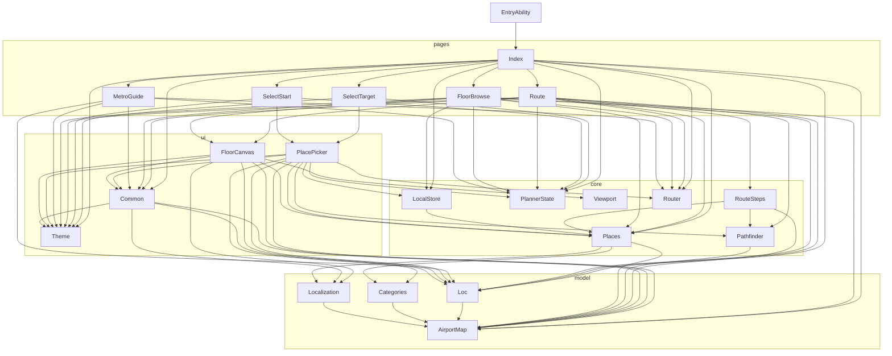

# 组件与模块 API（component-api.md）

> 图片编号 08 · 组件与核心模块的接口说明

这份文档回答"**改这个项目时，我可以调用什么、必须遵守什么约定**"：逐文件给出 `model/`、`core/`、`ui/`、`pages/` 的导出符号签名、参数与返回值含义、惰性缓存与副作用、真实调用点，以及页面间跳转和 `PlannerState` 的状态替换约定。所有内容以 `main@8350ff4` 的源码为准；与本文冲突时，以代码为准。

---

## 0. 阅读约定

| 约定 | 说明 |
|---|---|
| 路径 | 全部为仓库相对路径；行号写作 `文件路径:行号`，指向 `main@8350ff4` |
| "生成物" | `harmony_app/entry/src/main/ets/model/AirportMap.ets` 由 `tools/gen_model.py` 生成，**禁止手改**（见 §3.1） |
| "待确认" | 源码中无法判定的事实，标注「待确认」，不猜测 |
| 函数可见性 | 未写"导出"的函数均为文件内私有（`function` 无 `export`），不可跨文件调用 |
| ArkTS 限制 | 本项目禁用 `Record` 对象字面量，所有键值表用 `Map`；模块级 `Map` 在文件加载时构建或首次使用时惰性构建，二者在注释中已区分 |

---

## 1. 分层总表

| 层 | 目录 | 职责 | 是否含 UI | 文件清单（行数） |
|---|---|---|---|---|
| model | `harmony_app/entry/src/main/ets/model/` | 地图数据（生成物）+ 分类/命名/文案语义层；无状态、无副作用计算 | 否 | `AirportMap.ets`(2139, **生成物**)、`Loc.ets`(123)、`Categories.ets`(106)、`Localization.ets`(70) |
| core | `harmony_app/entry/src/main/ets/core/` | 纯逻辑：寻路、步骤生成、行程状态机、地点索引、视口变换、本地存储、路由常量 | 否 | `Pathfinder.ets`(289)、`RouteSteps.ets`(42)、`PlannerState.ets`(45)、`Places.ets`(30)、`Viewport.ets`(29)、`LocalStore.ets`(29)、`Router.ets`(6) |
| ui | `harmony_app/entry/src/main/ets/ui/` | 可复用组件：调色板、通用组件、Canvas 地图、地点选择器 | 是 | `Theme.ets`(11)、`Common.ets`(96)、`FloorCanvas.ets`(243)、`PlacePicker.ets`(122) |
| pages | `harmony_app/entry/src/main/ets/pages/` | 页面与导航：Index 宿主 + 5 个 `NavDestination` 子页 | 是 | `Index.ets`(134)、`SelectTarget.ets`(19)、`SelectStart.ets`(19)、`Route.ets`(251)、`MetroGuide.ets`(53)、`FloorBrowse.ets`(100) |
| 宿主能力 | `harmony_app/entry/src/main/ets/entryability/` | `UIAbility` 生命周期与窗口底色 | 否 | `EntryAbility.ets`(52) |

补充事实：

- `main_pages.json` 只注册 `pages/Index`（`harmony_app/entry/src/main/resources/base/profile/main_pages.json`），其余 5 个"页面"是同一 `Navigation` 栈内的 `NavDestination`，**不是**独立路由页。
- 全工程 22 个 `.ets` 共 4008 行（含 2139 行生成模型）。
- `resources/base/element/string.json` 与 `resources/en_US/element/string.json` 各含 **66 个键**，其中只有 `module_desc`、`EntryAbility_desc`、`EntryAbility_label` 被 `harmony_app/entry/src/main/module.json5` 引用（其余 **63 个键无任何代码引用**；ETS 内无 `$r('app.string.*')` 调用），UI 文案全部由 `model/Loc.ets` 接管 —— 详见 §9 风险 R1。
- 应用级 `label` 走另一份资源：`harmony_app/AppScope/resources/base/element/string.json` 的 `app_name`（被 `harmony_app/AppScope/app.json5:11` 引用），与 entry 模块的 string.json 互不相干。

---

## 2. core 层 API

### 2.1 `core/Pathfinder.ets`（寻路引擎）

| 符号 | 签名 | 含义 / 参数 | 返回值 | 惰性缓存 | 副作用 | 典型调用方 |
|---|---|---|---|---|---|---|
| `PREF_SHORTEST` | `const = 0` | 最短距离档 | — | — | 无 | 未被 import；`Route.ets:210` 用字面量 `0` |
| `PREF_ELEVATOR` | `const = 1` | 优先电梯档 | — | — | 无 | 同上（`Route.ets:210` 用 `1`） |
| `PREF_ESCALATOR` | `const = 2` | 优先扶梯档 | — | — | 无 | 同上（用 `2`） |
| `PREF_AVOID_STAIR` | `const = 3` | 避开楼梯档 | — | — | 无 | 同上（用 `3`） |
| `RouteLeg` | `interface` | `floor` 楼层；`nodeIds` 该层连续节点；`meters` 该段米数 | — | — | 无 | `Route.ets:6`、`RouteSteps.ets:21` |
| `RouteTransition` | `interface` | `fromId`/`toId` 换层两端；`viaType` = elevator/escalator/stair；`viaName` 设施名；`fromFloor`/`toFloor`；`meters` | — | — | 无 | `Pathfinder.ets:259`（`mergeTransitLegs`）、`RouteSteps.ets:34` |
| `Route` | `interface` | `nodeIds` 全程节点；`totalMeters`；`legs`；`transitions`；`viaSecurity` 是否经安检 | — | — | 无 | `RouteSteps.ets:13`、`Route.ets` 全页 |
| `node` | `function node(id: string): MapNode` | 按 id 取节点 | `MapNode` | **是**：`_nodeIndex`（`Pathfinder.ets:27,36-42`），首次调用构建 119 条索引 | 惰性建索引；**id 不存在时 `throw new Error('unknown node: ' + id)`**（`:45-47`） | 仅文件内（`planRoute` 内部调用）；**无跨文件调用方** |
| `planRoute` | `function planRoute(startId: string, endId: string, pref: number): Route` | 起终点 id + 偏好档（0–3） | `Route`；不可达时返回空 `Route`（`:193`） | 是（经 `node`/`adjTable`/`edgeType`） | 惰性建 `_adj`/`_etype`；**起终点 id 非法时抛异常**（`node()` 透传） | `RouteSteps.ets:18`（唯一调用方） |
| `QUICK_STARTS` | `const string[]` | 8 个"模拟当前位置"快捷起点 id（`:286-290`，已逐一核对存在于 `XHA_NODES`） | — | — | 无 | `ui/PlacePicker.ets:6,94` |

私有符号（不可跨文件调用，改算法时看这里）：`edgeKey`(`:31-33`)、`adjTable`(`:51-73`)、`edgeType`(`:75-86`)、`edgeWeight`(`:89-99`)、`dijkstra`(`:102-160`)、`mergeTransitLegs`(`:259-283`)；模块级表格 `VERTICAL_WEIGHT`(`:13-16`)、`PREF_MULT`(`:19-24`)。

使用注意（全部有代码依据）：

1. **偏好只影响选路，不改显示距离。** `edgeWeight()` 对垂直边返回 `Math.round(base * mult)`（`:89-99`），但 `planRoute` 累加 `totalMeters` 用的是**数据原始权重** `raw`（`:218` 注释、`:228-230`）。因此同一对起终点切换偏好，`totalMeters` 不变，只有 `nodeIds`/`legs` 会变。
2. **垂直边的 `weight` 字段被忽略。** 非 `walk` 边一律用 `VERTICAL_WEIGHT` 的 30/40/25 覆盖数据权重（`:94-97`）；当前 `data/XHA_xinghai_t1.map.json` 的垂直边权重恰好等于这三个基准值（elevator 13 条=30、escalator 4 条=40、stair 4 条=25），所以现在看不出差别 —— 一旦数据侧改垂直权重，App 不会跟随。
3. **偏好档位无越界保护。** `PREF_MULT[pref]` 直接下标访问（`:95`），`pref` 为 4 或负数会得到 `undefined` 并在 `.get(tp)` 处抛 `TypeError`。UI 只传 0–3（`Route.ets:210`），但 `changePreference(s, value: number)`（`PlannerState.ets:30`）不校验。
4. **安检异侧拆两段**：`startId`/`endId` 任一等于 `SECURITY_ID`，或两侧 `side` 相同 → 单次 Dijkstra；否则 `起→安检` 拼 `安检→终`（`:197-213`），失败返回空 `Route`。
5. **`mergeTransitLegs` 的语义**：把中间"只停一个节点"的过站腿折进相邻换乘（`:248-249`、`:259-283`），例如 4F→2F→1F 合并为一次 4F→1F 换乘，用于消除空 Tab。合并后仍满足 `legs.length === transitions.length + 1`。
6. **模块级缓存不可失效**：`_adj`/`_etype`/`_nodeIndex` 一旦构建即长期持有（`:27-29`）。地图是静态常量，正常运行无问题；但在热重载/HMR 场景下改 `AirportMap.ets` 后旧索引不会重建 —— 需要整页冷启动验证。

### 2.2 `core/RouteSteps.ets`（路线 → 可展示步骤）

| 符号 | 签名 | 含义 | 返回值 | 惰性缓存 | 副作用 | 典型调用方 |
|---|---|---|---|---|---|---|
| `RouteStep` | `interface` | `kind` 步骤类型；`fromId`/`toId`；`floor`/`toFloor`；`legIndex` 所属腿；`meters`；`facility` 设施或 `'security'` | — | — | 无 | `Route.ets:115,36` |
| `RouteView` | `interface` | `status` 状态码；`route` 原始 `Route`；`steps` 步骤表；`walkingMeters` 步行米数 | — | — | 无 | `Route.ets:15,33` |
| `buildRouteView` | `function buildRouteView(startId: string, endId: string, pref: number): RouteView` | 校验 + 调 `planRoute` + 展开为步骤 | 始终返回对象，用 `status` 区分成功/失败 | 无自有缓存；内部 `planRoute` 有缓存 | 通过 `planRoute` 间接建缓存；无 I/O | `Route.ets:15,33`（唯一调用方） |

私有：`edgeMeters(a, b)`（`:6-11`，线性扫描 145 条边找 `walk` 边权重，无缓存）。

`status` 取值与判定顺序（严格按 `:15-19`）：

| 顺序 | `status` | 触发条件 | 界面表现 |
|---|---|---|---|
| 1 | `missing` | `startId === ''` 或 `endId === ''` | `Route.ets:188` 用 `Loc.t('missing')` = "请先选择起点和目的地" |
| 2 | `invalid` | `place(startId)` 或 `place(endId)` 为 `undefined` | "这个地点已不可用" |
| 3 | `same` | `startId === endId` | "起点和目的地相同" |
| 4 | `unreachable` | `planRoute(...).nodeIds.length === 0` | "暂无可达路线" |
| 5 | `ready` | 以上都不成立 | 正常渲染地图与步骤 |

使用注意：

1. `status !== 'ready'` 时 `route.nodeIds` 为空、`steps` 为空，但 **`Route.ets` 全部渲染路径都被 `this.view.status !== 'ready'` 包住**（`Route.ets:186-189`、`:242-245`），因此不要新增"直接读 `steps[0]`"的代码。
2. **`RouteStep.meters` 只统计 `walk` 边**：`buildRouteView` 用私有的 `edgeMeters` 累加（`:23`），`transfer` 步骤的 `meters` 硬编码为 `0`（`:35`），尽管 `RouteTransition.meters` 里有真实米数（`Pathfinder.ets:235`）。于是 `RouteView.walkingMeters` **不包含换层耗时**，而 `Route.totalMeters` 包含 —— 两者永不相等，这是有意的口径差（界面上只显示 `walkingMeters`，见 `Route.ets:196`），改文案前请先确认口径。
3. `security` 步骤只在"安检不是终点"时插入（`:27-28`），`facility = 'security'`；`transfer` 步骤的 `facility` 是 `viaType`（elevator/escalator/stair），`Route.ets:57` 直接把它当 `Loc.t` 的 key 用，**新增换层设施类型时必须同时在 `Loc.ets` 增加同名 key**。

### 2.3 `core/PlannerState.ets`（行程状态机）

| 符号 | 签名 | 行为要点 |
|---|---|---|
| `PlannerState` | `class`，12 个字段 | 见 §8.3 字段表；`PlannerState.ets:2-7` |
| `copyPlanner` | `(s: PlannerState): PlannerState` | 全字段复制并 `revision + 1`（`:8-14`） |
| `newJourney` | `(s: PlannerState, endId: string = '', category: string = 'all'): PlannerState` | **丢弃旧行程**，新建对象（`stage` 回到 `editing`、`browseFloor` 回到 `4F`），写入 `draftEnd`/`category`（`:15-17`） |
| `beginEdit` | `(s: PlannerState, field: string): PlannerState` | 把已提交的 `startId`/`endId` 拷进草稿，`editing = field`，并清空 `category='all'`、`query=''`（`:18-20`） |
| `choosePlace` | `(s: PlannerState, id: string, start: boolean): PlannerState` | `start=true` 写 `draftStart`，否则写 `draftEnd`（`:21-23`） |
| `commitJourney` | `(s: PlannerState): PlannerState` | 草稿 → 正式，`stage='preview'`、`stepIndex=0`、`editing='new'`（`:24-26`） |
| `cancelEdit` | `(s: PlannerState): PlannerState` | 草稿回滚为已提交值，`editing='new'`（`:27-29`） |
| `changePreference` | `(s: PlannerState, value: number): PlannerState` | 写 `preference`，强制回到 `preview` + `stepIndex=0`（`:30-32`） |
| `swapJourney` | `(s: PlannerState): PlannerState` | 交换起终点并同步草稿，回到 `preview` + `stepIndex=0`（`:33-35`） |
| `startGuidance` | `(s: PlannerState): PlannerState` | `stage='guiding'`、`stepIndex=0`（`:36-38`） |
| `advanceGuidance` | `(s: PlannerState, count: number): PlannerState` | 非 `guiding` 或 `count<1` → 原样返回副本；`stepIndex >= count-1` → `stage='completed'`（**`stepIndex` 不变**）；否则 `stepIndex+1`（`:39-42`） |
| `previousStep` | `(s: PlannerState): PlannerState` | `stepIndex = max(0, stepIndex-1)`，并把 `stage` 强制拉回 `'guiding'`（`:43-45`） |

**副作用**：全部为纯函数，不触碰存储、网络、UI；唯一"副作用"是返回新对象（`revision` 递增）。

**调用方一览**：`newJourney` ← `Index.ets:34,37,40,44`、`Route.ets:74`；`copyPlanner` ← `PlacePicker.ets:46`、`FloorBrowse.ets:34,71,95` 及各转移函数内部；`choosePlace` ← `PlacePicker.ets:31`、`FloorBrowse.ets:18,23`、`MetroGuide.ets:11`；`commitJourney` ← `PlacePicker.ets:39`、`FloorBrowse.ets:26`；`cancelEdit` ← `PlacePicker.ets:25`、`SelectTarget.ets:15`、`SelectStart.ets:15`；`beginEdit` ← `Route.ets:70`；`changePreference` ← `Route.ets:77`；`swapJourney` ← `Route.ets:102`；`startGuidance` ← `Route.ets:140`；`advanceGuidance` ← `Route.ets:173`；`previousStep` ← `Route.ets:171`。

**最重要的约定（文件第 1 行即写明）**：`@Provide/@Consume` 只在**对象被整体替换**时触发观察，所以**永远不要就地改 `planner.xxx`**，必须写成 `this.planner = someHelper(this.planner, ...)`。就地赋值不会触发 `Route.ets:13` 的 `@Watch('onPlanner')`，界面不会刷新，且这是静默失败。

### 2.4 `core/Places.ets`（地点索引与检索）

| 符号 | 签名 | 含义 / 参数 | 返回 | 惰性缓存 | 副作用 | 调用方 |
|---|---|---|---|---|---|---|
| `place` | `(id: string): MapNode \| undefined` | 按 id 查节点 | 命中返回节点，未命中 `undefined` | **否**：`INDEX` 在模块加载时立即构建（`:4-5`，遍历 119 节点） | 导入即建 119 条 `Map` | `FloorCanvas.ets:38,65,86,95,115`、`PlacePicker.ets:34,118`、`RouteSteps.ets:16,39`、`Index.ets:46`、`FloorBrowse.ets:39` |
| `placeName` | `(id: string, en: boolean): string` | 取显示名 | 未知 id 返回 `''`（`:8`） | 否 | 无 | `PlacePicker.ets:23,52,70`、`Route.ets:57,60,99,105`、`Index.ets:6`（导入）、`FloorBrowse.ets:44,86` |
| `publicPlace` | `(n: MapNode): boolean` | `type !== 'corridor'` 一律算公开；`corridor` 只有在 `PUBLIC_CORRIDORS` 白名单内才算（`:6,9`，白名单 7 个 id 已核对存在） | `boolean` | 否 | 无 | `FloorCanvas.ets:76,133,200`、`searchPlaces` 内部（`:15`） |
| `gateCode` | `(n: MapNode): string` | 仅 `type === 'gate'` 时取 `name.replace('登机口','').toLowerCase()`，否则 `''`（`:10`） | `string` | 否 | 无 | `searchPlaces` 内部（`:17,20-21`） |
| `searchPlaces` | `(query: string, category: string = 'all'): MapNode[]` | 过滤 `publicPlace` + 分类，再按中文名/英文名/登机口编号做**子串**匹配（大小写不敏感）；**空 query 命中全部** | 新数组；登机口编号精确相等者排前（`:19-23`） | 否 | 无 | `PlacePicker.ets:21`（唯一调用方） |
| `recentPlaces` | `(ids: string[], id: string): string[]` | 把 `id` 置顶、去重、剔除图中不存在的 id，**最多 6 条**（`:25-30`） | 新数组 | 否 | 无 | `PlacePicker.ets:40`、`FloorBrowse.ets:27` |

使用注意：`searchPlaces` 的英文匹配走 `nodeName(n, true)`（`Localization.ets:58-66`），而 `nodeName` 对 `security` 类型硬编码返回 `'Central Security'`，对 `gate` 返回 `'Gate A101'` 形式 —— 因此搜 `"gate"` 会命中所有登机口，搜 `"a101"` 走 `gateCode` 路径。

### 2.5 `core/Viewport.ets`（视口变换）

`class Viewport`（`:2-29`）。全部字段可读写，`bbox`/`w`/`h`/`minZoom` 为 `private`。

| 方法 | 签名 | 行为 | 副作用 |
|---|---|---|---|
| `reset` | `(): void` | `zoom=1, tx=0, ty=0`（`:5`） | 改自身状态；**全工程无调用方** |
| `fit` | `(bbox: number[], w: number, h: number, pad: number): void` | 四边等距 `pad` 的适配，转调 `fitInsets`（`:6-8`） | 改自身状态；**除内部外无调用方**（`FloorCanvas` 直接调 `fitInsets`） |
| `fitInsets` | `(bbox: number[], w: number, h: number, left: number, top: number, right: number, bottom: number): void` | 计算 `zoom = clamp(min(innerW/bw, innerH/bh), ≥0.05)`，记录 `bbox/w/h`，**并设 `minZoom = zoom * 0.75`**（`:9-17`） | 改自身状态 | 
| `scrX` / `scrY` | `(x: number): number` / `(y: number): number` | 图片像素坐标 → 屏幕 vp 坐标（`:18-19`） | 无 |
| `pan` | `(dx: number, dy: number): void` | 平移后 `clampT()`（`:20`） | 改自身状态 |
| `pinch` | `(cx: number, cy: number, factor: number): void` | 以 `(cx,cy)` 为锚点缩放，`zoom` 夹在 `[minZoom, 5]`，再 `clampT()`（`:21-24`） | 改自身状态 |
| `clampT`（private） | `(): void` | 平移边界，四边留 56 的 margin（`:25-28`） | 改自身状态 |

关键契约：**绘图与命中检测共用同一套 vp 坐标**（文件第 1 行注释）。`FloorCanvas` 的 `CanvasRenderingContext2D` 用 `LengthMetricsUnit.DEFAULT`（`FloorCanvas.ets:21`），点击事件 `e.x/e.y` 也是 vp，所以 `Viewport` 的输出可直接与 `ClickEvent` 比较。调用方仅 `ui/FloorCanvas.ets:5,22`。

### 2.6 `core/LocalStore.ets`（preferences 读写）

| 符号 | 签名 | 行为 | 副作用 |
|---|---|---|---|
| `SavedChoices` | `interface { lang: string; recent: string[] }` | 读取结果载体（`:4`） | — |
| `LocalStore.prefs` | `private static preferences.Preferences \| undefined` | 单例句柄，`load()` 成功后缓存（`:6,11`） | — |
| `LocalStore.load` | `static async load(context: common.Context): Promise<SavedChoices>` | 打开 preferences `airport-guide`，读 `language`（默认 `zh`，只接受 `'en'`/`'zh'`，`:14`）与 `recent`（逗号分隔字符串），逐个用 `place()` 校验、去重、**截断到 6 条**（`:15-20`） | 建/打开持久化文件；缓存句柄；**任何异常被吞掉**（`:21`），失败时返回 `{lang:'zh', recent:[]}` |
| `LocalStore.save` | `static async save(lang: string, recent: string[]): Promise<void>` | `put('language')` + `put('recent', recent.join(','))` + `flush()`（`:27`） | 写持久化；**`prefs === undefined` 时直接 `return`，静默丢弃**（`:26`）；异常同样被吞（`:27`） |

调用方：`Index.ets:28`（load）、`Index.ets:32` / `PlacePicker.ets:41` / `FloorBrowse.ets:28`（save）。

**已知时序风险**：`load()` 是异步的（`Index.ets:28`），而 `save()` 在 `prefs` 尚未就绪时是空操作（`:26`）。用户在 `load` 完成前点语言切换（`Index.ets:32`），既写不进存储，随后 `.then` 里的 `this.lang = saved.lang`（`Index.ets:29`）还会把刚切的语言覆盖回旧值。

### 2.7 `core/Router.ets`（路由常量）

`Router.ets:2-6`，5 个 `const string`，值与字符串本身相同：

| 常量 | 值 | 对应页面 | 用途 |
|---|---|---|---|
| `NAV_SELECT_TARGET` | `'SelectTarget'` | `pages/SelectTarget.ets` | 选择目的地 |
| `NAV_SELECT_START` | `'SelectStart'` | `pages/SelectStart.ets` | 选择出发位置 |
| `NAV_PLAN` | `'Route'` | `pages/Route.ets` | 路线预览/指引 |
| `NAV_METRO` | `'MetroGuide'` | `pages/MetroGuide.ets` | 地铁方向选择 |
| `NAV_BROWSE` | `'FloorBrowse'` | `pages/FloorBrowse.ets` | 楼层地图浏览/点选 |

首页没有对应常量 —— 它是 `Navigation` 的根内容（`Index.ets:76`），只能通过 `pathStack.clear()` 回到。

---

## 3. model 层 API

### 3.1 `model/AirportMap.ets` —— 生成物，只读

文件头 `:1-7` 声明：源文件 `data/XHA_xinghai_t1.map.json`（由 `tools/gen_maps.py` 产出），再生成命令 `python3 tools/gen_model.py`。**任何手工修改都会在下次生成时丢失，并让代码与数据源漂移。**

| 符号 | 类型 / 签名 | 含义 | 规模 | 使用者 |
|---|---|---|---|---|
| `MapNode` | `interface`（`:9-17`） | `id`；`name` 中文名（数据源）；`type` 见下方类型表；`floor` = 4F/3F/2F/1F/B1/B2；`x`/`y` 图片来源坐标系像素（`pxPerMeter = 2.0`）；`side` = `land` 陆侧 / `air` 空侧 / `gate` 安检咽喉 | — | `FloorCanvas.ets:106,123,130`、`Common.ets:69`、`PlacePicker.ets:1`、`Places.ets:1`、`Index.ets:4` |
| `MapEdge` | `interface`（`:19-24`） | `from`/`to`/`type`（walk/elevator/escalator/stair）/`weight`（米） | — | 仅 `AirportMap.ets` 内部为 `XHA_EDGES` 做类型标注 |
| `XhaMeta` | `interface`（`:26-32`） | `airport`/`name`/`pxPerMeter`/`version`/`date` | — | 仅本文件 |
| `XHA_META` | `const XhaMeta`（`:34-40`） | `airport:'XHA'`、`name:'星海国际机场 主航站楼'`、`pxPerMeter:2.0`、`version:'1.0'`、`date:'2026-09-11'` | 1 条 | **.ets 内无使用者**（仅 `tools/` 侧脚本参考） |
| `SECURITY_ID` | `const string = 'xha_p4_sec'`（`:42`） | 唯一安检节点 id，陆侧↔空侧割点 | 1 | `Pathfinder.ets:4,196`、`RouteSteps.ets:24,27`、`FloorCanvas.ets:109,125` |
| `PX_PER_METER` | `const number = 2.0`（`:43`） | 像素/米标定 | 1 | **.ets 内无使用者** |
| `FLOOR_ORDER` | `const string[]`（`:45-52`） | `['4F','3F','2F','1F','B1','B2']`，**从上到下** | 6 | `FloorBrowse.ets:1,68`、`Localization.ets:69`（经 `floorOrder()`） |
| `FLOOR_LABELS` | `const Map<string,string>`（`:53-59`） | 中文楼层名：出发层/空侧候机夹层/到达层/地面迎客层/交通中心/地铁站台 | 6 | `Loc.ets:1,122`、`Localization.ets:48` |
| `FLOOR_LABELS_EN` | `const Map<string,string>`（`:60-66`） | 英文楼层名：Departures/Airside Mezzanine/Arrivals/Ground Welcome/Transport Center/Metro Platform | 6 | 同上 |
| `FLOOR_BBOX` | `const Map<string,number[]>`（`:67-73`） | 每层包围盒 `[minX,minY,maxX,maxY]`，图片像素坐标，供视口适配 | 6 | `FloorCanvas.ets:33,59` |
| `NODE_EN` | `const Map<string,string>`（`:74-193`） | 节点 id → 英文名，**119 条全覆盖**（与节点数一致） | 119 | `Localization.ets:62`、`Categories.ets:92` |
| `XHA_NODES` | `const MapNode[]`（`:195-1267`） | 全部节点，119 条 | 119 | `Pathfinder.ets:38`、`Places.ets:5,13`、`RouteSteps`（否）、`FloorCanvas.ets:75,131,199`、`Common.ets:1,69` |
| `XHA_EDGES` | `const MapEdge[]`（`:1268-2139`） | 全部边，145 条 | 145 | `Pathfinder.ets:56,78`、`FloorCanvas.ets:64`、`RouteSteps.ets:7` |

数据事实（本文件核对结果）：节点楼层分布 4F 55 / 2F 21 / B1 14 / 3F 12 / 1F 11 / B2 6；`side` 分布 land 63 / air 55 / gate 1；节点类型 15 种（corridor 28、gate 24、lift 19、hall 9、escalator 7、stair 7、toilet 5、checkin 4、coach 4、entrance 3、exit 3、baggage 2、metro 2、security 1、parking 1）；边类型 walk 124 / elevator 13 / escalator 4 / stair 4。

**改数据规则（唯一正确路径）**：

1. 改 `tools/gen_maps.py` 的 `XHA` spec（**这才是真源**；`gen_maps.py:main()` 会覆盖写 `data/XHA_xinghai_t1.map.json`）；
2. `python3 tools/gen_maps.py` → 重新产出 JSON；
3. `python3 tools/gen_model.py` → 重新产出本文件（内部会 `assert len(secs) == 1` 校验安检唯一）；
4. 可选 `python3 tools/preview_nodes.py` 出图核对。

**禁止**：直接编辑 `AirportMap.ets`；只改 JSON 后跑 `gen_maps.py`（改动会被冲掉）。

### 3.2 `model/Loc.ets` —— 活的 UI 文案表

| 符号 | 签名 | 含义 | 使用者 |
|---|---|---|---|
| `Loc.t` | `static t(key: string, en: boolean): string` | 查 UI 文案；**未命中时返回 key 本身**（`:121`），所以 key 拼错不会报错，界面会直接显示英文 key | 7 个文件、91 处（`Common.ets`、`FloorCanvas.ets`、`PlacePicker.ets`、`Index.ets`、`Route.ets`、`MetroGuide.ets`、`FloorBrowse.ets`） |
| `Loc.floor` | `static floor(f: string, en: boolean): string` | 楼层双语名，转查 `FLOOR_LABELS(_EN)`；未命中返回楼层码（`:122`） | `Common.ets:78`、`FloorCanvas.ets:223`、`Index.ets:61`、`FloorBrowse.ets:39,82` |
| `Translation`（私有） | `interface { key; zh; en }` | 内部结构（`:2`） | 仅本文件 |
| `TEXTS`（私有） | `const Translation[]` | **112 条**中英文案，`key` 全表见源码 `:3-116`；`ZH`/`EN` 两个 `Map` 在 `:117-119` 于模块加载时构建 | 仅本文件 |

关键联想键（`Route.ets` 依赖，改这些 key 会连带影响步骤文案）：`elevator`/`escalator`/`stair`（`:94-96`，对应 `RouteStep.facility`）、`missing`/`invalid`/`same`/`unreachable`（`:103-106`，对应 `RouteView.status`）、`pref_shortest`/`pref_elevator`/`pref_escalator`/`pref_avoid_stair`（`:87-90`）、`start_marker`/`end_marker`（`:110-111`，Canvas 绘制起终点字）、`zoom_in`/`zoom_out`/`full_floor`/`fit_route`（`:59-62`，Canvas 按钮）。

### 3.3 `model/Categories.ets`（分类与检索辅助）

| 符号 | 签名 | 含义 | 调用方 |
|---|---|---|---|
| `Category` | `interface { key; nameZh; nameEn; symbol }`（`:5-10`） | 分类定义 | `PlacePicker.ets:3,54,86` |
| `CATEGORIES` | `const Category[]`（`:13-24`） | **10 项**（`all` + 9 类），顺序即 tab 顺序 | `PlacePicker.ets:86` |
| `catOf` | `(n: MapNode): string`（`:55-62`） | 节点 → 分类键：先查 `ID_CAT`（7 条特例，`:45-52`），再查 `TYPE_CAT`（15 条，`:27-42`），都没有则 `'service'` | `Places.ets:15` |
| `catName` | `(key: string, en: boolean): string`（`:64-71`） | 分类双语名；未命中返回 key | `PlacePicker.ets:55` |
| `catSymbol` | `(key: string): string`（`:74-81`） | 分类符号；未命中返回 `'•'` | **无调用方（死代码）** |
| `matches` | `(n: MapNode, q: string): boolean`（`:84-97`） | 中文名或英文名子串匹配 | **无调用方（死代码）**；实际检索走 `Places.searchPlaces` |
| `HOT_DESTINATIONS` | `const string[]`（`:100-107`） | 14 个"高频直达"id（已核对全部存在） | **无调用方（死代码）**；首页用的是 `Index.ets:16` 本地常量 `POPULAR`（4 项，与前者不同） |

`TYPE_CAT`/`ID_CAT` 为文件私有 `Map`。**新增节点类型时必须同时改 `TYPE_CAT`**（否则新类型全落进 `service` 分类）与 `ui/Theme.ets` 的 `TYPE_COLOR`（否则地图标记取 `APP.accent` 兜底色）。

### 3.4 `model/Localization.ets`（类型/楼层/节点名解析）

| 符号 | 签名 | 行为 | 调用方 |
|---|---|---|---|
| `TYPE_ZH` | `const Map<string,string>`（`:6-21`） | 15 种节点类型的中文标签 | `typeLabel` |
| `TYPE_EN` | `const Map<string,string>`（`:23-38`） | 15 种节点类型的英文标签 | `typeLabel` |
| `typeLabel` | `(type: string, en: boolean): string`（`:40-44`） | 未命中返回 type 原文 | `Common.ets:78` |
| `floorName` | `(floor: string, en: boolean): string`（`:47-51`） | 楼层双语名；未命中返回楼层码 | **无调用方（死代码）**；界面统一走 `Loc.floor` |
| `floorShort` | `(floor: string): string`（`:53-55`） | 直接返回入参（`:54` 注释：4F/B1 本身已是短标签） | **无调用方（死代码）** |
| `nodeName` | `(n: MapNode, en: boolean): string`（`:58-66`） | 中英节点名。**`type === 'security'` 时硬编码返回 `'Central Security'` / `'中央安检大厅'`**（`:60`，注释说明"数据源的唯一性标注描述的是图结构，不是地名"）；`en` 时查 `NODE_EN`，缺失回落中文 `n.name` | `Places.ets:16`、`Common.ets:76,84`、`FloorCanvas.ets:149` |
| `floorOrder` | `(): string[]`（`:68-70`） | 返回 `FLOOR_ORDER` 引用（**不是副本**，改返回数组会污染模型） | **无调用方（死代码）** |

---

## 4. ui 层组件

### 4.1 `ui/Theme.ets`（调色板）

| 符号 | 类型 | 内容 | 实际使用情况 |
|---|---|---|---|
| `AppPalette` / `APP` | `interface` / `const`（`:1-2`） | `bg #F4F7F9`、`card #FFFFFF`、`card2 #E9F3F2`、`line #DFE7EB`、`text #172B3A`、`sub #657582`、`accent #007F7A`、`accentSoft #D5EEEB`、`gold #B86A12`、`gtext #86500E` | 全部 6 个 pages + `FloorCanvas` + `Common` + `PlacePicker` 使用；`card2` **未见使用** |
| `MapPalette` / `MAP` | `interface` / `const`（`:3-4`） | `surface`、`grid`、`ink`、`ink2`、`muted`、`corridor`、`landWash`、`airWash` | 仅 `surface`（`FloorCanvas.ets:57,241`）与 `ink2`（`:178`）被用；其余 6 个字段**未见使用** |
| `TYPE_COLOR` | `const Map<string,string>`（`:5-8`） | 15 种节点类型的标记色 | `FloorCanvas.ets:109`（取不到时回落 `APP.accent`） |
| `RoutePalette` / `ROUTE` | `interface` / `const`（`:9-10`） | `color`、`case`、`trans` | **全工程无引用（死代码）**；路线配色在 `FloorCanvas` 里是字面量 `'#9ACCC6'`(`:70`) 与 `APP.accent`(`:72`) |
| `HIT` | `const = '#007F7A'`（`:11`） | 命中高亮色 | **全工程无引用（死代码）** |

### 4.2 `ui/Common.ets`（通用组件）

| 符号 | 形态 | 入参（装饰器） | 回调 | 渲染职责 / 关键内部 |
|---|---|---|---|---|
| `iconFor` | `function (type: string): string`（`:5-13`） | — | — | 节点类型 → 图标名：gate/checkin→`plane`；metro→`metro`；security→`shield`；lift/escalator/stair→`layers`；baggage→`bag`；toilet→`facility`；其余→`pin` |
| `AppIcon` | `@Component export struct`（`:14-18`） | `@Prop name: string = 'pin'`；`@Prop iconSize: number = 24` | — | 渲染 `Image($rawfile('icons/' + name + '.svg'))`。**图标名拼错不会报错，只是空白**；可用文件见 `resources/rawfile/icons/`（18 个，其中 `close`、`fit` 当前无引用） |
| `PageHeader` | `@Component export struct`（`:19-45`） | `@Prop title: string = ''`；`@Prop back: boolean = true`；`@State reserve: number = 100`（内部） | `onBack: () => void`（普通成员，默认空函数） | 高 64 的标题栏；`back=true` 渲染 `id('back_button')` 返回键，`false` 渲染品牌图标；`refreshBar()`（`:24-31`）用 `getUIContext().getAtomicServiceBar().getBarRect()` 动态留出元服务胶囊宽度（拿不到时用 100）。**无障碍文案直接读 `AppStorage.get<string>('lang')`（`:37`），与页面的 `@StorageLink('lang')` 是两条读路径** |
| `PrimaryAction` | `@Component export struct`（`:46-55`） | `@Prop label: string = ''`；`@Prop actionEnabled: boolean = true` | `onAction: () => void` | 主按钮 `id('primary_action')`，最小高 52，禁用时透明度 0.45 |
| `EmptyState` | `@Component export struct`（`:56-66`） | `@Prop title: string = ''`；`@Prop hint: string = ''`；`@Prop icon: string = 'search'` | — | 图标 + 标题 + 提示的居中空态 |
| `PlaceRow` | `@Component export struct`（`:67-86`） | `@Prop item: MapNode = XHA_NODES[0]`；`@Prop selected: boolean = false`；`@Prop lang: string = 'zh'` | `onChoose: () => void` | 列表行 `id('place_' + item.id)`：图标 + 名称（`nodeName`）+ `楼层 · 楼层名 · 类型标签`；选中态换底色/描边/勾图标；整行无障碍文案 |
| `SectionTitle` | `@Component export struct`（`:87-96`） | `@Prop title: string = ''`；`@Prop detail: string = ''` | — | 区块标题，`detail` 为空字符串时不渲染右侧附属文本 |

### 4.3 `ui/FloorCanvas.ets`（地图画布）

`@Component export struct FloorCanvas`（`:10-243`）。

| 入参 | 装饰器 | 默认值 | 含义 |
|---|---|---|---|
| `floor` | `@Prop @Watch('changed')` | `'4F'` | 当前绘制楼层；变更即重绘 |
| `lang` | `@Prop @Watch('changed')` | `'zh'` | 文案语言；影响标注与无障碍文案 |
| `pathNodeIds` | `@Prop @Watch('changed')` | `[]` | 整条腿的节点序列（浅色底图路线）；变更会触发重新适配视口 |
| `currentIds` | `@Prop @Watch('changed')` | `[]` | 当前步骤高亮子路径（强调色 + 箭头） |
| `startId` | `@Prop @Watch('changed')` | `''` | 起点标记 |
| `endId` | `@Prop @Watch('changed')` | `''` | 终点标记（方块 + "终"） |
| `selectedId` | `@Prop @Watch('changed')` | `''` | 浏览模式选中节点 |
| `selectable` | `@Prop` | `false` | 是否响应点击选点；**无 `@Watch`** |
| `onNodeTap` | 普通成员回调 | `() => {}` | `(id: string) => void`，命中节点后回传 |

内部状态与关键方法：

| 成员 | 位置 | 说明 |
|---|---|---|
| `ctx` | `:21` | `CanvasRenderingContext2D(new RenderingContextSettings(true), LengthMetricsUnit.DEFAULT)` —— 抗锯齿开启，**坐标单位 vp** |
| `view` | `:22` | `Viewport` 实例 |
| `ready` / `fitKey` | `:23` | `onReady` 前不绘制；`fitKey = floor:画布宽:画布高:pathNodeIds 拼接`（`:55`），**key 不变则不重新 fit** |
| `areaW` / `areaH` | `:24` | 来自 `onAreaChange` 的实际尺寸（vp），`canvasW()/canvasH()` 兜底用 `ctx.width/height`（`:26-27`） |
| `panX` / `panY` / `pinchScale` | `:25` | 手势增量累加器 |
| `canvasFont(size, bold)` | `:28-30` | `fp2px` 换算 + `HarmonyOS Sans` |
| `changed()` | `:31` | `@Watch` 目标：`ready` 时 `draw()` |
| `fit(route: boolean)` | `:32-52` | `route=true` 且有路径时用路径包围盒（不足 160 时外扩 80），留白 `(32,48,72,90)`；否则用 `FLOOR_BBOX`，留白 `(24,48,72,78)` |
| `draw()` | `:53-81` | 顺序：清屏 → 楼层底衬 → 所有同层 `walk` 边（先 22 宽灰描边、再 18 宽白）→ `pathNodeIds` 浅色线 `#9ACCC6` → `currentIds` 强调线 + 箭头 → 所有 `publicPlace` 标记 → 起终点 → 标注 → 左上角楼层码 |
| `line(ids, color, width)` | `:82-91` | 白底 + 彩色双描边；跨层节点自动跳过 |
| `arrows(ids)` | `:92-105` | 相邻点距离 ≥ 28 才画白色三角箭头 |
| `marker(n)` | `:106-113` | 白心圆环；选中/路径上半径 10、线宽 3；**`SECURITY_ID` 强制用 `APP.gold`**，其余取 `TYPE_COLOR` |
| `endpoint(id, end)` | `:114-122` | 起点圆 + `Loc.t('start_marker')`，终点方块 + `Loc.t('end_marker')` |
| `priority(n)` | `:123-128` | 标注避让优先级：0=起/终/选中，1=安检或当前路径上的换层设施，2=路径上，3=其他 |
| `labels()` | `:129-181` | 按优先级排序后在 4 个候选位（下/上/右/左）里选不与已用框重叠的位置；低优先级且 `zoom < 0.4` 且非 gate/metro/checkin 则跳过；登机口语名去掉 `登机口`/`Gate ` 前缀；超 22 字截断加省略号 |
| `zoomBy(factor)` | `:182` | 以画布中心 `pinch` 后重绘（按钮用，`+` 1.35 / `-` 0.75） |
| `gestures()` | `:183-195` | `GestureGroup(Parallel, PanGesture(1指, distance 5), PinchGesture(2指, distance 3))`，平移用增量差 |
| `tap(e: ClickEvent)` | `:196-205` | `selectable` 为假直接返回；**vp 空间**找最近 `publicPlace` 节点，阈值 `24² = 576` |
| `@Builder control(name, key, run)` | `:206-210` | 48×48 图标按钮，`id('map_' + key)`，无障碍文案取 `Loc.t(key)` |
| `build()` | `:211-242` | `Canvas id('floor_canvas')`（`onReady`/`onAreaChange`/`gesture`/`onClick`）+ 覆盖层：右上下缩放（`map_zoom_in`/`map_zoom_out`）、左下 `map_fit_floor`、有路径时追加 `map_fit_route`；覆盖层 `hitTestBehavior(HitTestMode.Transparent)` |

使用注意：

1. **画布尺寸必须先落地才能绘制**：`draw()` 在 `areaW < 1 || areaH < 1` 时直接返回（`:54`），`onAreaChange` 里用 `setTimeout(..., 0)` 补一次绘制（`:219`）。
2. `pathNodeIds` 只传"该腿节点"，跨层节点会被 `n.floor !== this.floor` 过滤（`:86`），所以**一条合并腿只会画出起点楼层的那一段**，不会串层连线。
3. 命中检测只认 `publicPlace` 节点 —— 走廊内部节点（不在白名单）在浏览模式点不到（`:200`）。

### 4.4 `ui/PlacePicker.ets`（地点选择器）

`@Component export struct PlacePicker`（`:11-122`）。被 `SelectStart`/`SelectTarget` 复用，靠 `start` 切换语义。

| 入参 | 装饰器 | 默认 | 含义 |
|---|---|---|---|
| `start` | `@Prop` | `false` | `true` 选出发位置，`false` 选目的地 |
| `pathStack` | `@Consume` | — | 宿主 `Index` 提供的 `NavPathStack`（`Index.ets:20`） |
| `planner` | `@Consume` | — | 宿主的 `PlannerState`；**只整体替换，不就地改** |
| `recent` | `@Consume` | — | 最近查找 id 列表（`Index.ets:22`） |
| `lang` | `@StorageLink('lang')` | `'zh'` | 语言 |
| `q` / `category` / `list` / `searchFocused` | `@State` | `''` / `'all'` / `[]` / `false` | 搜索词、当前分类、检索结果、输入框聚焦态 |

| 方法 | 位置 | 行为 |
|---|---|---|
| `aboutToAppear` | `:20` | `q = start ? '' : planner.query`；`category = start ? 'all' : planner.category`；`rebuild()` |
| `rebuild` | `:21` | `list = searchPlaces(q, category)` |
| `selected` / `selectedName` | `:22-23` | 按 `start` 取 `draftStart`/`draftEnd` 及其显示名 |
| `back` | `:24-27` | `editing !== 'new'` 时先 `cancelEdit`，再 `pathStack.pop()` |
| `choose(id)` | `:28-32` | 清焦点、退出聚焦态，`planner = choosePlace(planner, id, start)` |
| `next` | `:33-44` | 目的地未选起点且非编辑态 → `push(NAV_SELECT_START)`；否则 `commitJourney` → 更新 `recent` → `LocalStore.save` → 编辑态则 `pop()`，新建则 `clear() + push(NAV_PLAN)` |
| `map` | `:45-48` | `copyPlanner` 后写 `mapMode = start ? 'start' : 'destination'`，`push(NAV_BROWSE)` |
| `actionLabel` | `:49-51` | 编辑态 `apply`，否则 `start ? 'view_route' : 'next_start'` |
| `quickLabel` | `:52` | 快捷起点的显示名 |
| `@Builder chip(c)` | `:53-59` | 分类 pill；点击写 `category` 并 `rebuild()` |

`build()` 结构（`:60-121`）：`PageHeader`（标题 `start_title`/`target_title`）→ 步骤提示 + 大标题/副标题（**聚焦时隐藏**，`:65`）→ 起点的"已选目的地"提示（`:69-72`）→ `TextInput id('place_search')` → 起点模式的"在地图上选择位置"按钮 `id('choose_on_map')`（聚焦时隐藏）→ 分类横向 `Scroll`（`ForEach(CATEGORIES, key=c.key)`）→ 起点专用快捷起点行（`:89`，仅 `start && !searchFocused && q 空 && category==='all'`）→ 空态或 `List id('place_list')` → 底部已选名 + `PrimaryAction`。整页 `maxWidth 840`。

---

## 5. pages 层

### 5.1 `pages/Index.ets` —— 宿主与 Navigation

`@Entry @Component struct Index`（`:17-134`），**唯一注册在 `main_pages.json` 的页面**。

| 成员 | 装饰器 / 位置 | 说明 |
|---|---|---|
| `pathStack` | `@Provide NavPathStack`（`:20`） | 全应用唯一导航栈；子页用 `@Consume` 取用 |
| `planner` | `@Provide PlannerState`（`:21`） | 行程状态单例（按引用替换刷新） |
| `recent` | `@Provide string[]`（`:22`） | 最近查找（最多 6 条） |
| `lang` | `@StorageLink('lang')`（`:23`） | 语言；同时写入 `AppStorage` 供 `Common.ets:37` 读取 |
| `aboutToAppear` | `:24-31` | `AppStorage.setOrCreate('lang')`；设置 `KeyboardAvoidMode.RESIZE`；异步 `LocalStore.load` 回填 `lang`/`recent` |
| `toggleLanguage` | `:32` | 中英互换 + `LocalStore.save` |
| `search(category)` | `:33-35` | `newJourney(planner, '', category)` + `push(NAV_SELECT_TARGET)` |
| `destination(id)` | `:36-38` | `newJourney(planner, id)` + `push(NAV_SELECT_START)`（从"最近/常用"直达） |
| `floor(f)` | `:39-42` | `newJourney` 后写 `browseFloor`/`mapMode='browse'` + `push(NAV_BROWSE)` |
| `metro` | `:43-45` | `newJourney` + `push(NAV_METRO)` |
| `node(id)` / `fallback()` | `:46-47` | 取节点，未知 id 返回空壳节点（`id:''`）避免 `PlaceRow` 崩 |
| `@Builder task(icon, label, category)` | `:48-55` | 首页三宫格；`category === 'metro'` 走 `metro()`，否则 `search(category)` |
| `@Builder floorTile(f)` | `:56-66` | 楼层入口卡 `id('floor_' + f)`；点击 `floor(f)` |
| `@Builder PageMap(name)` | `:67-74` | **路由分发表**：`NAV_SELECT_TARGET/NAV_SELECT_START/NAV_PLAN/NAV_METRO/NAV_BROWSE` → 对应 `NavDestination` 组件 |
| `build()` | `:75-133` | `Navigation(pathStack)` + 首页内容；`.hideTitleBar(true).mode(NavigationMode.Stack).navDestination(this.PageMap)` |

首页常量：`POPULAR = ['xha_p4_gA101','xha_p4_gC308','xha_p4_sec','xha_p2_bagA']`（`:16`，与 `Categories.HOT_DESTINATIONS` 的 14 项不同且未被复用）。

### 5.2 `pages/SelectTarget.ets` / `pages/SelectStart.ets`

两者结构完全对称（各 19 行）：

| 项 | SelectTarget | SelectStart |
|---|---|---|
| 组件 | `@Component export struct SelectTarget`（`:4-19`） | `@Component export struct SelectStart`（`:4-19`） |
| 消费 | `@Consume pathStack`（`:6`，**实际未使用**）、`@Consume planner`（`:7`） | 同（`:6`、`:7`，`pathStack` 同样未使用） |
| 内容 | `NavDestination { Row { PlacePicker({ start: false }) } }`（`:10`） | `NavDestination { Row { PlacePicker({ start: true }) } }`（`:10`） |
| 返回拦截 | `onBackPressed`：编辑态先 `cancelEdit`，**返回 `false`**（`:14-17`） | 同（`:14-17`） |

### 5.3 `pages/Route.ets` —— 路线预览与分步指引

`@Component export struct Route`（`:10-251`）。

| 成员 | 装饰器 / 位置 | 说明 |
|---|---|---|
| `pathStack` | `@Consume`（`:12`） | 导航栈 |
| `planner` | `@Consume @Watch('onPlanner')`（`:13`） | **依赖"整体替换"才会触发 `onPlanner`** |
| `lang` | `@StorageLink('lang')`（`:14`） | 语言 |
| `view` | `@State RouteView`（`:15`） | 初始 `buildRouteView('', '', 0)` → `status='missing'` |
| `legIndex` / `showSteps` / `mapHeight` | `@State`（`:16-17`） | 当前腿、步骤面板开关、地图高度（240–600 自适应，`:20-24`） |
| `scrollHeight` / `summaryHeight` / `signature` | 普通成员（`:18-19`） | 布局测高与"起终点+偏好"签名 |
| `aboutToAppear` | `:25` | 首次 `refresh()` |
| `onPlanner` | `:26-29` | 重新 `refresh()`；指引态下把 `legIndex` 对齐到当前步骤 |
| `refresh` | `:30-35` | **仅当 `startId:endId:preference` 变化时**重算 `buildRouteView` 并重置 `legIndex` |
| `currentStep` | `:36-40` | 按 `stepIndex` 取步骤，越界/空表返回兜底 `destination` 步骤 |
| `currentLeg` | `:41-44` | 取 `legIndex` 对应的 `RouteLeg`，越界返回空腿 |
| `activeIds` | `:45-52` | 预览态返回整腿；指引态返回当前步骤在腿内的切片（`fromId`→`toId`） |
| `stepTitle` | `:53-61` | 四类文案：security→`pass_security`；transfer→`take <设施> · <起点名> → <目标层>`；destination→`destination_step`；walk→`walk_to <终点名>` |
| `actionLabel` | `:62-65` | 主按钮文案按 `kind` 映射 `arrived_floor`/`passed_security`/`finish`/`arrived_here` |
| `title` | `:66-68` | 标题按 `stage` 映射 `route_complete`/`route_guiding`/`route_preview` |
| `edit(start)` | `:69-72` | `beginEdit` 后 `push` 到 SelectStart/SelectTarget |
| `newRoute` | `:73-75` | `newJourney` + `clear()` + `push(NAV_SELECT_TARGET)` |
| `replan(pref)` | `:76-78` | `changePreference` + `legIndex=0` |
| `@Builder preferenceMenu` | `:79-87` | 4 项菜单，`id('preference_0..3')` |
| `@Builder preference(p, key)` | `:88-93` | 横向偏好 pill，`id('preference_' + p)` |
| `@Builder endpoints` | `:94-108` | 起点/终点卡（`id('edit_start')`/`id('edit_end')`）+ 交换按钮 `id('reverse_route')` |
| `@Builder stepSheet` | `:109-130` | 全步骤面板，每行显示序号、标题、`楼层 (→ 目标层) · 米数`，点击跳到对应腿 |
| `@Builder footer` | `:131-178` | 预览态：说明 + `开始指引`；完成态：`new_journey`；指引态：进度 `步骤 x / n · 楼层`、偏好菜单 `id('route_preferences')`、`id('all_route_steps')`、当前步骤标题与米数、下一步预告、`id('previous_step')` |
| `build` | `:179-250` | `NavDestination`；`status !== 'ready'` 时只显示 `EmptyState` + `choose_again`；否则汇总卡（步行米数、换层次数、安检提示条 `#FFF2DF`）+ 偏好行 + 腿 Tab（`id('route_leg_' + i)`）+ `FloorCanvas`；`.bindSheet` 全步骤面板 |

注意：`Route` 传给 `FloorCanvas` 的 `pathNodeIds` 是 `currentLeg().nodeIds`（`:229`），`currentIds` 是 `activeIds()`（`:230`）。

### 5.4 `pages/MetroGuide.ets`

`@Component export struct MetroGuide`（`:6-53`）。

| 成员 | 位置 | 说明 |
|---|---|---|
| `pathStack` / `planner` | `@Consume`（`:8-9`） | 导航栈与行程状态 |
| `lang` | `@StorageLink('lang')`（`:10`） | 语言 |
| `choose(id)` | `:11` | `choosePlace(planner, id, false)` 写入 `draftEnd`，再 `push(NAV_SELECT_START)` —— **地铁页不规划路线，只选方向** |
| `@Builder directionCard(id, title, subtitle)` | `:13-23` | 方向卡 `id('metro_' + id)`，写死 `xha_b2_platA`（往市区）/ `xha_b2_platB`（往星湖） |
| `@Builder metroStep(no, key)` | `:24-31` | 三步说明行（`metro_gate`/`metro_down`/`metro_wait`） |
| `build` | `:32-52` | `NavDestination` + `PageHeader` + 两张方向卡 + 三段说明，`maxWidth 840` |

### 5.5 `pages/FloorBrowse.ets`

`@Component export struct FloorBrowse`（`:11-100`）。

| 成员 | 位置 | 说明 |
|---|---|---|
| `pathStack` / `planner` / `recent` | `@Consume`（`:12`） | 导航栈、状态、最近查找 |
| `lang` | `@StorageLink('lang')`（`:13`） | 语言 |
| `floor` / `picked` / `showDetail` / `startFeedback` | `@State`（`:14-15`） | 当前楼层、地图选中节点、详情面板、起点已选回执 |
| `aboutToAppear` | `:16` | `floor = planner.browseFloor` |
| `chooseStart` | `:17-21` | 写 `draftStart`；`mapMode === 'start'` 则 `pop()`，否则留在本页并显示回执 |
| `chooseEnd` | `:22-31` | 写 `draftEnd`；`mapMode === 'destination'` 则 `pop()`；否则 `draftStart` 非空就 `commitJourney` + 存 recent + `clear() + push(NAV_PLAN)`，为空则 `push(NAV_SELECT_START)` |
| `back` | `:32-37` | 入口模式（start/destination）先恢复 `mapMode='browse'` 再 `pop()` |
| `nextDestination` | `:38` | `push(NAV_SELECT_TARGET)` |
| `detailFloor` | `:39` | `楼层 · 楼层名` |
| `@Builder detail` | `:41-56` | 底部详情：名称、楼层、`pick_start`（`mapMode !== 'destination'` 时）、`pick_dest`（`mapMode !== 'start'` 时）、取消 |
| `build` | `:57-99` | `NavDestination` + `PageHeader` + 标题/提示 + 楼层切换条（`id('map_floor_' + f)`，切换时写回 `planner.browseFloor`）+ `FloorCanvas({ selectable: true, ... })` + 图例 + 起点回执；`.bindSheet` 详情；`onBackPressed` 同步复位 `mapMode` 并返回 `false` |

### 5.6 页面跳转与参数传递

**没有 URL 参数**：`pushPathByName(name, null)` 全部传 `null`（`PlacePicker.ets:36,43,47`、`Index.ets:34,37,41,44`、`Route.ets:71,74`、`FloorBrowse.ets:29,30,38`、`MetroGuide.ets:11`）。**页面间数据一律经由宿主的 `@Provide planner`**。

| 起点 | 动作 | 目标 | 依据 |
|---|---|---|---|
| Index 搜索/三宫格 | `newJourney(planner, '', category)` | `SelectTarget` | `Index.ets:34` |
| Index 最近/常用项 | `newJourney(planner, id)` | `SelectStart` | `Index.ets:37` |
| Index 楼层卡 | `newJourney` + `browseFloor`/`mapMode` | `FloorBrowse` | `Index.ets:40-41` |
| Index 地铁卡 | `newJourney` | `MetroGuide` | `Index.ets:44` |
| SelectTarget 选完目的地 | 无起点则 | `SelectStart` | `PlacePicker.ets:35-37` |
| SelectTarget 选完目的地 | 有起点则 `commitJourney` + `clear()` | `Route` | `PlacePicker.ets:42-43` |
| SelectStart 选完起点 | `commitJourney` | `Route`（`clear()` 后 push） | `PlacePicker.ets:42-43` |
| SelectTarget/SelectStart 返回 | 编辑态 `cancelEdit` | 上一页 | `PlacePicker.ets:25-26` |
| SelectTarget/SelectStart（系统返回） | `cancelEdit`，返回 `false` 交系统 | 上一页 | `SelectTarget.ets:14-17` |
| SelectStart「在地图上选择位置」 | `mapMode='start'` | `FloorBrowse` | `PlacePicker.ets:46-47` |
| Route 编辑起点/终点 | `beginEdit(field)` | `SelectStart`/`SelectTarget` | `Route.ets:70-71` |
| Route 规划新路线 | `newJourney` + `clear()` | `SelectTarget` | `Route.ets:74` |
| MetroGuide 选方向 | `choosePlace(..., false)` | `SelectStart` | `MetroGuide.ets:11` |
| FloorBrowse 选完起点/终点（入口模式） | 直接 `pop()` 回上一页 | `SelectStart`/`SelectTarget` | `FloorBrowse.ets:19,24` |
| FloorBrowse 详情「接下来选择目的地」 | — | `SelectTarget` | `FloorBrowse.ets:38` |

---

## 6. 依赖方向图

实际 import 关系（已逐行核对 `from` 语句）：



缩进版（同样事实，便于 grep 对照）：

```
entryability/EntryAbility  → pages/Index
pages/Index                → model/{Loc, AirportMap}, core/{PlannerState, Places, LocalStore, Router},
                             ui/{Theme, Common}, pages/{SelectTarget, SelectStart, Route, MetroGuide, FloorBrowse}
pages/SelectTarget|SelectStart → ui/PlacePicker, ui/Theme, core/PlannerState
pages/Route                → model/Loc, core/{RouteSteps, PlannerState, Places, Router, Pathfinder}, ui/{Common, FloorCanvas, Theme}
pages/MetroGuide           → model/Loc, core/{PlannerState, Router}, ui/{Theme, Common}
pages/FloorBrowse          → model/{AirportMap, Loc}, core/{Places, PlannerState, LocalStore, Router}, ui/{Theme, FloorCanvas, Common}
ui/PlacePicker             → model/{AirportMap, Loc, Categories}, core/{PlannerState, Places, Pathfinder, LocalStore, Router}, ui/{Common, Theme}
ui/FloorCanvas             → model/{AirportMap, Localization, Loc}, core/{Viewport, Places}, ui/{Theme, Common}
ui/Common                  → model/{AirportMap, Localization, Loc}, ui/Theme
core/RouteSteps            → model/AirportMap, core/{Pathfinder, Places}
core/Pathfinder            → model/AirportMap
core/Places                → model/{AirportMap, Localization, Categories}
core/LocalStore            → core/Places
model/Loc                  → model/AirportMap
model/Categories           → model/AirportMap
model/Localization         → model/AirportMap
```

**依赖规则（允许 / 禁止）**：

| 规则 | 说明 |
|---|---|
| ✅ 允许 | `pages → ui → core → model` 单向向下；同层内 `core → core`（如 `RouteSteps → Pathfinder`、`LocalStore → Places`）与 `ui → ui`（`FloorCanvas → Common`） |
| ✅ 允许 | `model → model` 单向：`Loc`/`Categories`/`Localization → AirportMap`；`Places → Localization/Categories` 属 core 内部，合规 |
| ❌ 禁止 | `model → core` / `model → ui` / `model → pages`（模型层必须保持纯数据，不得反向依赖） |
| ❌ 禁止 | `core → ui` / `core → pages`（core 是纯逻辑，不得引用组件与配色；当前无违反） |
| ❌ 禁止 | `ui → pages`（组件不得知道具体页面；当前无违反，`PlacePicker` 通过 `@Consume pathStack` 间接导航而非 import 页面） |
| ⚠️ 例外 | `core/LocalStore.ets` 依赖 `core/Places.ets`（`LocalStore.ets:3`），而 `Places` 在模块加载时立即建 119 条索引（`Places.ets:4-5`）—— 也就是**只要 `LocalStore` 被 import，地图索引就被建好**，这属于隐性耦合，但并非违规 |
| ⚠️ 注意 | `pages/Route.ets:6` 只从 `Pathfinder` 取 `RouteLeg` 类型；**没有任何页面直接调用 `planRoute`**，路线一律经 `RouteSteps.buildRouteView` |

---

## 7. 常见改动配方

> 每条都给出**要改的文件与函数**，以及必须同步改动的位置。改完请按 `docs/development.md` 的回归清单验证。

### 7.1 新增一个 POI 节点

| 步骤 | 文件 / 函数 | 具体动作 |
|---|---|---|
| 1 | `tools/gen_maps.py`（`XHA` spec 的楼层节点表，如 `:101-136`） | 在目标楼层加一行 `(id, 中文名, type, x, y)`；id 命名沿用 `xha_p<层>_<义>`；坐标是图片来源像素（`pxPerMeter=2.0`） |
| 2 | `tools/gen_maps.py` 的连边表 | 加入至少一条 `walk` 边，否则新节点不可达；跨层则加 `elevator`/`escalator`/`stair` 边（权重由 `VERTICAL_WEIGHT` 固定，写什么都会被覆盖，见 `gen_maps.py:20,52`） |
| 3 | `tools/gen_model.py` 的 `NAME_EN` 字典 | 补中文名 → 英文名映射；**漏了则英文模式回落中文**（`Localization.ets:61-64`） |
| 4 | 分类映射 | 若 type 是新的，改 `model/Categories.ets` 的 `TYPE_CAT`（`:27-42`）；若该节点语义需并入其他分类，改 `ID_CAT`（`:45-52`） |
| 5 | 地图配色 | 若 type 是新的，改 `ui/Theme.ets` 的 `TYPE_COLOR`（`:5-8`），否则标记用 `APP.accent` 兜底（`FloorCanvas.ets:109`） |
| 6 | 跑生成链 | `python3 tools/gen_maps.py` → `python3 tools/gen_model.py` → 可选 `python3 tools/preview_nodes.py` |
| 7 | 可选 | 想让新节点出现在快捷入口：`core/Pathfinder.ets` 的 `QUICK_STARTS`（`:286-290`）或 `pages/Index.ets` 的 `POPULAR`（`:16`） |

**注意**：`FLOOR_BBOX` 由生成器按该层所有节点自动计算，新节点落在包围盒外会自动扩框，无需手改。

### 7.2 新增一档换层偏好

| 步骤 | 文件 / 函数 | 具体动作 |
|---|---|---|
| 1 | `core/Pathfinder.ets` | 加 `export const PREF_XXX = 4;`（`:7-10`）；在 `PREF_MULT` 数组末尾追加一个 `Map`，**必须给 elevator/escalator/stair 三个键都设值**（`:19-24`，缺键时 `edgeWeight` 回落乘子 1，`:97`） |
| 2 | `model/Loc.ets` | 在 `TEXTS`（`:3-116`）加一条 `pref_xxx` 中英文案 |
| 3 | `pages/Route.ets` | `preferenceMenu`（`:79-87`）与 `preference` 行（`:210`）各加一项并传 `4`；`changePreference` 不校验范围，但跳档必须与 `PREF_MULT` 下标一致 |
| 4 | 验证 | `python3 tools/pathfind_reference.py` 与偏好相关的对照；确认新档不改变 `totalMeters` 口径（§2.1 注意 1） |
| 5 | 防御（建议） | 给 `edgeWeight` 的 `PREF_MULT[pref]` 加越界回落，否则非法档位抛 `TypeError` |

### 7.3 新增一个页面

| 步骤 | 文件 / 函数 | 具体动作 |
|---|---|---|
| 1 | `core/Router.ets` | 加 `export const NAV_XXX = 'Xxx';`（`:2-6`） |
| 2 | `pages/Xxx.ets` | 新建 `@Component export struct Xxx`，根节点用 `NavDestination`；用 `@Consume pathStack` / `@Consume planner` 取宿主状态；`.hideTitleBar(true)`（现有 5 页均如此） |
| 3 | `pages/Index.ets` | `import` 新组件（`:11-15` 区），并在 `@Builder PageMap(name)`（`:67-74`）加一条 `else if (name === NAV_XXX)` 分支 |
| 4 | 页面清单 | **无需**改 `harmony_app/entry/src/main/resources/base/profile/main_pages.json` —— 它不是独立路由页；只有新增**顶级 Entry 页**才需要改该文件并同步 `harmony_app/entry/src/main/ets/entryability/EntryAbility.ets:32` 的 `loadContent` |
| 5 | 跳转 | 从别处 `this.pathStack.pushPathByName(NAV_XXX, null)`；**参数不能走路由**，一律写进 `planner`（§5.6） |
| 6 | 状态（若需要新字段） | 在 `core/PlannerState.ets` 的 `PlannerState`（`:2-7`）加字段，并**同步 `copyPlanner`（`:8-14`）**，否则新字段在任何状态转移后都会丢 |

### 7.4 改一个颜色或文案

| 目标 | 文件 / 函数 | 注意 |
|---|---|---|
| 应用配色（背景/卡片/主色/文字） | `ui/Theme.ets` 的 `APP`（`:2`） | 同时改 `resources/base/element/color.json` 的 `start_window_background` 与 `entryability/EntryAbility.ets:19-24` 的窗口/状态栏色，否则冷启动与页面转场会闪色差 |
| 地图配色（底图、路线、标记） | `ui/Theme.ets` 的 `MAP`（`:4`）、`TYPE_COLOR`（`:5-8`） | 注意 `FloorCanvas.ets` 里还有**画布内字面量**：楼底衬 `#E9F0F1`（`:61`）、边描边 `#DCE6E8`/`#FFFFFF`（`:68`）、路径浅色 `#9ACCC6`（`:70`）；`ROUTE`/`HIT` 调色板当前未被使用（§4.1） |
| 界面文案（按钮、标题、提示） | `model/Loc.ets` 的 `TEXTS`（`:3-116`） | **不是** `resources/*/element/string.json`（那份 UI 文案已无代码引用，§9 R4）；`Loc.t` 未命中会静默显示 key |
| 节点/楼层显示名 | 节点名走 `tools/gen_model.py` 的 `NAME_EN` + 重新生成；楼层名走 `AirportMap.ets` 的 `FLOOR_LABELS(_EN)`（生成物，改 `data` 源后重生成） | `security` 类型节点的名字被 `Localization.ets:60` 硬编码覆盖，改数据无用 |
| 步骤/状态文案 | `Loc.ets` 中 `walk_to`/`pass_security`/`take`/`to_floor`/`destination_step`（`:91-98`）与 `missing`/`invalid`/`same`/`unreachable`（`:103-106`） | 这些 key 被 `Route.ets:53-65,188` 按 `kind`/`status` 精确匹配 |
| 圆角/字号尺寸 | 目前**内联在组件里**（如 `Common.ets:52` borderRadius 14、`PrimaryAction` 最小高 52）；`resources/base/element/float.json` 的 `card_radius`/`pill_radius` **无代码引用** | 改尺寸请直接改组件属性，或先决定是否引入 `float.json`（当前是死配置） |

### 7.5 新增一处中英文案

| 步骤 | 文件 / 函数 | 具体动作 |
|---|---|---|
| 1 | `model/Loc.ets` 的 `TEXTS`（`:3-116`） | 追加 `{ key: "xxx", zh: "中文", en: "English" }`；**key 全局唯一**，重复时后写入者覆盖前者（`ZH`/`EN` 在 `:117-119` 依序 `set`） |
| 2 | 调用处 | `Loc.t('xxx', this.lang === 'en')`；需要楼层名用 `Loc.floor(f, en)` |
| 3 | 若该文案是"节点名"而不是"界面文案" | 应改 `tools/gen_model.py` 的 `NAME_EN` 并重新生成 `AirportMap.ets` 的 `NODE_EN`，不要放进 `TEXTS` |
| 4 | 若该文案由 `RouteStep.facility` 动态驱动 | key 必须等于 `facility` 的取值（`elevator`/`escalator`/`stair`），见 `Loc.ets:94-96` 与 `Route.ets:57` |
| 5 | 验证 | 切到 English 走一遍对应页面；`Loc.t` 的回落行为会让漏配项显示为 key 原文 |

---

## 8. 数据契约

### 8.1 `Route` / `RouteLeg` / `RouteTransition`（`core/Pathfinder.ets`）

| 结构 | 字段 | 类型 | 含义与不变量 |
|---|---|---|---|
| `RouteLeg`（`:163-167`） | `floor` | `string` | 该腿所在楼层（`4F`/`3F`/`2F`/`1F`/`B1`/`B2`） |
| | `nodeIds` | `string[]` | 该层连续节点，**至少 1 个**；首尾分别是进入/离开该层的节点 |
| | `meters` | `number` | 该腿内 walk 边原始米数之和（合并腿不累加被吸收段，见 §2.1 注意 5） |
| `RouteTransition`（`:169-177`） | `fromId` / `toId` | `string` | 换层两端节点 id |
| | `viaType` | `string` | `elevator` / `escalator` / `stair`（三者之一，由边 `type` 决定） |
| | `viaName` | `string` | 换层设施名，取 **`fromId` 节点的中文名**（`:235`）—— 英文模式下 `RouteStep` 不使用该字段（`Route.ets:57` 用 `placeName(fromId)` 重算） |
| | `fromFloor` / `toFloor` | `string` | 换层前后楼层 |
| | `meters` | `number` | 该次换层的基准米数（30/40/25，或合并后之和） |
| `Route`（`:179-185`） | `nodeIds` | `string[]` | 全程节点序列，空数组表示不可达 |
| | `totalMeters` | `number` | 全程原始米数之和（**含换层**，且不受偏好影响，`:218`） |
| | `legs` | `RouteLeg[]` | 分楼层腿；**合并后仍满足 `legs.length === transitions.length + 1`** |
| | `transitions` | `RouteTransition[]` | 换层序列，与 `legs` 下标对齐：`transitions[i]` 是 `legs[i]` 与 `legs[i+1]` 之间的换乘 |
| | `viaSecurity` | `boolean` | 是否走了"拆两段"的安检路径（`:205,250`）；`true` 时界面显示安检提示条（`Route.ets:201-203`） |

空值约定：不可达/非法时 `planRoute` 返回 `{ nodeIds: [], totalMeters: 0, legs: [], transitions: [], viaSecurity: false }`（`:193`）。

**当前未被界面消费的字段**：`Route.totalMeters` 只在 `Pathfinder.ets` 与空值构造处出现，UI 从未读取（界面显示的是 `RouteView.walkingMeters`，`Route.ets:196`）。

### 8.2 `RouteStep` / `RouteView`（`core/RouteSteps.ets`）

| 结构 | 字段 | 类型 | 含义 |
|---|---|---|---|
| `RouteStep`（`:4`） | `kind` | `string` | `walk` / `security` / `transfer` / `destination`（四值，见下表） |
| | `fromId` / `toId` | `string` | 步骤起止节点；`security`/`destination` 步骤两者相同 |
| | `floor` | `string` | 步骤所在楼层；`transfer` 时为**换层前**楼层 |
| | `toFloor` | `string` | `transfer` 为换层后楼层；其余等于 `floor` |
| | `legIndex` | `number` | 所属腿下标，用于"点步骤跳腿"（`Route.ets:125`） |
| | `meters` | `number` | **仅 walk 步骤非零**（累计到当前节点/安检/腿尾）；`security`(0)、`transfer`(0)、`destination`(0) 恒为 0 |
| | `facility` | `string` | `transfer` 步骤为 `viaType`（`elevator`/`escalator`/`stair`）；`security` 为 `'security'`；其余 `''` |
| `RouteView`（`:5`） | `status` | `string` | `ready` / `missing` / `invalid` / `same` / `unreachable`（判定顺序见 §2.2） |
| | `route` | `Route` | 原始路线；非 `ready` 时为空 `Route` |
| | `steps` | `RouteStep[]` | 步骤表；`ready` 时**至少含末尾一个 `destination` 步骤**（`:40-41`） |
| | `walkingMeters` | `number` | 所有 walk 步骤米数之和（**不含换层**） |

`kind` 的生成规则与界面对应（`Route.ets:53-65`）：

| `kind` | 生成条件 | 界面按钮文案 | 地图高亮 |
|---|---|---|---|
| `walk` | 腿内节点推进到安检节点或腿尾时切段（`:24-26`） | `arrived_here`（"已到达此处"） | 当前腿的 `fromId→toId` 切片（`Route.ets:45-52`） |
| `security` | `toId` 是 `SECURITY_ID` 且它**不是终点**时额外插入（`:27-29`） | `passed_security`（"已通过安检"） | 该步骤单节点，`activeIds` 退化为 `[fromId]` |
| `transfer` | 腿之间追加，取自 `transitions[li]`（`:33-37`） | `arrived_floor`（"已到达下一层"） | 换层步骤不改变腿内高亮 |
| `destination` | 循环结束后恒追加（`:39-41`） | `finish`（"确认到达目的地"） | — |

### 8.3 `PlannerState` 字段与取值（`core/PlannerState.ets:2-7`）

| 字段 | 类型 | 默认值 | 含义 | 全部取值 | 写入方（真实调用点） |
|---|---|---|---|---|---|
| `startId` | `string` | `''` | 已提交的起点 id | 任意节点 id 或 `''` | `commitJourney`(`:25`)、`swapJourney`(`:34`) |
| `endId` | `string` | `''` | 已提交的终点 id | 同上 | `commitJourney`(`:25`)、`swapJourney`(`:34`) |
| `draftStart` | `string` | `''` | 编辑中的起点 | 同上 | `choosePlace`(`:22`)、`beginEdit`(`:19`)、`cancelEdit`(`:28`)、`swapJourney`(`:34`) |
| `draftEnd` | `string` | `''` | 编辑中的终点 | 同上 | `choosePlace`(`:22`)、`beginEdit`(`:19`)、`newJourney`(`:16`)、`cancelEdit`(`:28`) |
| `preference` | `number` | `0` | 换层偏好档 | `0`=最短距离 / `1`=优先电梯 / `2`=优先扶梯 / `3`=避开楼梯（`Pathfinder.ets:7-10`）；`changePreference` 不校验范围 | `changePreference`(`:31`) |
| `stage` | `string` | `'editing'` | 行程阶段 | `editing`（初始/选择中）/ `preview`（路线预览）/ `guiding`（分步指引）/ `completed`（指引完成） | `commitJourney`(`:25`)、`changePreference`(`:31`)、`swapJourney`(`:34`)、`startGuidance`(`:37`)、`advanceGuidance`(`:41`)、`previousStep`(`:44`) |
| `stepIndex` | `number` | `0` | 当前指引步骤下标 | `0 .. steps.length-1`；完成时保持最后一个合法值不变（`advanceGuidance:41`） | `commitJourney`、`changePreference`、`swapJourney`、`startGuidance`、`advanceGuidance`、`previousStep` |
| `category` | `string` | `'all'` | 目的地分类过滤 | `CATEGORIES[].key`：`all`/`gate`/`checkin`/`door`/`baggage`/`metro`/`transport`/`parking`/`service`/`vertical`（`Categories.ets:13-24`） | `newJourney`(`:16`)、`beginEdit`（重置为 `'all'`，`:19`） |
| `query` | `string` | `''` | 搜索词 | 任意字符串 | 仅 `beginEdit` 重置为 `''`（`:19`）；**没有任何代码把输入框内容写回该字段**（`PlacePicker.ets:20` 只读），因此它实际上恒为 `''` |
| `browseFloor` | `string` | `'4F'` | 楼层浏览起始层 | `4F`/`3F`/`2F`/`1F`/`B1`/`B2` | `newJourney` 不保留（新对象默认 `4F`）；`Index.ets:40`、`FloorBrowse.ets:71` 通过 `copyPlanner` 后赋值 |
| `mapMode` | `string` | `'browse'` | 楼层地图进入模式 | `browse`（纯浏览）/ `start`（为起点选点）/ `destination`（为终点选点） | `PlacePicker.ets:46`、`Index.ets:40`、`FloorBrowse.ets:34,95` |
| `editing` | `string` | `'new'` | 是否处于"修改已提交行程"模式 | `new`（新建）/ `start`（改起点）/ `end`（改终点）；由 `beginEdit(field)` 的 `field` 直接赋值 | `beginEdit`(`:19`)、`commitJourney`(`:25`)、`cancelEdit`(`:28`) |
| `revision` | `number` | `0` | 每次 `copyPlanner`/`newJourney` 自增 | 单调递增 | `copyPlanner`(`:12`)、`newJourney`(`:16`)；**全工程无读取方**，仅作为"对象已替换"的心智标记（`@Watch` 实际靠引用替换触发，不依赖该值） |

---

## 9. 待确认与已知偏差（供 TODO 与后续排查）

以下均已在源码定位，**未在本次任务中修改**（本文件为唯一新增产物）：

| 编号 | 事项 | 证据 |
|---|---|---|
| R1 | entry 模块的 `resources/base/element/string.json` 与 `resources/en_US/element/string.json` 各 66 个键，除 `module_desc`/`EntryAbility_desc`/`EntryAbility_label` 外的 **63 个键已无任何 `.ets` 读取**（全工程无 `$r('app.string.*')`），真实文案在 `model/Loc.ets`；两份表已出现措辞分歧（如 string.json `route_same_side`="同侧直达，无需安检" vs `Loc.ets:73` same_side="这条路线无需经过中央安检"） | `resources/base/element/string.json`、`Loc.ets:3-116`；`grep '$r('` 无结果 |
| R2 | `resources/base/element/float.json` 的 `card_radius`/`pill_radius` 无代码引用；圆角/尺寸全部内联在组件属性里 | `float.json`；`Common.ets:52`、`Common.ets:83` |
| R3 | `PlannerState.query` 只被读、从不被写（搜索词不跨页面保留）；`revision` 只增不读 | `PlannerState.ets:19`、`PlacePicker.ets:20`、`grep 'revision'` 仅 PlannerState 自身 |
| R4 | `LocalStore.save` 在 `prefs` 未就绪时空操作，且 `Index.aboutToAppear` 的异步 `load().then` 会覆盖用户在加载完成前的语言切换 | `LocalStore.ets:26`、`Index.ets:28-32` |
| R5 | 垂直边数据权重被 `VERTICAL_WEIGHT` 覆盖（当前数值恰好相同，属"隐性一致"）；偏好档位越界会抛 `TypeError` | `Pathfinder.ets:94-97`、`:19-24`、`PlannerState.ets:30` |
| R6 | `RouteStep.meters` 丢掉了换层米数、`Route.totalMeters` 从未被界面显示，导致"步行米数"只看 walk 边 | `RouteSteps.ets:23,35`、`Pathfinder.ets:250`、`Route.ets:196` |
| R7 | 死代码/重复表：`Categories.catSymbol`/`matches`/`HOT_DESTINATIONS`、`Localization.floorName`/`floorShort`/`floorOrder`、`Viewport.reset`/`fit`、`Theme.ROUTE`/`HIT`、`AirportMap.XHA_META`/`PX_PER_METER`、`Pathfinder.PREF_*`；首页 `POPULAR`(4 项) 与 `HOT_DESTINATIONS`(14 项) 语义重复且内容不同 | 各文件导出点；`Index.ets:16`、`Categories.ets:100-107` |
| R8 | `SelectTarget.ets:6`/`SelectStart.ets:6` 声明了未使用的 `@Consume pathStack`；`Common.ets:37` 单独走 `AppStorage.get('lang')`，与页面的 `@StorageLink('lang')` 形成两条读路径（`AppStorage` 初值仅在 `Index.ets:25` 写入） | 对应行号 |
| R9 | `EdgeCase`：`advanceGuidance` 把 `stage` 置为 `completed` 时不同步 `stepIndex`，`previousStep` 又强制把 `completed` 拉回 `guiding`（属有意设计，但"完成后再上一步"会让标题从"本次指引已完成"跳回"正在指引"，需产品确认） | `PlannerState.ets:41,44`、`Route.ets:67,141` |

---

## 变更记录

| 版本 | 日期 | 修改人 | 说明 |
|---|---|---|---|
| v1.0 | 2026-10-02 | DSH Agent | 首次创建，基于 main@8350ff4 |
