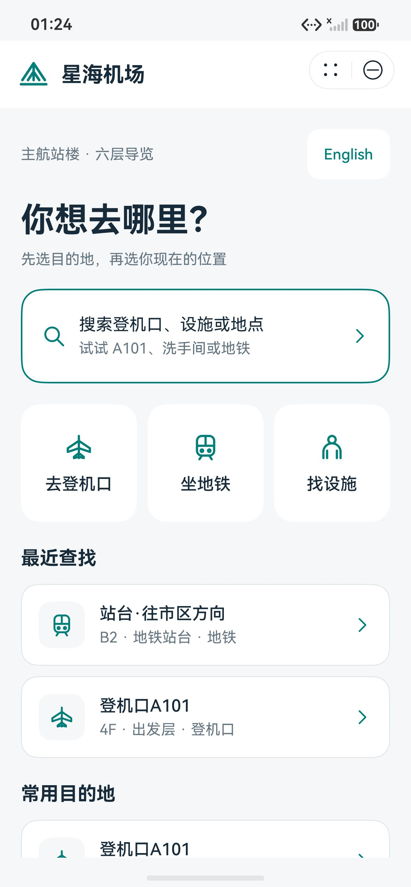
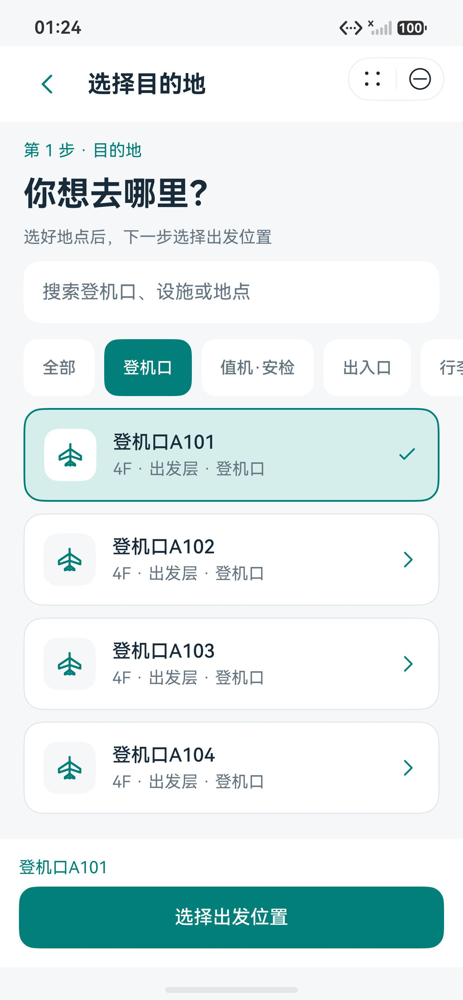
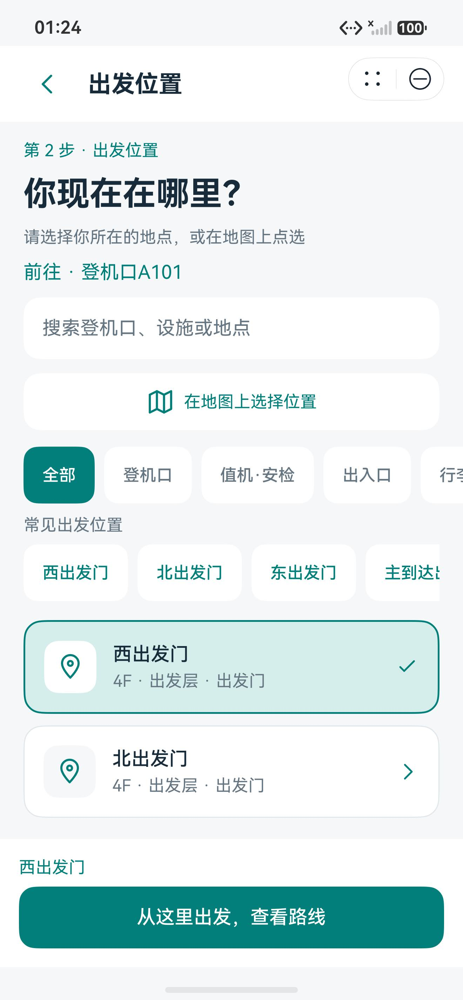
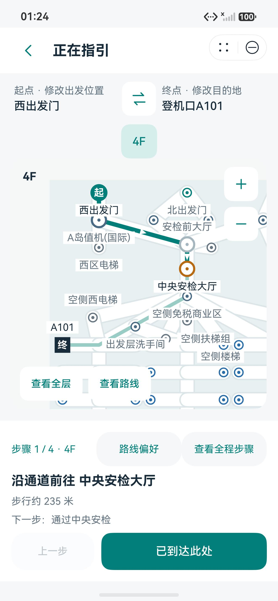
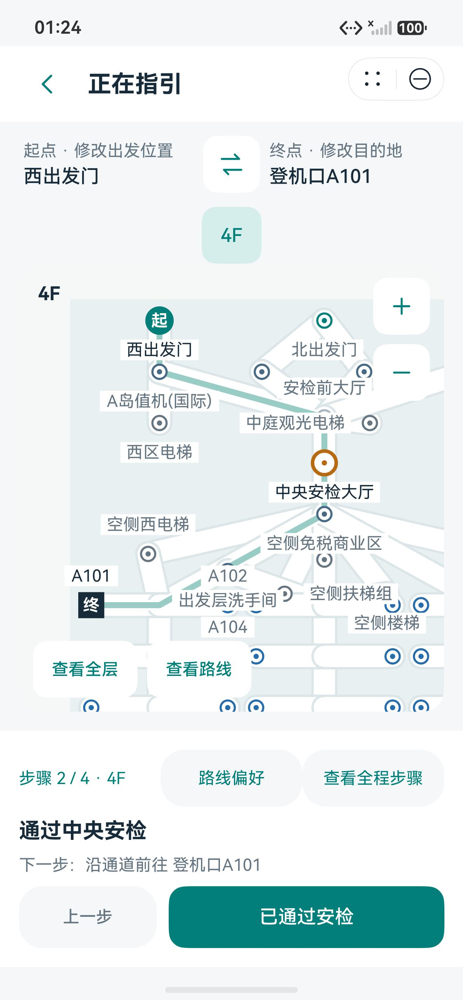
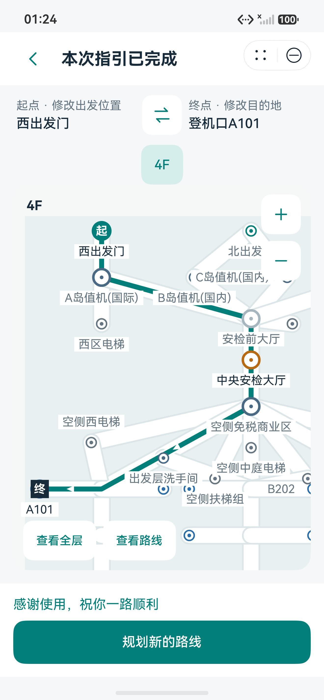
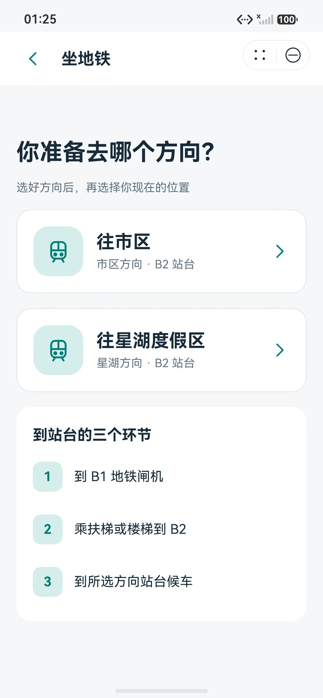
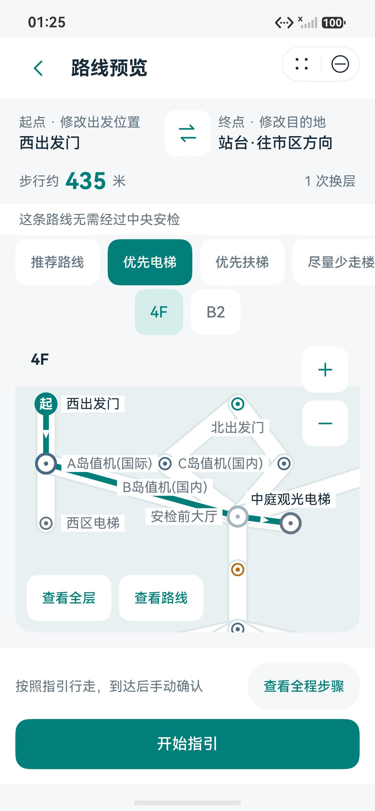
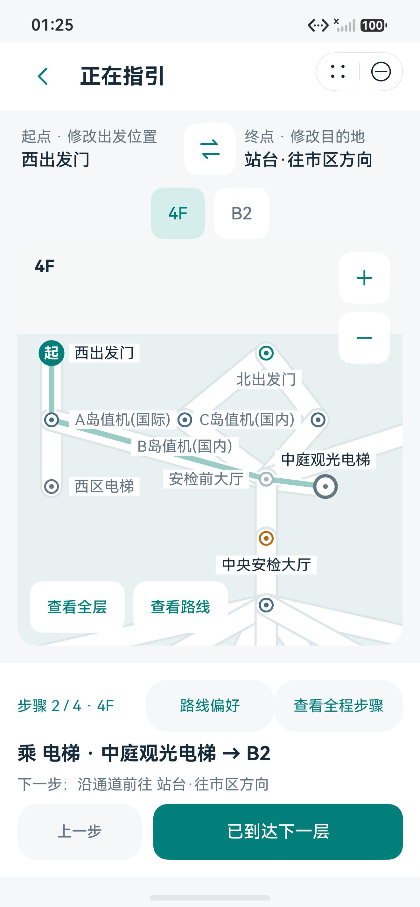
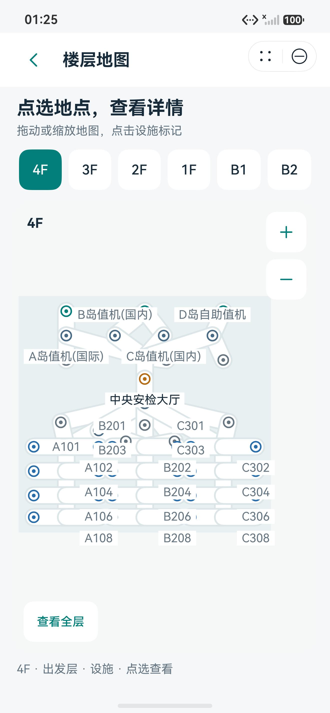

# 星海机场导航元服务 · 手机展示截图

这组图片是 HarmonyOS 模拟器上的系统原始截图，用于元服务介绍和案例介绍。每张均为完整 **1320 × 2848 JPEG**，未裁剪、拼接、重绘或修改画面。截图中的星海机场是示例地图；起点由体验者手动选择，路线按设备内示例数据计算，逐步指引也由体验者手动确认，不代表实时定位或真实机场导航。

| 序号 | 图片 | 页面与介绍场景 |
| --- | --- | --- |
| 01 | [首页](01-home.jpeg) | 中文首页，展示搜索、快捷任务和常用地点入口；当前没有选定起终点。 |
| 02 | [选择目的地](02-destination-a101.jpeg) | 从登机口分类选择 A101，显示已选状态和下一步按钮。 |
| 03 | [选择出发位置](03-start-west-departure.jpeg) | 手动选择西出发门，展示目的地与起点的两步规划流程。 |
| 04 | [安检路线预览](04-security-route-preview.jpeg) | 西出发门至 A101 的路线、楼层地图及中央安检提示。 |
| 05 | [开始逐步指引](05-guidance-next-step.jpeg) | 当前步骤、下一步提示和手动确认操作。 |
| 06 | [通过安检](06-security-confirmation.jpeg) | 中央安检步骤及到达后手动确认。 |
| 07 | [指引完成](07-completed.jpeg) | 完成状态和规划新路线入口。 |
| 08 | [地铁方向](08-metro-directions.jpeg) | 市区／星湖两个方向与到站台的主要环节。 |
| 09 | [地铁跨层路线](09-metro-cross-floor-preview.jpeg) | 从西出发门到市区方向站台的跨层路线预览，选择了优先电梯。 |
| 10 | [电梯换层](10-elevator-transfer.jpeg) | 乘电梯换层的逐步指引与手动确认。 |
| 11 | [4F 全层地图](11-floor-4f-map.jpeg) | 从首页楼层入口打开 4F 地图并使用“查看全层”。 |

采集使用 `hdc -t 127.0.0.1:5555 shell snapshot_display -f /data/local/tmp/xha_product_<name>.jpeg`，再用 `hdc -t 127.0.0.1:5555 file recv` 原样取回 JPEG。可从仓库根目录运行 `py -3 tools/capture_product_screens.py` 按相同界面流程重拍；脚本逐页等待转场稳定至少 1 秒，核验系统截图格式和 1320 × 2848 分辨率，结束后将应用留在中文首页。

采集日期为 2026-10-01，使用 API 26 手机模拟器、中文和标准字号。[manifest.json](manifest.json) 保存每张图片的分辨率、SHA-256 和对应 HAP 的 SHA-256，方便后续核对素材版本。复拍脚本需要本机 `hdc`、Python 与 Pillow，且应用已经安装并运行。

介绍材料可优先采用首页、路线预览、安检确认和电梯换层四张图；完整案例可按 01–07 展示登机口导航闭环，再用 08–11 展示地铁与楼层导览。

| 首页 | 目的地 | 出发位置 |
| --- | --- | --- |
|  |  |  |

| 路线预览 | 分步指引 | 安检确认 |
| --- | --- | --- |
|  |  |  |

| 指引完成 | 地铁方向 | 跨层路线 |
| --- | --- | --- |
|  |  |  |

| 电梯换层 | 全层地图 |
| --- | --- |
|  |  |
