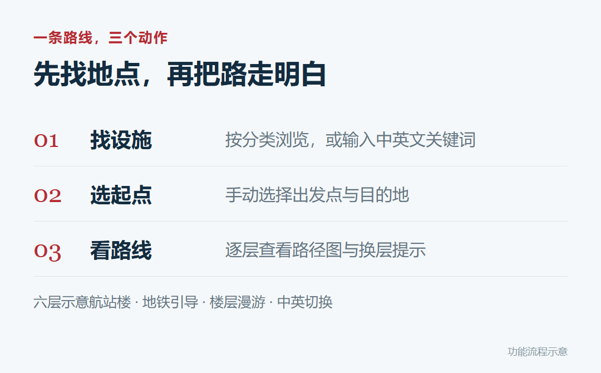
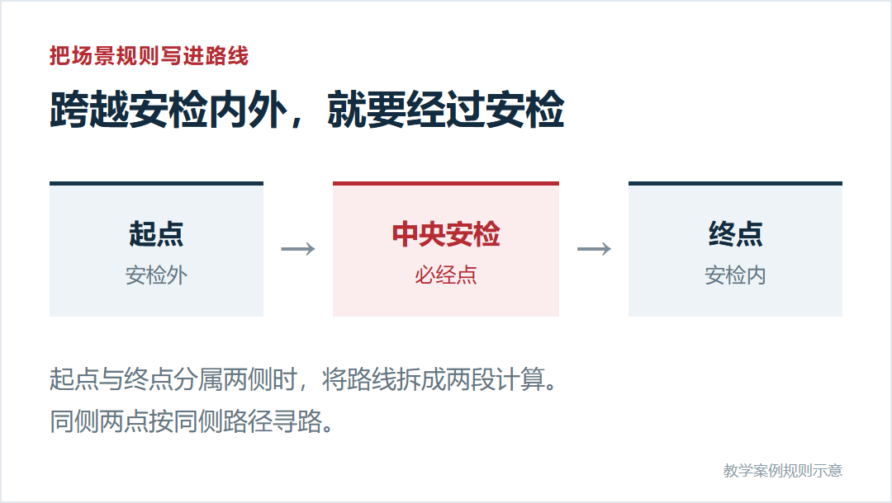
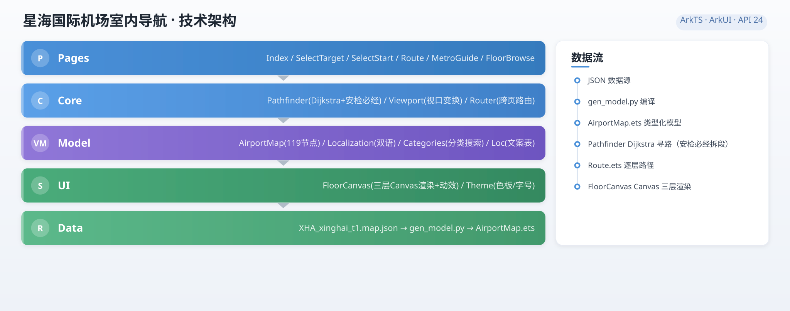

# 【鸿蒙元服务七日游】第一天，把机场里的路做成导航

> **原文来源**：微信公众号「鸿蒙开发实践中心」  
> **原文链接**：[https://mp.weixin.qq.com/s/BR6uOubxsKKWZHMcqdWKTg](https://mp.weixin.qq.com/s/BR6uOubxsKKWZHMcqdWKTg)  
> **定位说明**：本文为本仓库（星海国际机场 XHA 室内导航元服务）官方发布的原始开发导读 Blog，归档于此作为产品设计背景、核心场景规则与技术链路的原始参考资料。

---

## 快速事实与代码映射

| 业务概念 / 技术模块 | 文章核心说明 | 上游 ArkTS 源码真源 | 多端移植共享核心映射 |
|---|---|---|---|
| **地图源数据** | 6 层楼、119 节点、145 条连接边 | `data/XHA_xinghai_t1.map.json` / `tools/gen_maps.py` | `packages/core/src/generated/map-data.ts` |
| **类型化模型生成** | JSON 编译期转 ArkTS 强类型常量模型 | `tools/gen_model.py` → `AirportMap.ets` | `tools/export_shared.py` |
| **安检必经约束** | 陆侧/空侧跨侧必须经过唯一安检咽喉割点 | `xha_p4_sec`，`Pathfinder.ets:planRoute()` | `packages/core/src/pathfinder.ts` |
| **Dijkstra 寻路与偏好** | 垂直通道（电梯/扶梯/楼梯）加权与 4 档偏好 | `Pathfinder.ets` (`PREF_MULT`, `VERTICAL_WEIGHT`) | `packages/core/src/pathfinder.ts` |
| **Canvas 分层绘制** | 示意背景、节点连线、导航路径三层绘制与生长动效 | `ui/FloorCanvas.ets` | `packages/core/src/render.ts`（渲染命令流） |
| **视口坐标变换** | 平移、缩放与对齐保持一致 | `core/Viewport.ets` | `packages/core/src/viewport.ts` |
| **中英双语** | 同一份地图数据即时切换中英文 | `model/Loc.ets` / `Localization.ets` | `packages/core/src/i18n.ts` / `i18n-data.ts` |
| **六页流程组织** | Navigation 导航、行程状态驱动 | `pages/Index.ets` 等 6 页 | `packages/core/src/app-model.ts` |

---

## 文章正文

### 鸿蒙元服务七日游 · 第一天

拖着行李走进航站楼，你可能也遇到过这样的时刻：  
“安检在哪层？”“登机口怎么走？”“落地后怎样换乘地铁？”  

熟悉的出行需求，也能成为一次鸿蒙开发实践。  

“鸿蒙元服务七日游”的第一站，鸿蒙开发实践中心带你走进“星海国际机场”室内导航元服务。从找设施、选起点，到跨楼层寻路，把一段路变成一条可以运行、可以修改的交互流程。  

这是一个教学示意机场，地图与登机口数据随工程提供，起点由用户手动选择。你可以用它学习室内指引的实现，再换成自己熟悉的场景。  

---

### 01 · 选好两端，路线一层层展开

找目的地时，可以按分类浏览设施，也可以输入中英文关键词。选好起点和终点后，页面给出途经楼层、逐层路径图和换层提示。

  
*功能流程示意，依据案例 README 绘制。*

六层航站楼提供不同的空间场景。想先熟悉环境，可以进入楼层漫游，点开节点查看详情，再把该地点设为出发点或目的地；到达后要去地铁站，也有单独的指引入口。  

中英文可以随时切换，同一份地图呈现两种语言。先跑通一次，再切换语言看一遍，更容易理解数据与页面之间的关系。  

---

### 02 · 路线算得短，也要走对“必经点”

这个案例值得细看的地方，是“**安检必经**”。当起点和终点分属安检外与安检内，寻路会把中央安检纳入路线，按“**起点 → 安检 → 终点**”组织结果。

  
*安检必经规则示意；用于说明教学案例中的寻路约束。*

一个场景规则，就这样进入了算法和页面。开发者可以观察：同侧两点怎样寻路，跨侧路线怎样经过安检，跨楼层时又怎样把换层过程讲清楚。  

---

### 03 · 技术拆解：一条路线怎样变成画面

这套元服务使用 **ArkTS 与 ArkUI**，地图模型、寻路计算和绘图都在设备侧完成。下面这张架构图，把页面、核心逻辑、模型、绘图与数据的分工放在了一起。

  
*图由案例仓库提供，查看[架构图原文件](../cases/arch-diagram.svg)。*

沿着图右侧的数据流读下来，关键过程是：  
**JSON 地图 → ArkTS 类型化模型 → Dijkstra 寻路 → 逐层路线 → Canvas 绘制**。

#### 第一步：把地点和连接关系写成数据
地图的源文件是 `XHA_xinghai_t1.map.json`，共描述六个楼层、119 个节点和 145 条连接边。节点记录地点名称、类别、楼层与坐标；边描述哪些地点相连，以及步行、电梯、扶梯或楼梯等连接类型。

开发时，`gen_model.py` 将这份 JSON 生成 `AirportMap.ets` 中的类型化模型，再随元服务打包。寻路、绘图和节点双语名称都基于同一套模型。改造自己的场景时，可以从地图数据入手，重新生成模型后再运行工程，核对路线与显示结果。

#### 第二步：用算法选路，再把场景规则落进去
`Pathfinder.ets` 使用 **Dijkstra 最短路径算法**，根据连接边的权重比较路线的累计代价。电梯、扶梯和楼梯也作为跨层连接参与计算；“优先电梯”“优先扶梯”“避开楼梯”等偏好，通过调整换层连接的计算权重影响选路。

前面提到的“安检必经”，则落实在 `planRoute` 中：起终点分属安检内外时，分别计算“起点到中央安检”和“中央安检到终点”，再拼接两段路线。算法与业务约束共同决定最终结果。

#### 第三步：把节点序列画成能看懂的指引
路线结果按途经楼层组织，由 `Route.ets` 展示逐层路径与换层提示。`FloorCanvas` 按**示意背景、节点连线、导航路径**三个层次绘制内容，突出当前路线；路径生长动效由绘制进度控制。

这些内容共用 `Viewport` 的坐标变换，平移或缩放时，背景、设施节点与路线同步变化，保持对齐。页面流程由 ArkUI `Navigation` 组织，节点双语名称和页面文案分别由 `Localization`、`Loc` 等模块管理。

再看下面的 4F 出发层图示，就能把“节点、连接边、路线”与实际地图位置对应起来。

  
*依据案例原始地图数据重绘的 4F 出发层示意。*

从这条数据流出发，你能学到的不只有一张地图，还包括**结构化数据建模、带场景约束的寻路、Canvas 分层绘制，以及多页与双语的组织方式**。这套思路可以继续用于校园、展馆或园区导览。

---

### 04 · 今天可以动手改一件事

把示意机场换成你熟悉的校园或展馆，先做一条“入口到服务台”的路线。  
**先改地图数据，再生成模型，最后核对路线与画面。**  

在 JSON 中调整地点名称、坐标与连接关系，运行 `gen_model.py` 更新模型，再在页面中选择起终点；如果涉及跨层，继续检查换层连接与提示是否对应。这样，你改动的数据就能沿着架构图中的流程走到界面上。  

也可以把这个明确的目标交给 AI 编码助手，边运行边核对：地图上的起点、终点和实际显示的路线，是否一致？  

这个假期，从一条自己的路线开始，完成一次看得见结果的鸿蒙开发实践。  

#### 获取源码，开始你的第一条路线
本案例的源码与完整实践说明已公开。进入 GitCode 仓库，按 README 的“快速体验”运行工程；想理解实现过程，可以继续阅读“完整实践”。  
* 仓库地址：`https://gitcode.com/harmony-practice-center/HarmonyOS-METASERVICE-airport-guide`  
* 鸿蒙开发实践中心是一个在线开发实践平台。  

---

## 本 Fork（多端移植版）的承接与演进

本工作区在学习和消化上述官方 Blog 体系的基础上，完成了进一步的架构演进：

1. **核心逻辑解耦与提炼（`packages/core`）**：
   * 将 Blog 第 03 节中详述的数据流水线与约束算法全部下沉为平台无关的 TypeScript 模块，不引入任何平台私有 API。
   * 数据生成链路在原本的 `gen_maps.py → gen_model.py` 后增加 `export_shared.py`，确保 TS 共享核心与 ArkTS 原生真源永不漂移。
2. **绘制契约化（`render.ts`）**：
   * 将 Blog 中描述的 `FloorCanvas` 三层绘制提炼为平台中立的「渲染命令流（DrawCommand）」，Web Canvas 2D、Apple SwiftUI Canvas、微信小程序 Canvas 2D 统一消费同一份命令序列，严格对齐视觉呈现。
3. **多端覆盖**：
   * 在保留 `harmony_app/` 作为只读参照的同时，成功拓展出 Web/PWA（`apps/web`）、Apple 原生（`apps/apple`）及微信小程序（`apps/weapp`）。
