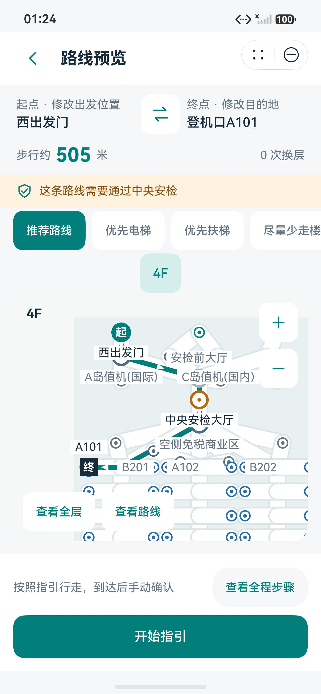
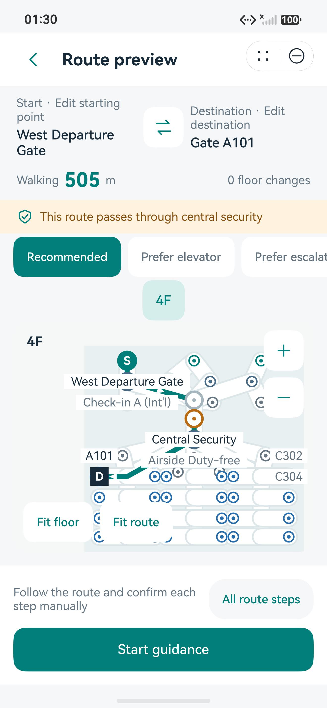
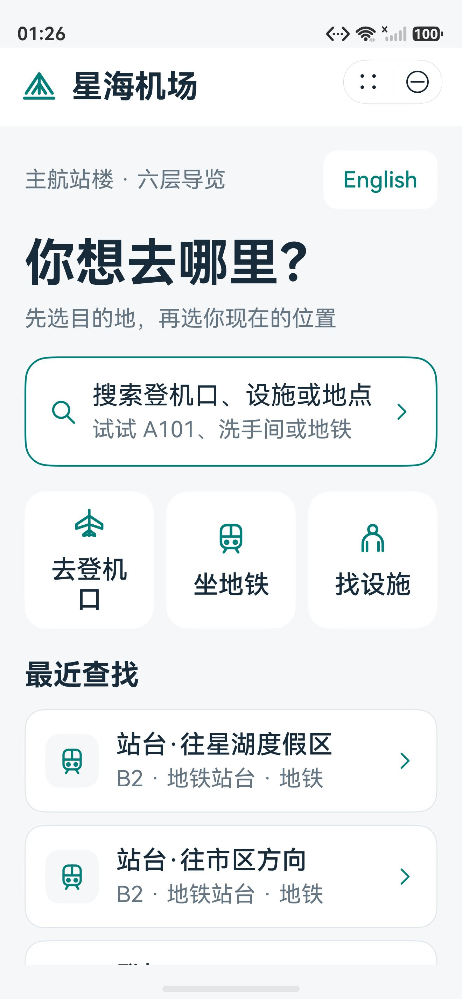
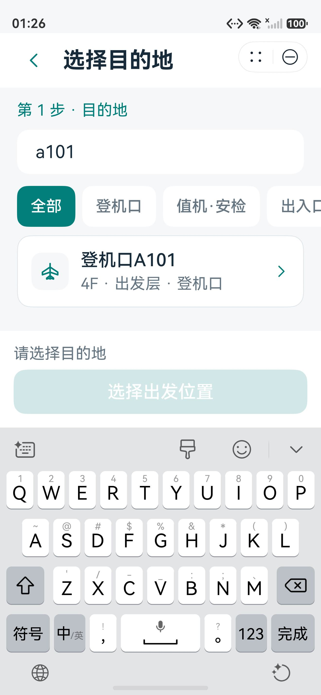
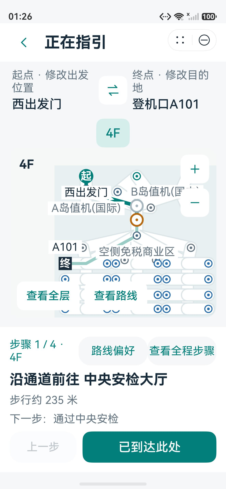

# 星海国际机场导航元服务体验记录

**记录日期：** 2026-10-01

**产品定位：** HarmonyOS 本地运行的机场导览示例

**验证范围：** 工程逻辑回归、API 24 手机扩展流程、大字体搜索与宽屏跨层路线，API 26 手机及自建宽屏 QA 模拟器中英文核心流程

## 本轮结果

本轮围绕六页导航流程整理了页面状态与路线步骤处理，并更新了地图适配、文字布局、固定操作区、图标和应用入口图标。机场图谱仍以 `data/XHA_xinghai_t1.map.json` 为唯一源数据，包含 **119 个节点、145 条边、6 个楼层**；Dijkstra 算法和陆侧、空侧之间必须经过中央安检的拆段规则没有变化。

页面分为首页、目的地选择、起点选择、路线、地铁引导和楼层浏览。新行程与路线编辑草稿分开处理，起终点可以交换或取消编辑；路线拆成步行、安检和换层步骤，用户逐项确认后才推进，支持回退和查看全程步骤。地图按当前路线范围适配，预览中的 A101 终点标记和名称在 API 26 截图中完整可见。

目的地检索支持中英文；本机保存最多 6 条最近目的地。主要按钮采用 48 vp 触控高度，文字使用系统字体，图标资源使用 SVG，应用入口使用单独的 launcher icon。API 24 大字体（约为标准字号的 1.3 倍）截图显示首页入口、键盘压缩后的搜索结果、已选地点和路线指引操作区仍可见。API 24 手机完成中文 21 项状态流程、14 项六层与地图流程，以及英文地铁两方向 6 项流程，均通过。API 24 MateX7 宽屏验证了地铁跨层预览、指引和换层步骤；地图选点英文流程也通过。API 24 折叠屏模拟器完成 1080×2444 折叠态与 2210×2416 展开态重适配验证。API 26 自建 MateX7-profile 宽屏 QA 模拟器的中英文全流程确认路线地图留白及固定操作区可见；英文末版另验证了首步 `Next:` 提示和选择“Prefer elevator”后回到预览并重置指引状态。

## 变更文件概览

| 范围 | 文件 | 用途 |
| --- | --- | --- |
| 页面 | `harmony_app/entry/src/main/ets/pages/` 下的 `Index.ets`、`SelectTarget.ets`、`SelectStart.ets`、`Route.ets`、`MetroGuide.ets`、`FloorBrowse.ets` | 六页入口、目的地/起点、路线步骤、地铁和楼层浏览体验 |
| 状态与地图 | `harmony_app/entry/src/main/ets/core/` 下的 `PlannerState.ets`、`RouteSteps.ets`、`Places.ets`、`LocalStore.ets`、`Viewport.ets`、`Router.ets` | 行程草稿、路线步骤、地点检索/最近列表、本地保存、地图适配与导航状态 |
| 组件与文案 | `harmony_app/entry/src/main/ets/ui/` 下的 `Common.ets`、`FloorCanvas.ets`、`Theme.ets`；`harmony_app/entry/src/main/ets/model/Loc.ets`、`Localization.ets` | 公共控件、Canvas 地图、主题、系统字体与双语文案 |
| 工程和资源 | `harmony_app/entry/src/main/ets/entryability/EntryAbility.ets`、`harmony_app/AppScope/app.json5`、`harmony_app/build-profile.json5`、`harmony_app/entry/src/main/resources/` | 元服务运行配置、API 兼容目标、SVG 图标和 launcher 图标 |
| 验收辅助 | `tools/verify_product.mjs`、`tools/verify_flows.py`、`tools/smoke_emulator.py`、`tools/capture_product_screens.py`、`tools/gen_brand_assets.py` | 核心逻辑验证、扩展 UI 流程、系统截图采集和品牌图标生成 |

`data/XHA_xinghai_t1.map.json` 和 `harmony_app/entry/src/main/ets/core/Pathfinder.ets` 未改动；本轮未改变机场示例数据、Dijkstra 选路实现或安检割点拆分规则。

## 体验边界

“星海国际机场”及其楼层、地点、距离均为随包提供的示例数据。起点由用户手动选择，当前版本不提供室内定位、真实航班状态、机场运营数据或云端服务。因此，本记录证明的是示例工程在指定模拟器和路径下的运行体验，不能据此推断真实机场数据准确、现场网络/设备适配、商用部署或运营验收已经完成。实际机场上线仍需授权数据、签名发布流程和现场验证。

## 构建与复现

以下命令在已配置 HarmonyOS SDK、Node.js、Java 与 hvigorw 的环境中执行。SDK 由本机 DevEco 配置，本轮以 **API 26 编译**；工程的 `compatibleSdkVersion` 和 `targetSdkVersion` 保持 **HarmonyOS 6.1.0（API 23）**。构建产物为未签名 HAP，用于模拟器验证；签名发布另需相应配置。

```powershell
$env:DEVECO_SDK_HOME = 'C:\Program Files\Huawei\DevEco Studio\sdk'
$env:NODE_HOME = 'C:\Program Files\Huawei\DevEco Studio\tools\node'
$env:JAVA_HOME = 'C:\Program Files\Huawei\DevEco Studio\jbr'
$env:PATH = "$env:JAVA_HOME\bin;$env:NODE_HOME;$env:PATH"
Push-Location harmony_app
& "$env:NODE_HOME\node.exe" 'C:\Program Files\Huawei\DevEco Studio\tools\hvigor\bin\hvigorw.js' assembleHap --no-daemon --mode module -p product=default -p module=entry@default -p buildMode=debug --console=plain
Pop-Location
```

构建后检查：

```powershell
Get-Item harmony_app/entry/build/default/outputs/default/entry-default-unsigned.hap
```

最终构建成功，HAP 为 **751,682 字节**，SHA-256 为 `214963FBC7766873D312BEB42B235E6E8812BB1BCE9DB22FCED45C6F7437AD18`。构建及验收元数据另存于 [ProductExperience-20261001.json](ProductExperience-20261001.json)。

在 HAP 已安装并且模拟器已由开发者启动的前提下，运行核心 UI 冒烟流程。脚本通过指定的 hdc target 操作应用并保存布局 JSON、截图和 PASS/FAIL 输出；它不安装 HAP 或启动模拟器。

```powershell
$env:PYTHONUTF8 = '1'
py -3 tools/smoke_emulator.py --target <hdcId> --out .temp/product-20261001/api26/smoke-zh --language zh
py -3 tools/smoke_emulator.py --target <hdcId> --out .temp/product-20261001/api26/smoke-en --language en
```

API 26 手机本轮在 `127.0.0.1:5555` 实测：中文和英文均完成首页、A101 分类选点、西出发门选点、路线预览、中央安检提示、开始指引、步骤计数、上一步和逐项确认到完成页。API 26 自建宽屏 profile（2210×2416、HarmonyOS 7 `phone_all_x86`、MateX7 硬件配置、4 GB、无窗口模式）也完成中英文核心流程。模拟器首次启动后，脚本等待首页转场稳定再操作，避免启动动画阶段吞掉首个触控；这是测试稳定性处理。API 26 这两次 UI 流程使用登机口分类选择 A101；文本键盘搜索由 API 24 体验另行验证。

## 已确认的验证结果

| 验证项 | 命令或证据 | 结果 |
| --- | --- | --- |
| Python 寻路基线 | `python tools/pathfind_reference.py` | 500 组随机起终点基线通过，含安检必经断言 |
| ArkTS 核心逻辑回归 | `node tools/verify_product.mjs` | 6/6 套件通过；500 组起终点 × 4 种偏好，共 2,000 条路线；覆盖 RouteSteps、PlannerState、地点搜索与最近列表、Viewport、Loc 双语键检查 |
| API 26 中文核心流程 | `tools/smoke_emulator.py --language zh` | 通过；A101 路线包含中央安检，4 个指引步骤逐项推进并完成 |
| API 26 英文核心流程 | `tools/smoke_emulator.py --language en` | 通过；页面与步骤文案切换为英文，路线流程完成 |
| API 26 宽屏中英文核心流程 | `api26-wide/final-smoke-zh`、`api26-wide/final-smoke-en` | 自建 MateX7-profile QA 模拟器 2210×2416；地图边距、终点标记及固定操作区可见，双语完整流程通过 |
| API 26 英文末版指引与偏好变更 | `api26-wide/final-en-step1` | `Next:` 提示可见；选择 `Prefer elevator` 后返回预览，指引进度重置 |
| API 24 中文状态流程 | [公开摘要](product-20261001/api24-state.json) | 21 项通过，覆盖查看其他路线楼层不推进指引、全程步骤、回退、编辑取消/确认、偏好重算、交换和新行程等状态 |
| API 24 中文六层与地图流程 | [公开摘要](product-20261001/api24-map.json) | 14 项通过，覆盖六层入口、地图缩放/适配、节点详情、设为起点及地图选点后预览 |
| API 24 英文地铁方向 | [公开摘要](product-20261001/api24-metro.json) | 市区与星湖两个方向各完成入口、出发位置和预览，共 6 项通过 |
| API 24 宽屏跨层指引 | `api24-wide/release/10_cross_floor_preview.jpeg`、`12_cross_floor_guidance.jpeg`、`14_transfer_step.jpeg` | 2210×2416：跨层预览、指引及换层步骤；最新版本差异仅为地图标签避让微调 |
| API 24 宽屏地图选点 | `api24-wide/map-selection-en` | 英文从地图选择目的地、地图选择起点、西出发门到路线预览通过 |
| API 24 折叠/展开适配 | `api24-wide/final-marker` | 最终版本在 1080×2444 折叠态与 2210×2416 展开态重新适配；起终点标记与按钮可见，路线保持不变 |
| API 24 搜索与大字体 | `api24/release-large-font` | 最终版本搜索带空格的小写 ` a101 `，键盘、选中地点、起点、预览、当前和下一步骤、确认按钮均已验证；验证后恢复标准字号 |
| 最终版本系统截图 | `tools/capture_product_screens.py` | 11 个中文主要功能场景，1320×2848 原始 JPEG，地图关键标记避让已纳入最终截图 |
| 应用进程日志抽查 | `runtime/audit.json` | API 24/26 四个当前应用进程日志中未发现 JsError、CppCrash、uncaught、Fatal 或 Unhandled 错误 |

以上三个 JSON 为可随仓库发布的 UI 流程摘要，保留通过项和逐步断言，不包含设备布局树或完整过程截图；这些详细材料仅保存在本地 `.temp/`。公开代表截图见[手机截图说明](../images/product-20261001/phone/README.md)。

核心逻辑回归通过对当前 ETS 模块进行本地执行，覆盖行程新建、编辑取消、提交、交换、偏好改变、步骤前进/回退等状态转换；两千条路线都检查 RouteSteps 与路由结果的一致性。旧版 500 组 Python 参考实现基线也继续通过。

## 证据截图

以下为本轮确认通过的精选截图。截图由模拟器系统截图命令保存，保留原始分辨率，没有拼贴、裁剪或重绘；原始截图和布局 JSON 保存在 `.temp/product-20261001/` 下。宽屏和大字体图像用于验证证据。

| API 26 中文首页 | API 26 中文路线预览 | API 26 中文完成页 |
| --- | --- | --- |
|  |  |  |

| API 26 英文路线预览 | API 24 大字体首页 | API 24 大字体搜索键盘与结果 |
| --- | --- | --- |
|  |  |  |

| API 24 大字体路线指引 |
| --- |
|  |

## 尚未覆盖

- API 23 设备实测尚未进行；API 24/26 宽屏及折叠态证据来自 QA 模拟器配置，不代表实体折叠屏验收。
- API 26 全流程通过分类选点验证；API 26 文本键盘搜索流程没有纳入这次冒烟路径。
- 未验证真实机场数据、真实定位、生产签名、上架或现场运行。
