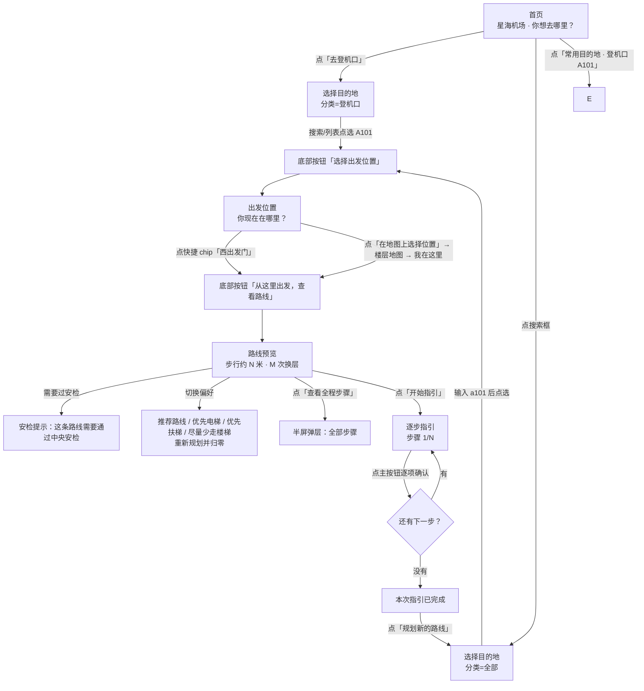

# 使用者功能说明（user-guide.md）

> 图片编号 06 · 面向使用者的功能说明

本文档写给**用户与测试同学**：不解释代码怎么写的，只回答"怎么用、会看到什么、异常怎么办"。它逐页说明六个页面的元素与操作、走完一条完整路线、搜索与手势的真实行为、边界提示文案，以及常见问题。每条描述都能在 `harmony_app/entry/src/main/ets/**` 的代码里对上；界面文案直接引用 `model/Loc.ets` 中的实际中文。

**使用前提**：应用是纯端侧示例，打开即用，不需要登录、不需要联网、不申请任何权限。地图与距离来自随包示例数据，"当前位置"必须由你自己选，进度也要你自己确认。

---

## 1. 六页总览

| 页面 | 进入方式 | 一句话作用 | 实现文件 |
| --- | --- | --- | --- |
| 首页 | 应用启动即达 | 看机场总览、搜索、三个快捷入口、常用目的地、六层楼层入口 | `pages/Index.ets` |
| 选择目的地 | 首页搜索框 / "去登机口" / "找设施" | 分类 + 搜索选终点 | `pages/SelectTarget.ets` → `ui/PlacePicker.ets` |
| 出发位置 | 选完目的地后自动进入；或首页"坐地铁"选完方向 | 选"你现在在哪里" | `pages/SelectStart.ets` → `ui/PlacePicker.ets` |
| 路线 | 起点页点"从这里出发，查看路线" | 路线预览 → 逐步指引 → 完成 | `pages/Route.ets` |
| 楼层地图 | 首页楼层卡片；或起点页"在地图上选择位置" | 单层地图浏览与点选 | `pages/FloorBrowse.ets` |
| 坐地铁 | 首页"坐地铁"卡片 | 选方向后进入起点选择 | `pages/MetroGuide.ets` |

> 只有 `pages/Index` 注册为独立页面，其余五页都是 Navigation 子页（`NavDestination`），因此它们**没有独立启动入口**，只能从首页逐层进入（`harmony_app/entry/src/main/resources/base/profile/main_pages.json`、`harmony_app/entry/src/main/ets/pages/Index.ets:68-74`）。
>
> 引用约定：下文代码路径中 `pages/...`、`ui/...`、`core/...`、`model/...` 均指 `harmony_app/entry/src/main/ets/` 下的同名文件。

## 2. 首页（`pages/Index.ets`）

自上而下的元素与可执行操作：

| 元素 | 文案 / 内容 | 点它会怎样 |
| --- | --- | --- |
| 顶部标题栏 | "星海机场" + 品牌图标（无返回按钮） | — |
| 语言按钮 `language_switch` | 当前中文时显示 `English`，英文时显示 `中文` | 立即整页切换中英，并保存到本地（`pages/Index.ets:32`） |
| 副标题 | "主航站楼 · 六层导览" | — |
| 大标题 + 提示 | "你想去哪里？" / "先选目的地，再选你现在的位置" | — |
| 搜索框 `home_search` | "搜索登机口、设施或地点" + "试试 A101、洗手间或地铁" | 进入"选择目的地"页，**分类为"全部"、搜索词为空** |
| 三张任务卡 | "去登机口" / "坐地铁" / "找设施" | 前两个分别以分类 `gate`、`service` 进入"选择目的地"；"坐地铁"进入"坐地铁"页 |
| 最近查找 | 标题"最近查找"（仅在本地有记录时出现，最多 6 条） | 点某条 = **直接把它当目的地**，跳到"出发位置"页 |
| 常用目的地 | 固定 4 条：登机口A101、登机口C308、中央安检大厅、行李提取A区（`pages/Index.ets:16`） | 同上，直接当目的地并跳到"出发位置"页 |
| 查看楼层地图 | 4F/3F/2F/1F/B1/B2 六个卡片，两列排布，每张显示楼层号 + 楼层名（如"出发层"）+ "楼层地图" | 进入该层"楼层地图"页 |
| 页脚说明 | "星海机场示例导览 · 位置由你手动选择" | — |

注意：首页**没有**固定的"当前楼层"缩略图（`docs/需求文档.md:53` 曾设想），楼层信息以六个卡片呈现。

## 3. 选择目的地（`ui/PlacePicker.ets`，`start=false`）

| 元素 | 内容 | 操作结果 |
| --- | --- | --- |
| 标题栏 | "选择目的地" + 返回按钮 | 返回首页（返回前会丢弃未提交的编辑草稿） |
| 步骤提示 | "第 1 步 · 目的地" | — |
| 大标题 / 提示 | "你想去哪里？" / "选好地点后，下一步选择出发位置" | 键盘弹出（输入框获得焦点）时这两行会隐藏，给列表让位 |
| 搜索框 `place_search` | 占位文案"搜索登机口、设施或地点" | 输入即实时过滤 |
| 分类横滑 chips | 全部 / 登机口 / 值机·安检 / 出入口 / 行李 / 地铁 / 接驳交通 / 停车·地面 / 商业·服务 / 换层设施 | 点击切换分类并重新过滤 |
| 结果列表 `place_list` | 每行：类型图标 + 名称 + "楼层 · 楼层名 · 类型标签"；已选中项高亮并显示 ✓ | 点击 = 选中为目的地（不立即跳页） |
| 底部选中条 | 未选时显示"请选择目的地"，已选时显示地点名 | — |
| 底部主按钮 `primary_action` | 未选起点时显示"选择出发位置"（`next_start`） | 进入"出发位置"页 |

选中后没有马上规划，必须再点底部按钮；如果此前起点已存在（编辑场景），按钮文案变为"更新路线"（`apply`）。

## 4. 出发位置（`ui/PlacePicker.ets`，`start=true`）

页面结构与目的地页一致，差异如下：

| 元素 | 内容 |
| --- | --- |
| 标题 / 步骤 | "出发位置" + "第 2 步 · 出发位置" |
| 大标题 / 提示 | "你现在在哪里？" / "请选择你所在的地点，或在地图上点选" |
| 已选目的地回显 | "前往 · <目的地名>"（当目的地已确定时显示） |
| 常见出发位置 | 8 个快捷 chip：西出发门、北出发门、东出发门、2F 主到达出口、B2 站台·往市区方向、B2 站台·往星湖度假区、1F 出租·网约上车点、B1 交通中心大厅（`core/Pathfinder.ets:286-290`） |
| 在地图上选择位置 | 进入"楼层地图"页并处于"设为出发点"模式 |
| 结果列表 | 与目的地页相同，已选中项显示 ✓ |
| 底部选中条 | 未选时"请选择出发位置" |
| 底部主按钮 | "从这里出发，查看路线"（`view_route`）；未选地点时置灰不可点 |

快捷 chip 与"在地图上选择位置"只在**未输入搜索词、分类为"全部"、且键盘未聚焦**时才显示（`ui/PlacePicker.ets:79,89`），避免与搜索结果抢空间。

## 5. 路线页（`pages/Route.ets`）

路线页用一个页面承载三种阶段：**预览 → 指引 → 完成**。

### 5.1 共同元素

| 元素 | 内容 |
| --- | --- |
| 标题栏 | 阶段不同：`路线预览` / `正在指引` / `本次指引已完成` |
| 起终点条 `edit_start` / `edit_end` | 左侧"起点 · 修改出发位置"+ 地点名；右侧"终点 · 修改目的地"+ 地点名。点任一侧进入编辑 |
| 交换按钮 `reverse_route` | 交换起点与终点（无障碍文本"交换起终点"） |
| 楼层 Tabs `route_leg_<i>` | **只列出路线实际经过的楼层**，可横滑；点击切换地图显示哪一层（不改变进度） |
| 地图区 | Canvas 楼层图，显示本层路径段、起终点标记、安检标记，可拖拽缩放 |

### 5.2 预览阶段

| 元素 | 内容 |
| --- | --- |
| 摘要行 | "步行约 <总米数> 米" + "<N> 次换层" |
| 安检提示条 | 需要安检时显示盾牌图标 + "这条路线需要通过中央安检"（琥珀底色）；同侧时显示"这条路线无需经过中央安检" |
| 偏好横滑按钮 | "推荐路线" / "优先电梯" / "优先扶梯" / "尽量少走楼梯"，当前档位高亮 |
| 底部 | 提示"按照指引行走，到达后手动确认" + "查看全程步骤"按钮 + 主按钮"开始指引" |

**米数口径**：显示的是**只累计 walk（同层步行）边**的米数；电梯/扶梯/楼梯只计"次换层"，不计入步行米数（`core/RouteSteps.ets:6-11,26`、`docs/开发文档.md:287`）。

**换偏好会重置**：切换任一偏好会重新规划、回到预览、步骤计数归零（`core/PlannerState.ets:30-32`）。

### 5.3 指引阶段

| 元素 | 内容 |
| --- | --- |
| 步骤计数 | "步骤 <当前> / <总数> · <当前步骤所在楼层>" |
| 路线偏好按钮 `route_preferences` | 弹出菜单，可随时换四档偏好（同样会回到预览并归零） |
| 查看全程步骤 `all_route_steps` | 半屏弹层，列出所有步骤（序号、标题、楼层、米数）；点某一步只把地图切到那一段 |
| 当前步骤标题 | 例如"沿通道前往 登机口A101"、"通过中央安检"、"乘 电梯 · 中庭电梯(C) → 2F"、"到达目的地后确认完成" |
| 步行米数 | 当前步骤有步行距离时显示"步行约 N 米" |
| 下一步 | "下一步：<下一步标题>" |
| 回到当前步骤 `return_current` | 仅当你手动切到别的地图段时出现，点它跳回当前步骤对应的路段 |
| 上一步 `previous_step` | 回退一步（第一步时置灰） |
| 主按钮 | 按步骤类型变化："已到达此处" / "已通过安检" / "已到达下一层" / "确认到达目的地"（最后一步） |

看完最后一步并点"确认到达目的地"后进入完成页；在完成页点主按钮"规划新的路线"会清空起终点，直接回到"选择目的地"页。

### 5.4 进度规则

- 仅点主按钮（或"上一步"）会改变进度；**查看其他楼层、点全程步骤列表都不推进指引**。
- 进度只存在当前会话里，退出应用不保留；下次进入是新行程、起终点为空（`core/PlannerState.ets:15-17`）。

## 6. 坐地铁（`pages/MetroGuide.ets`）与楼层地图（`pages/FloorBrowse.ets`）

### 6.1 坐地铁

| 元素 | 内容 | 操作结果 |
| --- | --- | --- |
| 标题 / 大标题 / 提示 | "坐地铁" / "你准备去哪个方向？" / "选好方向后，再选择你现在的位置" | — |
| 往市区卡片 `metro_xha_b2_platA` | "往市区" + "市区方向 · B2 站台" | 把目的地设为 B2 站台·往市区方向，进入"出发位置"页 |
| 往星湖度假区卡片 `metro_xha_b2_platB` | "往星湖度假区" + "星湖方向 · B2 站台" | 目的地设为 B2 站台·往星湖度假区，进入"出发位置"页 |
| 到站台的三个环节 | 静态三步说明：① 到 B1 地铁闸机 ② 乘扶梯或楼梯到 B2 ③ 到所选方向站台候车 | 纯说明，不可点；实际路线在后续路线页生成 |

选完方向与起点后，页面流程与普通路线完全一致（同一个路线页、同一个寻路引擎）。

### 6.2 楼层地图

| 元素 | 内容 | 操作结果 |
| --- | --- | --- |
| 标题 / 大标题 | "楼层地图" / "点选地点，查看详情"（"设为出发点"模式下标题变成"你现在在哪里？"） | — |
| 楼层横滑按钮 `map_floor_<层>` | 4F / 3F / 2F / 1F / B1 / B2 | 切换楼层并清空当前选中节点 |
| 地图区 | 该层 Canvas 地图 | 单指拖拽平移、双指捏合缩放、点击设施标记弹半屏详情 |
| 底部说明 | "<楼层> · <楼层名> · 设施 · 点选查看" | — |
| 详情弹层 | 地点名 + "<楼层> · <楼层名>" + 动作按钮 | "我在这里"（设为出发点）/ "去这里"（设为目的地）/ "取消"；从首页进入时可两个都用，"设为出发点"后页面底部出现"已选择出发位置 · <地点> + 接下来选择目的地" |

在详情里选"去这里"：若还没有起点，会接着进入"出发位置"页；若已有起点，直接进入路线预览（并把该地点记入"最近查找"）。

## 7. 完整操作流程

以 README 的推荐走查为例：**去登机口 A101，从西出发门出发**。

各步骤会显示的信息：

| 步骤 | 显示的信息 |
| --- | --- |
| 选择目的地 | 分类 Tab、搜索框、结果行的"名称 + 楼层 · 楼层名 · 类型标签" |
| 选择出发位置 | 已选目的地回显"前往 · X"、快捷起点、结果行、底部选中地点 |
| 路线预览 | 总步行米数、换层次数、是否经中央安检、当前偏好、楼层 Tabs、地图（起/终点标记 + 路径线） |
| 逐步指引 | 步骤序号与总数、当前楼层、当前步骤标题、本步步行米数、下一步提示 |
| 换层步骤 | "乘 电梯/扶梯/楼梯 · <设施名> → <目标楼层>" |
| 安检步骤 | "通过中央安检"，确认按钮为"已通过安检" |
| 完成 | "本次指引已完成" + "感谢使用，祝你一路顺利" + "规划新的路线" |
| 地铁换乘 | 方向卡片（往市区/往星湖）+ 三步环节说明；选方向后与普通流程一致，终点为 B2 对应站台 |

## 8. 搜索、分类与最近使用

| 行为 | 实际表现 | 出处 |
| --- | --- | --- |
| 搜索范围 | 只搜"对外可见的地点"：所有非 `corridor` 节点，外加 7 个白名单通道节点（安检前大厅、3F 观景露台、亲子游乐区、行李寄存处、航站楼间连廊、B1 地铁闸机群、B2 站台联络通道）。普通中转通道不出现 | `core/Places.ets:6,9` |
| 匹配方式 | 中文名子串、英文名子串（均忽略大小写）、登机口编号子串；输入前后空格会被忽略 | `core/Places.ets:12-17` |
| 排序 | **登机口编号完全相等的排最前**（输入 `a101` 时"登机口A101"置顶），其余保持数据顺序 | `core/Places.ets:19-23` |
| 分类 | 10 个 Tab 覆盖全部地点；个别节点的分类按 id 校正（行李寄存处归"行李"、地铁站厅/闸机/站台联络通道归"地铁"、航站楼间连廊归"停车·地面"、交通中心大厅与机场巴士站台归"接驳交通"） | `model/Categories.ets:13-24,45-52` |
| 无结果 | 显示"没有找到这个地点" + "试试登机口编号，或换一个分类" + 按钮"清除搜索"（点它清空搜索词并回到"全部"分类） | `ui/PlacePicker.ets:102-107` |
| 最近使用 | 每次确认一条路线，目的地会写入"最近查找"；重复选择会去重并置顶，**最多保留 6 条**；重启应用后仍在 | `core/Places.ets:25-30`、`core/LocalStore.ets:15-20` |
| 持久化位置 | 本机 Preferences，文件名 `airport-guide`，字段 `language`（zh/en）与 `recent`（逗号分隔的 id 串） | `core/LocalStore.ets:10,27` |
| 最近使用入口 | 首页"最近查找"区每行可点击，点它 = 直接以该地点为目的地进入起点页 | `pages/Index.ets:107-114` |

## 9. 中英切换

| 项 | 表现 |
| --- | --- |
| 切换入口 | 首页右上按钮：中文时显示 `English`，英文时显示 `中文` |
| 影响范围 | 全部界面文案（运行时文案表，112 条键）与地点显示名（119 个节点的英文名表，缺失时回落中文） |
| 生效方式 | 立即生效，无需重启；首页、结果列表、路线页、地图标注同步刷新 |
| 保存 | 切换时写入本机 `language`；下次启动自动恢复上次语言 |
| 已知边界 | 语言只有中/英两种，选不出第三种；搜索的英文匹配依赖英文名表，极少数未翻译节点会回落中文名（`model/Localization.ets:58-66`） |

> 实现提示（供测试判断用）：界面上"中央安检大厅"在英文下显示 `Central Security`，这是代码里的固定特例（`model/Localization.ets:60`）。

## 10. 地图手势与操作

| 手势 / 控件 | 行为 |
| --- | --- |
| 单指拖拽 | 平移地图（拖动距离超过 5vp 才触发，避免与点击冲突） |
| 双指捏合 | 以捏合中心为不动点缩放；缩放下限 = 适配缩放 × 0.75，上限 5 倍（`core/Viewport.ets:13,22`） |
| 点击设施标记 | 仅在"楼层地图"页可点选（24vp 半径内的最近节点）——路线页与首页不做点选 |
| 右上 `map_zoom_in` / `map_zoom_out` | 以画布中心放大 1.35 倍 / 缩小到 0.75 倍 |
| 左下 `map_fit_floor`（"查看全层"） | 视口适配整层包围盒 |
| 左下 `map_fit_route`（"查看路线"） | 仅当有路径时出现，视口适配本层路径范围 |
| 自动适配时机 | 切换楼层（Tabs）、切换路线、画布尺寸变化时重新适配；**拖拽/缩放状态在切换楼层时会被重置**（`ui/FloorCanvas.ets:55-56`） |

地图上的标记语言：起/终点分别是圆形"起"与方形"终"（英文 `S` / `D`）；安检节点用金色圆点强调；路径线为白描边青色（`#9ACCC6`），当前步骤路段用主题色 `#007F7A` 加粗并带箭头。

## 11. 边界与异常

所有异常状态由 `buildRouteView` 的 `status` 决定，页面用同一个空状态组件 + 不同文案展示（`core/RouteSteps.ets:12-19`、`pages/Route.ets:186-189,242-245`）。

| 触发条件 | `status` | 页面文案 | 可用的恢复操作 |
| --- | --- | --- | --- |
| 起点或终点为空 | `missing` | 主标题"请先选择起点和目的地"+ 提示"重新选择地点即可继续规划" | 底部按钮"重新选择地点" → 回到"选择目的地" |
| 地点 id 在图中不存在 | `invalid` | "这个地点已不可用" + 同上提示 | 同上 |
| 起点与终点是同一地点 | `same` | "起点和目的地相同" + 同上提示 | 同上（或返回上一页改选） |
| 图里算不出路径 | `unreachable` | "暂无可达路线" + 同上提示 | 同上 |

其他边界：

| 场景 | 表现 |
| --- | --- |
| 无机票/航班动态数据 | 没有任何航班号、时间、状态入口；登机口只是静态地点（`data/README.md:47-48`） |
| 无实时定位 | 起点必须手选；快捷起点只有 8 个，其余需搜索或在地图上点选 |
| 搜索无结果 | 见 §8"无结果"行，可一键清除 |
| 编辑途中返回 | 在"选择目的地/出发位置"页按返回，会丢弃本次编辑草稿、保留原路线与进度（`ui/PlacePicker.ets:24-27`、`pages/SelectTarget.ets:14-17`） |
| 确认编辑 | 点"更新路线"后重新规划、回到路线预览、进度归零（`core/PlannerState.ets:24-26`） |
| 交换起终点 | 点交换按钮立即重新规划并回到预览、进度归零（`core/PlannerState.ets:33-35`） |
| 换路线偏好 | 同上，回到预览并归零（`core/PlannerState.ets:30-32`） |
| 无权限 / 无网络 | 不需要：工程未声明任何权限，也没有网络请求（`harmony_app/entry/src/main/module.json5` 无权限段） |
| 本地存储读写失败 | 静默降级，导航仍可用，只是语言与"最近查找"不保存（`core/LocalStore.ets:21,27`） |

## 12. 无障碍与适配

| 项 | 结论 | 证据 |
| --- | --- | --- |
| 大字体 | **已实测**：API 24 约 1.3 倍字号下，首页入口、键盘压缩后的搜索结果、已选地点、路线指引操作区仍可见 | `docs/reports/ProductExperience-20261001.md:81`；截图 `docs/images/product-20261001/api24-large-font-home.jpeg`、`api24-large-font-search-keyboard.jpeg`、`api24-large-font-selected.jpeg`、`api24-large-font-guidance.jpeg` |
| 折叠屏（折叠态/展开态） | **已实测**：API 24 模拟器完成 1080×2444 折叠态与 2210×2416 展开态重适配，起终点标记与按钮可见、路线不变 | `docs/reports/ProductExperience-20261001.md:80`；截图 `docs/images/product-20261001/api24-folded-preview-en.jpeg` |
| 宽屏 | **已实测**：API 24/API 26 宽屏（2210×2416）跨层预览、指引、换层步骤与中英文全流程通过；页面内容有最大宽度约束（首页/选择页 840vp，路线页/楼层页 1000vp）居中显示 | `docs/reports/ProductExperience-20261001.md:73,78`、`pages/Route.ets:246`、`ui/PlacePicker.ets:120` |
| 触控尺寸 | 主要按钮最小高度 52vp、多数按钮 48vp，与应用"主要按钮 48vp 触控高度"的结论一致 | `ui/Common.ets:51`、`pages/Route.ets:169`、`docs/reports/ProductExperience-20261001.md:15` |
| 无障碍文本 | 部分控件提供了无障碍文本：返回按钮、地图缩放按钮、交换起终点按钮、地图 Canvas（楼层名）、地点行（"名称, 楼层"） | `ui/Common.ets:37,84`、`ui/FloorCanvas.ets:209,223`、`pages/Route.ets:102` |
| 实体折叠屏验收 | **待确认**：宽屏/折叠证据来自 QA 模拟器配置，报告明确"不代表实体折叠屏验收" | `docs/reports/ProductExperience-20261001.md:107` |
| 屏幕阅读器全量覆盖 | **待确认**：代码中仅上述若干控件显式设置了无障碍文本，未做逐页全量核查，`docs/` 下也没有相应验证记录 | 代码检索结果 |
| API 23 实机 | **待确认**：工程声明兼容 `6.1.0(23)`，但报告明确"API 23 设备实测尚未进行" | `docs/reports/ProductExperience-20261001.md:107` |

## 13. 常见问题 FAQ

1. **打开应用要我登录或联网吗？** 不用。元服务免安装、纯端侧，工程未声明任何权限，也没有网络请求（`harmony_app/entry/src/main/AppScope/app.json5`、`entry/src/main/module.json5`）。
2. **为什么我的位置不能自动定位？** 这是示例应用的既定边界：无室内定位，起点由你手动选择（首页页脚就写着"位置由你手动选择"）。
3. **怎么知道要不要过安检？** 路线预览页会明确提示：需要时显示"这条路线需要通过中央安检"，否则显示"这条路线无需经过中央安检"。规则是陆侧与空侧之间的路线必经唯一中央安检，同侧不绕行。
4. **能绕过安检吗？** 不能。中央安检是陆侧与空侧之间唯一通路，异侧路线会被强制拆成"起点→安检→终点"两段（`docs/开发文档.md:175`、`core/Pathfinder.ets:196-212`）。
5. **步行米数为什么和换层距离对不上？** 显示的"步行约 N 米"只累计同层步行边；电梯/扶梯/楼梯折算为"次换层"单独提示，不计入步行米数（`core/RouteSteps.ets:6-11`）。
6. **换了偏好为什么路线看起来没变？** 偏好只影响**垂直边（换层设施）的选路成本**；如果这条路线本来就只有一条合理通路，四档偏好可能得到同一条路线、同样的米数，这是符合设计的（`docs/开发文档.md:287`）。
7. **切换偏好或交换起终点后，为什么指引从头开始了？** 这是刻意设计：改偏好或交换都会重新规划并让步骤计数归零（`core/PlannerState.ets:30-35`）。
8. **中途退出，下次打开还在原来的步骤吗？** 不在。指引进度只保存在当前会话，重启后是新行程、起终点为空。
9. **"最近查找"会保存几条？保存在哪里？** 最多 6 条，存在本机 Preferences（文件名 `airport-guide`），不会上传；重复选择会去重并置顶（`core/Places.ets:25-30`）。
10. **搜索结果里为什么找不到某些"通道"？** 普通中转通道不对外展示，只有 7 个白名单通道节点可以被搜到（如安检前大厅、B1 地铁闸机群），这是为了避免列表被拓扑点淹没（`core/Places.ets:6,9`）。
11. **起点和目的地选了同一个地方会怎样？** 路线页显示"起点和目的地相同"，底部提供"重新选择地点"（`core/RouteSteps.ets:17`）。
12. **楼层切换到别的层，会不会把我的进度弄乱？** 不会。切楼层、点全程步骤里的任意一步都只是改变地图显示，进度只随"上一步 / 主确认按钮"变化；如果你切走后又想回到当前步骤，点"回到当前步骤"即可。
13. **搜索框弹出的键盘挡住了结果怎么办？** 键盘弹出时页面会隐藏大标题与提示行，列表可正常滚动；输入焦点进入后"在地图上选择位置"等辅助按钮也会暂时隐藏（`ui/PlacePicker.ets:65-83`）。

## 14. 截图索引（真实素材）

| 场景 | 截图 |
| --- | --- |
| 首页 | `docs/images/product-20261001/phone/01-home.jpeg` |
| 选择目的地 A101 | `docs/images/product-20261001/phone/02-destination-a101.jpeg` |
| 选择出发位置（西出发门） | `docs/images/product-20261001/phone/03-start-west-departure.jpeg` |
| 安检路线预览 | `docs/images/product-20261001/phone/04-security-route-preview.jpeg` |
| 逐步指引（当前与下一步） | `docs/images/product-20261001/phone/05-guidance-next-step.jpeg` |
| 通过安检确认 | `docs/images/product-20261001/phone/06-security-confirmation.jpeg` |
| 指引完成 | `docs/images/product-20261001/phone/07-completed.jpeg` |
| 地铁方向 | `docs/images/product-20261001/phone/08-metro-directions.jpeg` |
| 地铁跨层路线预览 | `docs/images/product-20261001/phone/09-metro-cross-floor-preview.jpeg` |
| 电梯换层指引 | `docs/images/product-20261001/phone/10-elevator-transfer.jpeg` |
| 4F 全层地图 | `docs/images/product-20261001/phone/11-floor-4f-map.jpeg` |

英文界面与宽屏、大字体、折叠态证据见 `docs/images/product-20261001/api26-*.jpeg`、`docs/images/product-20261001/api24-*.jpeg`，说明见 `docs/images/product-20261001/README.md`。

## 变更记录

| 版本 | 日期 | 修改人 | 说明 |
| --- | --- | --- | --- |
| v1.0 | 2026-10-02 | DSH Agent | 首次创建，基于 main@8350ff4 |
